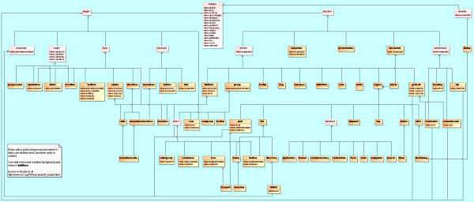

# <a id="roles"></a>5. The Roles Model

This section is [normative](#def_normative).

This section defines the WAI-ARIA [role](#def_role) [taxonomy](#def_taxonomy) and describes the characteristics and properties of all [roles](#def_role). A formal RDF/OWL representation of all the information presented here is available in [Schemata Appendix](#a_schemata).

The roles, their characteristics, the states and properties they support, and specification of how they may be used in markup, shall be considered normative. The RDF/OWL representation used to model the taxonomy shall be considered informative. The RDF/OWL taxonomy may be used as a vehicle to extend WAI-ARIA in the future or by tool manufacturers to validate states and properties applicable to roles per this specification.

Roles are element types and authors **MUST NOT** change role values over time or with user actions. Authors wishing to change a role **MUST** do so by deleting the associated element and its children and replacing it with a new element with the appropriate role. Typically, platform accessibility APIs do not provide a vehicle to notify assistive technologies of a role value change, and consequently, assistive technologies may not update their cache with the new role attribute value. 

In order to reflect the content in the DOM, user agents **SHOULD** map the role attribute to the appropriate value in the implemented accessibility API, and user agents **SHOULD** update the mapping when the role attribute changes.

## <a id="relationshipsconcepts"></a>5.1. Relationships Between Concepts

The [role](#def_role) [taxonomy](#def_taxonomy) uses the following relationships to relate WAI-ARIA roles to each other and to concepts from other specifications, such as HTML and XForms.

### <a id="superclassrole"></a>5.1.1. Superclass Role

Inheritance is expressed in RDF using the RDF Schema 1.1[subClassOf](http://www.w3.org/TR/2014/REC-rdf-schema-20140225/#ch_subclassof) (\[[RDFS](#ref_RDFS)\]) property.

**RDF Property**

rdfs:subClassOf

The [role](#def_role) that the current subclassed role extends in the [taxonomy](#def_taxonomy). This extension causes all the properties and constraints of the superclass role to propagate to the subclass role. Other than well known stable specifications, inheritance may be restricted to items defined inside this specification, so that external items cannot be changed and affect inherited [classes](#def_class).

### <a id="subclassroles"></a>5.1.2. Subclass Roles

**RDF Property**

&lt;none&gt;

Informative list of [roles](#def_role) for which this role is the superclass. This is provided to facilitate reading of the specification but adds no new information.

### <a id="relatedConcept"></a>5.1.3. Related Concepts

**RDF Property**

role:relatedConcept

Informative data about a similar or related idea from other specifications. Concepts that are related are not necessarily identical. Related concepts do not inherit properties from each other. Hence if the definition of one concept changes, the properties, behavior, and definition of its related concept is not affected.

For example, a progress bar is like a status indicator. Therefore, the [`progressbar`](#progressbar) [widget](#def_widget) has a `role:relatedConcept` value which includes [`status`](#status). However, if the definition of [`status`](#status) is modified, the definition of a [`progressbar`](#progressbar) is not affected.

### <a id="baseConcept"></a>5.1.4. Base Concept

**RDF Property**

role:baseConcept

Informative data about [objects](#def_object) that are considered prototypes for the [role](#def_role). Base concept is similar to type, but without inheritance of limitations and properties. Base concepts are designed as a substitute for inheritance for external concepts. A base concept is like a [related concept](#relatedConcept) except that the base concept is almost identical to the role definition.

For example, the [`checkbox`](#checkbox) defined in this document has similar functionality and anticipated behavior to a [checkbox defined in HTML](http://www.w3.org/TR/html4/interact/forms.html#checkbox). Therefore, a [`checkbox`](#checkbox) has an HTML `checkbox` as a `baseConcept`. However, if the original HTML checkbox baseConcept definition is modified, the definition of a [`checkbox`](#checkbox) in this document will not be affected, because there is no actual inheritance of the respective type.

## <a id="Properties"></a>5.2. Characteristics of Roles

Roles are defined and described by their characteristics. Characteristics define the structural function of a role, such as what a role is, concepts behind it, and what instances the role can or must contain. In the case of [widgets](#def_widget) this also includes how it interacts with the [user agent](#def_useragent) based on mapping to HTML forms and XForms. States and properties from WAI-ARIA that are supported by the role are also indicated.

The roles [taxonomy](#def_taxonomy) defines the following characteristics. These characteristics are implemented in RDF as properties of the OWL [classes](#def_class) that describe the roles.

### <a id="isAbstract"></a>5.2.1. Abstract Roles

**RDF Property**

N/A

**Values**

Boolean

Abstract [roles](#def_role) are the foundation upon which all other WAI-ARIA roles are built. Content authors **MUST NOT** use abstract roles because they are not implemented in the API binding. User agents **MUST NOT** map abstract roles to the standard role mechanism of the accessibility API. Abstract roles are provided to help with the following:

1. Organize the role [taxonomy](#def_taxonomy) and provide roles with a meaning in the context of known concepts.
2. Streamline the addition of roles that include necessary features.

### <a id="requiredState"></a>5.2.2. Required States and Properties

**RDF Property**

role:requiredState

**Values**

Any valid RDF object reference, such as a URI.

[States](#def_state) and [properties](#def_property) specifically required for the [role](#def_role) and subclass roles. Content authors **MUST** provide [values](#def_value) for required states and properties.

When an [object](#def_object) inherits from multiple ancestors and one ancestor indicates that property is supported while another ancestor indicates that it is required, the property is required in the inheriting object.

> Note: An host language attribute with the appropriate [implicit WAI-ARIA semantic](#implicit_semantics) fulfills this requirement.

### <a id="supportedState"></a>5.2.3. Supported States and Properties

**RDF Property**

role:supportedState

**Values**

Any valid RDF object reference, such as a URI.

[States](#def_state) and [properties](#def_property) specifically applicable to the [role](#def_role) and child roles. [User agents](#def_useragent) **MUST** map all supported states and properties for the role to an accessibility API. Content authors **MAY** provide [values](#def_value) for supported states and properties, but need not in some cases where default values are sufficient.

> Note: A host language attribute with the appropriate [implicit WAI-ARIA semantic](#implicit_semantics) fulfills this requirement.

### <a id="inheritedattributes"></a>5.2.4. Inherited States and Properties

Informative list of properties that are inherited onto a [role](#def_role) from superclass roles. [States](#def_state) and [properties](#def_property) are inherited from superclass roles in the role [taxonomy](#def_taxonomy), not from ancestor [elements](#def_element) in the DOM tree. These properties are not explicitly defined on the role, as the inheritance of properties is automatic. This information is provided to facilitate reading of the specification. The set of supported states and properties combined with inherited states and properties forms the full set of states and properties supported by the role.

### <a id="mustContain"></a>5.2.5. Required Owned Elements

**RDF Property**

role:mustContain

**Values**

Any valid RDF object reference, such as a URI.

Any [element](#def_element) that will be [owned](#def_owned_element) by the element with this [role](#def_role). For example, an element with the role [`list`](#list) will own at least one element with the role [`group`](#group) or [`listitem`](#listitem).

When multiple roles are specified as _required owned elements_ for a role, at least one instance of one required owned element is expected. This specification does _not_ require an instance of each of the listed owned roles. For example, a `menu` should have at least one instance of a `menuitem`, `menuitemcheckbox`, _or_ `menuitemradio`. The `menu` role does not require one instance of each. 

There may be times that required owned elements are missing, for example, while editing or while loading a data set. When a widget is missing _required owned elements_ due to script execution or loading, authors **MUST** mark a containing element with [`aria-busy`](#aria-busy) equal to `true`. For example, until a page is fully initialized and complete, an author could mark the document element as busy.

> Note: A role that has 'required owned elements' does not imply the reverse relationship. While processing of a role may be incomplete without elements of given roles present as descendants, elements with roles in this list do not always have to be found within elements of the given role. See [required context role](#scope) for requirements about the context where elements of a given role will be contained.

> Note: An element with a [subclass role](#subclassroles) of the 'required owned element' does not fulfill this requirement. For example, the [`list`](#list) role requires ownership of an element using either the [`listitem`](#listitem) or [`group`](#group) role. Although the [`group`](#group) role is the superclass of [`row`](#row), adding a owned element with a role of [`row`](#row) will not fulfill the requirement that [`list`](#list) must own a [`listitem`](#listitem) or a [`group`](#group).

> Note: An element with the appropriate [implicit WAI-ARIA semantic](#implicit_semantics) fulfills this requirement.

### <a id="scope"></a>5.2.6. Required Context Role

**RDF Property**

role:scope

**Values**

Any valid RDF object reference, such as a URI.

The required context role defines the owning container where this [role](#def_role) is allowed. If a role has a required context, authors **MUST** ensure that an element with the role is contained inside (or [owned](#def_owned_element) by) an element with the required context role. For example, an element with role `listitem` is only meaningful when contained inside (or owned by) an element with role `list`.

> Note: A role that has 'required context role' does not imply the reverse relationship. While an element with the given role needs to appear within an element of the listed role(s) in order to be meaningful, elements of the listed roles do not always need descendant elements of the given role in order to be meaningful. See [required owned elements](#mustContain) for requirements about elements that require presence of a given descendant to be processed properly.

> Note: An element with the appropriate [implicit WAI-ARIA semantic](#implicit_semantics) fulfills this requirement.

### <a id="namecalculation"></a>5.2.7. Accessible Name Calculation

**RDF Property**

role:nameFrom

**Values**

One of the following values:

1. author: name comes from values provided by the author in explicit markup features such as the [`aria-label`](#aria-label) attribute, [`aria-labelledby`](#aria-labelledby) attribute, or the host language labeling mechanism, such as the `alt` or `title` attributes in HTML, with HTML `title` attribute having the lowest precedence for specifying a text alternative.
2. contents: name comes from the text value of the [element](#def_element) node. Although this may be allowed in addition to "author" in some [roles](#def_role), this is used in content only if higher priority "author" features are not provided. Note: Priority is defined by the [text alternative computation](#textalternativecomputation) algorithm.

#### <a id="namecomputation"></a>5.2.7.1. Name Computation

An [accessible name](#def_accessible_name) is computed using a number of methods, outlined below in the section titled [Text Alternative Computation](#textalternativecomputation).

#### <a id="descriptioncomputation"></a>5.2.7.2. Description Computation

An accessible description may be computed by concatenating the text alternatives for nodes referenced by an `aria-describedby` attribute on the current node. The text alternatives for the referenced nodes are computed using a number of methods, outlined below in the section titled [Text Alternative Computation](#textalternativecomputation).

#### <a id="textalternativecomputation"></a>5.2.7.3. Text Alternative Computation

The text equivalent computation outlined below is a description of how user agents acquire a name or description that they then publish through the accessibility API. Authors can use the current section as a guide for creating names and descriptions in their markup. Accessibility checker tools can implement a name and/or description generator based on this algorithm such that authors can use the generated text equivalent to confirm that names and descriptions are as the author intended.

The text alternative is reused in both the name and description computation, as described above. There are different rules provided for several different types of nodes and combinations of markup. Text alternatives are built up, when appropriate, from all the relevant content contained within an [element](#def_element). This is accomplished via rule 2C (which is recursive), using the full set of rules to retrieve text from its own children.

The text alternative for a given node is computed as follows:

1. Skip [hidden](#def_hidden) elements unless the author specifies to use them via an `aria-labelledby` or `aria-describedby` being used in the current computation. By default, users of [assistive technologies](#def_at) won't receive the hidden information, but an author will be able to explicitly override that and include the hidden text alternative as part of the label string sent to the [accessibility API](#def_accessibility_api).</li>

2. For any non-skipped elements:

	1. Authors **MAY** specify an element's text alternative in content [attributes](#def_attribute), used in this order of preference:

		* The `aria-labelledby` attribute takes precedence as the element's text alternative unless this computation is already occurring as the result of a recursive `aria-labelledby` declaration (in other words, `aria-labelledby` is not recursive when referenced from another element, so it will not cause loops). However, the element's `aria-labelledby` attribute can reference the element's own IDREF in order to concatentate a string provided by the element's `aria-label` attribute or another feature lower in this preference list. The text alternatives for all the elements referenced will be computed using this same set of rules. User agents will then trim whitespace and join the substrings using a single space character. Substrings will be joined in the order specified by the author (IDREF order in the `aria-labelledby` attribute).</li>
		* If `aria-labelledby` is empty or undefined, the `aria-label` attribute, which defines an explicit text string, is used. However, if this computation is already occurring as the result of a recursive text alternative computation **and** the current element is an embedded control as defined in rule 2B, ignore the `aria-label` attribute and skip directly to rule 2B.</li>
		* If `aria-labelledby` and `aria-label` are both empty or undefined, and if the element is not marked as presentational (role="presentation"), check for the presence of an equivalent host language attribute or element for associating a label, and use those mechanisms to determine a text alternative. For example, in HTML, the `img` element's `alt` attribute defines a label string and the `label` element references the form element it labels. See [How to Specify Alternate Text](http://www.w3.org/TR/REC-html40/struct/objects.html#h-13.8) ([[HTML](#ref_HTML)], section 13.8) and HTML 5 [Requirements for providing text to act as an alternative for images](http://www.w3.org/TR/2010/WD-html5-20100624/embedded-content-1.html#alt) ([[HTML5](#ref_HTML5)], section 4.8.1.1).

> Editorial Note: We've asked the HTML5 WG to remove or reduce this section, so we may remove the reference to it from ARIA.

	2. Authors sometimes embed a control within the label of another widget, where the user can adjust the embedded control's value. For example, consider a check box label that contains a text input field: "Flash the screen [input] times". If the user has entered "5" for the embedded text input, the complete label is "Flash the screen 5 times". For such cases, include the value of the embedded control as part of the text alternative in the following manner:
		* If the embedded control is a text field, use its value.
		* If the embedded control is a menu, use the text alternative of the chosen menu item.
		* If the embedded control is a select or combobox, use the chosen option.
		* If the embedded control is a range (e.g., a `spinbutton` or `slider`), use the value of the `aria-valuetext` attribute if available, or otherwise the value of the `aria-valuenow` attribute.

	3. Otherwise, if the attributes checked in rules A and B didn't provide results, text is collected from descendant content if the current element's [role](#def_role) allows "Name From: contents." The text alternatives for child nodes will be concatenated, using this same set of rules. This same rule may apply to a child, which means the computation becomes recursive and can result in text being collected in all the nodes in this subtree, no matter how deep they are. However, any given descendant subtree may instead collect their part of the text alternative from the preferred markup described in A and B above. These author-specified attributes are assumed to provide the correct text alternative for the entire subtree. All in all, the node rules are applied consistently as text alternatives are collected from descendants, and each containing element in those descendants may or may not allow their contents to be used. Each node in the subtree is consulted only once. If text has been collected from a child node, and is referenced by another IDREF in some descendant node, then that second, or subsequent, reference is not followed. This is done to avoid infinite loops.

	4. The last resort is to use text from a tooltip attribute (such as the `title` attribute in HTML). This is used only if nothing else, including subtree content, has provided results.

3. Text nodes are often visited because they are children of an element that uses rule 2C to collect text from its children. However, because it is possible to specify or alter textual content using CSS rules, it is necessary for user agents to combine such content, as appropriate, with the text referenced by the text nodes to produce a complete text alternative. An example is the use of CSS `:before` and `:after` pseudo-elements, where the user agent combines the textual content specified in the style sheet with that given in the DOM.

	* When an image replaces text, then the UA should use the original text, since that text is presumably the equivalent.
	* When text replaces an image, then the UA should provide that text.
	* When new text replaces old, then the UA should include the new text, since that is what is rendered on screen.
	
> Notes: Though the user agent may make efforts to compute a text alternative from CSS-generated text in the absence of text content determinable from the DOM, authors should not provide text through a style sheet, as the user agent may incorrectly determine the text alternative.

The purpose of the flat text alternative string is to create a perceivable label in alternative presentations. At each step of the algorithm, an implementation will trim the existing text equivalent string and the string to be added, then join those two strings with a single space. For example, a space character may be inserted between the text of two elements used one after the other in a description.

#### <a id="tac_example1"></a>5.2.7.4. Text Alternative Computation Example \#1
* **aria-labelledby (Rule 2A):** The label of the first menuitem in the menubar example markup above is "File" based on rule 2A. The element has an `aria-labelledby` attribute that picks out the `span` element with `id="fileLabel"` The `span` contains the label text.
* **Namefrom: contents (Rule 2C):** The label of the first item in the file menu is "New" based on rule 2C. Since `menuitem` elements can acquire their label by the "Namefrom: content" technique, the textual content of the `menuitem` element itself is sufficient. Note that this element has no attributes such as `aria-labelledby`, `aria-label`, or `alt`, from which to acquire a label.

```
<ul role="menubar">
    <li role="menuitem" aria-haspopup="true" aria-labelledby="fileLabel"><span id="fileLabel">File</span>
        <ul role="menu">
            <li role="menuitem">New</li>
            <li role="menuitem">Open…</li>
            …
        </ul>
    </li>
    …
</ul>
```

#### <a id="tac_example2"></a>5.2.7.5. Text Alternative Computation Example \#2

* **native `label` element (Rule 2A):** Use of a native element is illustrated by the first checkbox where its label is defined by the HTML `label` element.
* **embedded input (Rule 2C):** The third checkbox illustrates an embedded control adding to a larger label (Rule 2B). Here the label is "Flash the screen 3 times", where "3" is taken from the value of the embedded text `input`.
* **aria-label (Rule 2A):** Rule 2A, using aria-label, is shown for this embedded text `input`. The rationale is to give a label to this element, but in a way that does not interfere with the enclosing label of the checkbox. The label is needed by a screen reader when focus is on the text input.

```html
<fieldset>
    <legend>Meeting alarms</legend>
        <input type="checkbox" id="beep"> <label for="beep">Beep</label> <br>
    <input type="checkbox" id="mtgTitle"> <label for="mtgTitle">Display the meeting title</label> <br>
        <input type="checkbox" id="flash">
    <label for="flash">
        Flash the screen
        <input type="text" value="3" size="2" id="numTimes" aria-label="Number of times to flash screen">
        times
    </label>
</fieldset>
```

### <a id="childrenArePresentational"></a>5.2.8. Presentational Children

**RDF Property**

role:childrenArePresentational

**Values**

Boolean (true | false)

The DOM descendants are presentational. [User agents](#def_useragent) **SHOULD NOT** expose descendants of this [element](#def_element) through the platform [accessibility API](#def_accessibility_api). If [user agents](#def_useragent) do not hide the descendant nodes, some information may be read twice.

### <a id="implictValueForRole"></a>5.2.9. Implicit Value for Role

Many states and properties have default values. Occasionally, the default value when used on a given role should be different from the usual default. Roles that require a state or property to have a non-standard default value indicate this in the "Implicit Value for Role". This is expressed in the form "`state or property name` is `new default value`". Roles that define this have the new default value for the state or property if the author does not provide an explicit value.

## <a id="roles_categorization"></a>5.3. Categorization of Roles

To support the current user scenario, this specification categorizes [roles](#def_role) that define user interface [widgets](#def_widget) (sliders, tree controls, etc.) and those that define page structure (sections, navigation, etc.). Note that some assistive technologies provide special modes of interaction for regions marked with role `application` or `document`.

[](http://www.w3.org/TR/wai-aria/rdf_model)
**Class diagram of the relationships described in the role data model.**

[SVG class diagram](http://www.w3.org/TR/wai-aria/rdf_model.svg) | [PNG class diagram](http://www.w3.org/TR/wai-aria/rdf_model.png) | [Class diagram description](http://www.w3.org/TR/wai-aria/rdf_model.html)

Roles are categorized as follows:

1. [Abstract Roles](#abstract_roles)
2. [Widget Roles](#widget_roles)
3. [Document Structure Roles](#document_structure_roles)
4. [Landmark Roles](#landmark_roles)

### <a id="abstract_roles"></a>5.3.1. Abstract Roles

The following [roles](#def_role) are used to support the WAI-ARIA role [taxonomy](#def_taxonomy) for the purpose of defining general role concepts.

Abstract roles are used for the ontology. Authors **MUST NOT** use abstract roles in content.

* [`command` (abstract role)](#command)
* [`composite` (abstract role)](#composite)
* [`input` (abstract role)](#input)
* [`landmark` (abstract role)](#landmark)
* [`range` (abstract role)](#range)
* [`roletype` (abstract role)](#roletype)
* [`section` (abstract role)](#section)
* [`sectionhead` (abstract role)](#sectionhead)
* [`select` (abstract role)](#select)
* [`structure` (abstract role)](#structure)
* [`widget` (abstract role)](#widget)
* [`window` (abstract role)](#window)

### <a id="widget_roles"></a>5.3.2. Widget Roles

The following roles act as standalone user interface widgets or as part of larger, composite widgets.

* [`alert`](#alert)
* [`alertdialog`](#alertdialog)
* [`button`](#button)
* [`checkbox`](#checkbox)
* [`dialog`](#dialog)
* [`gridcell`](#gridcell)
* [`link`](#link)
* [`log`](#log)
* [`marquee`](#marquee)
* [`menuitem`](#menuitem)
* [`menuitemcheckbox`](#menuitemcheckbox)
* [`menuitemradio`](#menuitemradio)
* [`option`](#option)
* [`progressbar`](#progressbar)
* [`radio`](#radio)
* [`scrollbar`](#scrollbar)
* [`slider`](#slider)
* [`spinbutton`](#spinbutton)
* [`status`](#status)
* [`tab`](#tab)
* [`tabpanel`](#tabpanel)
* [`textbox`](#textbox)
* [`timer`](#timer)
* [`tooltip`](#tooltip)
* [`treeitem`](#treeitem)

The following roles act as composite user interface widgets. These roles typically act as containers that manage other, contained widgets.

* [`combobox`](#combobox)
* [`grid`](#grid)
* [`listbox`](#listbox)
* [`menu`](#menu)
* [`menubar`](#menubar)
* [`radiogroup`](#radiogroup)
* [`tablist`](#tablist)
* [`tree`](#tree)
* [`treegrid`](#treegrid)

### <a id="document_structure_roles"></a>5.3.3. Document Structure

The following [roles](#def_role) describe structures that organize content in a page. Document structures are not usually interactive.

* [`article`](#article)
* [`columnheader`](#columnheader)
* [`definition`](#definition)
* [`directory`](#directory)
* [`document`](#document)
* [`group`](#group)
* [`heading`](#heading)
* [`img`](#img)
* [`list`](#list)
* [`listitem`](#listitem)
* [`math`](#math)
* [`note`](#note)
* [`presentation`](#presentation)
* [`region`](#region)
* [`row`](#row)
* [`rowgroup`](#rowgroup)
* [`rowheader`](#rowheader)
* [`separator`](#separator)
* [`toolbar`](#toolbar)

### <a id="landmark_roles"></a>5.3.4. Landmark Roles

The following [roles](#def_role) are regions of the page intended as navigational [landmarks](#def_landmark). All of these roles inherit from the `landmark` base type and, with the exception of `application`, all are imported from the [Role Attribute](http://www.w3.org/TR/2011/WD-role-attribute-20110113/#s_role_module_attributes) \[[ROLE](#ref_ROLE)\]. The roles are included here in order to make them clearly part of the WAI-ARIA Role [taxonomy](#def_taxonomy).

* [`application`](#application)
* [`banner`](#banner)
* [`complementary`](#complementary)
* [`contentinfo`](#contentinfo)
* [`form`](#form)
* [`main`](#main)
* [`navigation`](#navigation)
* [`search`](#search)

## <a id="role_definitions"></a>5.4. Definition of Roles

Below is an alphabetical list of WAI-ARIA [roles](#def_role) to be used by rich internet application authors.

Abstract roles are used for the ontology. Authors **MUST NOT** use abstract roles in content.

**[`alert`](#alert)**

A message with important, and usually time-sensitive, information. See related alertdialog and status.

**[`alertdialog`](#alertdialog)**

A type of dialog that contains an alert message, where initial focus goes to an element within the dialog. See related alert and dialog.

**[`application`](#application)**

A region declared as a web application, as opposed to a web document.

**[`article`](#article)**

A section of a page that consists of a composition that forms an independent part of a document, page, or site.

**[`banner`](#banner)**

A region that contains mostly site-oriented content, rather than page-specific content.

**[`button`](#button)**

An input that allows for user-triggered actions when clicked or pressed. See related link.

**[`checkbox`](#checkbox)**

A checkable input that has three possible values: true, false, or mixed.

**[`columnheader`](#columnheader)**

A cell containing header information for a column.

**[`combobox`](#combobox)**

A presentation of a select; usually similar to a textbox where users can type ahead to select an option, or type to enter arbitrary text as a new item in the list. See related listbox.

**[`command` (abstract role)](#command)**

A form of widget that performs an action but does not receive input data.

**[`complementary`](#complementary)**

A supporting section of the document, designed to be complementary to the main content at a similar level in the DOM hierarchy, but remains meaningful when separated from the main content.

**[`composite` (abstract role)](#composite)**

A widget that may contain navigable descendants or owned children.

**[`contentinfo`](#contentinfo)**

A large perceivable region that contains information about the parent document.

**[`definition`](#definition)**

A definition of a term or concept.

**[`dialog`](#dialog)**

A dialog is an application window that is designed to interrupt the current processing of an application in order to prompt the user to enter information or require a response. See related alertdialog.

**[`directory`](#directory)**

A list of references to members of a group, such as a static table of contents.

**[`document`](#document)**

A region containing related information that is declared as document content, as opposed to a web application.

**[`form`](#form)**

A landmark region that contains a collection of items and objects that, as a whole, combine to create a form. See related search.

**[`grid`](#grid)**

A grid is an interactive control which contains cells of tabular data arranged in rows and columns, like a table.

**[`gridcell`](#gridcell)**

A cell in a grid or treegrid.

**[`group`](#group)**

A set of user interface objects which are not intended to be included in a page summary or table of contents by assistive technologies.

**[`heading`](#heading)**

A heading for a section of the page.

**[`img`](#img)**

A container for a collection of elements that form an image.

**[`input` (abstract role)](#input)**

A generic type of widget that allows user input.

**[`landmark` (abstract role)](#landmark)**

A region of the page intended as a navigational landmark.

**[`link`](#link)**

An interactive reference to an internal or external resource that, when activated, causes the user agent to navigate to that resource. See related button.

**[`list`](#list)**

A group of non-interactive list items. See related listbox.

**[`listbox`](#listbox)**

A widget that allows the user to select one or more items from a list of choices. See related combobox and list.

**[`listitem`](#listitem)**

A single item in a list or directory.

**[`log`](#log)**

A type of live region where new information is added in meaningful order and old information may disappear. See related marquee.

**[`main`](#main)**

The main content of a document.

**[`marquee`](#marquee)**

A type of live region where non-essential information changes frequently. See related log.

**[`math`](#math)**

Content that represents a mathematical expression.

**[`menu`](#menu)**

A type of widget that offers a list of choices to the user.

**[`menubar`](#menubar)**

A presentation of menu that usually remains visible and is usually presented horizontally.

**[`menuitem`](#menuitem)**

An option in a set of choices contained by a menu or menubar.

**[`menuitemcheckbox`](#menuitemcheckbox)**

A menuitem with a checkable state whose possible values are true, false, or mixed.

**[`menuitemradio`](#menuitemradio)**

A checkable menuitem in a set of elements with role menuitemradio, only one of which can be checked at a time.

**[`navigation`](#navigation)**

A collection of navigational elements (usually links) for navigating the document or related documents.

**[`note`](#note)**

A section whose content is parenthetic or ancillary to the main content of the resource.

**[`option`](#option)**

A selectable item in a select list.

**[`presentation`](#presentation)**

An element whose implicit native role semantics will not be mapped to the accessibility API.

**[`progressbar`](#progressbar)**

An element that displays the progress status for tasks that take a long time.

**[`radio`](#radio)**

A checkable input in a group of radio roles, only one of which can be checked at a time.

**[`radiogroup`](#radiogroup)**

A group of radio buttons.

**[`range` (abstract role)](#range)**

An input representing a range of values that can be set by the user.

**[`region`](#region)**

A large perceivable section of a web page or document, that is important enough to be included in a page summary or table of contents, for example, an area of the page containing live sporting event statistics.

**[`roletype` (abstract role)](#roletype)**

The base role from which all other roles in this taxonomy inherit.

**[`row`](#row)**

A row of cells in a grid.

**[`rowgroup`](#rowgroup)**

A group containing one or more row elements in a grid.

**[`rowheader`](#rowheader)**

A cell containing header information for a row in a grid.

**[`scrollbar`](#scrollbar)**

A graphical object that controls the scrolling of content within a viewing area, regardless of whether the content is fully displayed within the viewing area.

**[`search`](#search)**

A landmark region that contains a collection of items and objects that, as a whole, combine to create a search facility. See related form.

**[`section` (abstract role)](#section)**

A renderable structural containment unit in a document or application.

**[`sectionhead` (abstract role)](#sectionhead)**

A structure that labels or summarizes the topic of its related section.

**[`select` (abstract role)](#select)**

A form widget that allows the user to make selections from a set of choices.

**[`separator`](#separator)**

A divider that separates and distinguishes sections of content or groups of menuitems.

**[`slider`](#slider)**

A user input where the user selects a value from within a given range.

**[`spinbutton`](#spinbutton)**

A form of range that expects the user to select from among discrete choices.

**[`status`](#status)**

A container whose content is advisory information for the user but is not important enough to justify an alert, often but not necessarily presented as a status bar. See related alert.

**[`structure` (abstract role)](#structure)**

A document structural element.

**[`tab`](#tab)**

A grouping label providing a mechanism for selecting the tab content that is to be rendered to the user.

**[`tablist`](#tablist)**

A list of tab elements, which are references to tabpanel elements.

**[`tabpanel`](#tabpanel)**

A container for the resources associated with a tab, where each tab is contained in a tablist.

**[`textbox`](#textbox)**

Input that allows free-form text as its value.

**[`timer`](#timer)**

A type of live region containing a numerical counter which indicates an amount of elapsed time from a start point, or the time remaining until an end point.

**[`toolbar`](#toolbar)**

A collection of commonly used function buttons or controls represented in compact visual form.

**[`tooltip`](#tooltip)**

A contextual popup that displays a description for an element.

**[`tree`](#tree)**

A type of list that may contain sub-level nested groups that can be collapsed and expanded.

**[`treegrid`](#treegrid)**

A grid whose rows can be expanded and collapsed in the same manner as for a tree.

**[`treeitem`](#treeitem)**

An option item of a tree. This is an element within a tree that may be expanded or collapsed if it contains a sub-level group of treeitem elements.

**[`widget` (abstract role)](#widget)**

An interactive component of a graphical user interface (GUI).

**[`window` (abstract role)](#window)**

A browser or application window.

---

### <a id="#alert"></a>`alert` (role)

A message with important, and usually time-sensitive, information. See related [`alertdialog`](#alertdialog) and [`status`](#status).

Alerts are used to convey messages to alert the user. In the case of audio warnings this is an accessible alternative for a hearing-impaired user. The `alert` [role](#def_role) goes on the node containing the alert message. Alerts are specialized forms of the [`status`](#status) role, which will be processed as an atomic [live region](#def_liveregion).

Alerts are assertive live regions and will be processed as such by assistive technologies. Neither authors nor user agents are required to set or manage focus to them in order for them to be processed. Since alerts are not required to receive focus, content authors **SHOULD NOT** require users to close an alert. If the operating system allows, the [user agent](#def_useragent) **SHOULD** fire a system alert [event](#def_event) through the accessibility API when the WAI-ARIA alert is created. If an alert requires focus to close the alert, then content authors **SHOULD** use [`alertdialog`](#alertdialog) instead.

> Note: Elements with the role `alert` have an implicit `aria-live` value of `assertive`, and an implicit `aria-atomic` value of `true`.

<table class="role-features">
<caption>Characteristics of alert</caption>
<thead>
<tr>
<th scope="col">Characteristic</th>
<th scope="col">Value</th>
</tr></thead>
<tbody>
<tr>
<th class="role-parent-head">Superclass Role:</th>
<td class="role-parent">[`region`](#region)</td>
</tr>
<tr>
<th class="role-children-head">Subclass Roles:</th>
<td class="role-children">
* [`alertdialog`](#alertdialog)</td>
</tr>
<tr>
<th class="role-related-head">Related Concepts:</th>
<td class="role-related">[XForms alert](http://www.w3.org/TR/2007/REC-xforms-20071029/#ui-common-elements-alert)</td>
</tr>
<tr>
<th class="role-inherited-head">Inherited States and Properties:</th>
<td class="role-inherited">
* [`aria-atomic`](#aria-atomic)
* [`aria-busy` (state)](#aria-busy)
* [`aria-controls`](#aria-controls)
* [`aria-describedby`](#aria-describedby)
* [`aria-disabled` (state)](#aria-disabled)
* [`aria-dropeffect`](#aria-dropeffect)
* [`aria-expanded` (state)](#aria-expanded)
* [`aria-flowto`](#aria-flowto)
* [`aria-grabbed` (state)](#aria-grabbed)
* [`aria-haspopup`](#aria-haspopup)
* [`aria-hidden` (state)](#aria-hidden)
* [`aria-invalid` (state)](#aria-invalid)
* [`aria-label`](#aria-label)
* [`aria-labelledby`](#aria-labelledby)
* [`aria-live`](#aria-live)
* [`aria-owns`](#aria-owns)
* [`aria-relevant`](#aria-relevant)</td>
</tr>
<tr>
<th class="role-namefrom-head">Name From:</th>
<td class="role-namefrom">author</td>
</tr>
<tr>
<th class="implicit-values-head">Implicit Value for Role:</th>
<td class="implicit-values">
Default for [`aria-live`](#aria-live) is `assertive`.<br>
Default for [`aria-atomic`](#aria-atomic) is `true`.
</td>
</tr></tbody>
</table>

---

### <a id="#alertdialog"></a>`alertdialog` (role)

A type of dialog that contains an alert message, where initial focus goes to an [element](#def_element) within the dialog. See related [`alert`](#alert) and [`dialog`](#dialog).

Alert dialogs are used to convey messages to alert the user. The `alertdialog` [role](#def_role) goes on the node containing both the alert message and the rest of the dialog. Content authors **SHOULD** make alert dialogs modal by ensuring that, while the `alertdialog` is shown, keyboard and mouse interactions only operate within the dialog.

Unlike [`alert`](#alert), `alertdialog` can receive a response from the user. For example, to confirm that the user understands the alert being generated. When the alert dialog is displayed, authors **SHOULD** set focus to an active element within the alert dialog, such as a form edit field or an OK button. The [user agent](#def_useragent) **SHOULD** fire a system alert [event](#def_event) through the accessibility API when the alert is created, provided one is specified by the intended [accessibility API](#def_accessibility_api).

Authors **SHOULD** use [`aria-describedby`](#aria-describedby) on an `alertdialog` to point to the alert message element in the dialog. If they do not, [assistive technologies](#def_at) will resort to their internal recovery mechanism to determine the contents of an alert message.

<table class="role-features">
<caption>Characteristics of alertdialog</caption>
<thead>
<tr>
<th scope="col">Characteristic</th>
<th scope="col">Value</th>
</tr></thead>
<tbody>
<tr>
<th class="role-parent-head">Superclass Role:</th>
<td class="role-parent">
* [`alert`](#alert)
* [`dialog`](#dialog)
</td>
</tr>
<tr>
<th class="role-related-head">Related Concepts:</th>
<td class="role-related">[XForms alert](http://www.w3.org/TR/2007/REC-xforms-20071029/#ui-common-elements-alert)</td>
</tr>
<tr>
<th class="role-inherited-head">Inherited States and Properties:</th>
<td class="role-inherited">
* [`aria-atomic`](#aria-atomic)
* [`aria-busy` (state)](#aria-busy)
* [`aria-controls`](#aria-controls)
* [`aria-describedby`](#aria-describedby)
* [`aria-disabled` (state)](#aria-disabled)
* [`aria-dropeffect`](#aria-dropeffect)
* [`aria-expanded` (state)](#aria-expanded)
* [`aria-flowto`](#aria-flowto)
* [`aria-grabbed` (state)](#aria-grabbed)
* [`aria-haspopup`](#aria-haspopup)
* [`aria-hidden` (state)](#aria-hidden)
* [`aria-invalid` (state)](#aria-invalid)
* [`aria-label`](#aria-label)
* [`aria-labelledby`](#aria-labelledby)
* [`aria-live`](#aria-live)
* [`aria-owns`](#aria-owns)
* [`aria-relevant`](#aria-relevant)</td>
</tr>
<tr>
<th class="role-namefrom-head">Name From:</th>
<td class="role-namefrom">author</td>
</tr>
<tr>
<th class="role-namerequired-head">Accessible Name Required:</th>
<td class="role-namerequired">True</td>
</tr></tbody>
</table>

---

### <a id="#application"></a>`application` (role)

A region declared as a web application, as opposed to a web [`document`](#document).

When the user navigates an element assigned the role of [`application`](#application), [assistive technologies](#def_at) that typically intercept standard keyboard events **SHOULD** switch to an application browsing mode, and pass keyboard events through to the web application. The intent is to hint to certain [assistive technologies](#def_at) to switch from normal browsing mode into a mode more appropriate for interacting with a web application; some [user agents](#def_useragent) have a browse navigation mode where keys, such as up and down arrows, are used to browse the document, and this native behavior prevents the use of these keys by a web application.

> Note: Where appropriate, assistive technologies that typically intercept other standard device input events, such as touch screen input, could switch to an application browsing mode that passes some or all of those events through to the web application.

Authors **SHOULD** set the [role](#def_role) of `application` on the [element](#def_element) that encompasses the entire application. If the application role applies to the entire web page, authors **SHOULD** set the role of `application` on the root node for content, such as the `body` element in HTML or `svg` element in SVG.

For example, an email application has a document and an application in it. The author would want to use typical application navigation mode to cycle through the list of emails, and much of this navigation would be defined by the application author. However, when reading an email message the content will appear in a region with a [`document`](#document) [role](#def_role) in order to use browsing navigation.

For all instances of non-decorative static text or image content inside an application, authors **SHOULD** either associate the text with a form [widget](#def_widget) or [`group`](#group) (via [`aria-label`](#aria-label), [`aria-labelledby`](#aria-labelledby), or [`aria-describedby`](#aria-describedby)) or separate the text into an element with role of [`document`](#document) or [`article`](#article).

Authors **SHOULD** provide a title or label for applications. Authors **SHOULD** use label text that is suitable for use as a navigation preview or table-of-contents entry for the page section. Content authors **SHOULD** provide the label through one of the following methods:

* If the application includes the entire contents of the web page, use the host language feature for title or label, such as the `title` element in both HTML and SVG. This has the effect of labeling the entire application.
* Otherwise, provide a visible label referenced by the application using [`aria-labelledby`](#aria-labelledby).

User agents **SHOULD** treat elements with the role of `application` as navigational [landmarks](#def_landmark).

Authors **MAY** use the `application` role on the [primary content element](#def_primarycontentelement) of the host language (such as the `body` element in HTML) to define an entire page as an application. However, if the [primary content element](#def_primarycontentelement) is defined as having a role of `application`, user agents **MUST NOT** use the element as a navigational landmark. If assistive technologies use an interaction mode that intercepts standard keyboard events, when encountering the `application` role, those assistive technologies **SHOULD** switch to an interaction mode that passes keyboard events through to the web application.

<table class="role-features">
<caption>Characteristics of application</caption>
<thead>
<tr>
<th scope="col">Characteristic</th>
<th scope="col">Value</th>
</tr>
</thead>
<tbody>
<tr>
<th class="role-parent-head">Superclass Role:</th>
<td class="role-parent">[`landmark`](#landmark)</td>
</tr>
<tr>
<th class="role-related-head">Related Concepts:</th>
<td class="role-related">[Device Independence Delivery Unit](http://www.w3.org/TR/di-gloss/#def-delivery-unit)</td>
</tr>
<tr>
<th class="role-inherited-head">Inherited States and Properties:</th>
<td class="role-inherited">
* [`aria-atomic`](#aria-atomic)
* [`aria-busy` (state)](#aria-busy)
* [`aria-controls`](#aria-controls)
* [`aria-describedby`](#aria-describedby)
* [`aria-disabled` (state)](#aria-disabled)
* [`aria-dropeffect`](#aria-dropeffect)
* [`aria-expanded` (state)](#aria-expanded)
* [`aria-flowto`](#aria-flowto)
* [`aria-grabbed` (state)](#aria-grabbed)
* [`aria-haspopup`](#aria-haspopup)
* [`aria-hidden` (state)](#aria-hidden)
* [`aria-invalid` (state)](#aria-invalid)
* [`aria-label`](#aria-label)
* [`aria-labelledby`](#aria-labelledby)
* [`aria-live`](#aria-live)
* [`aria-owns`](#aria-owns)
* [`aria-relevant`](#aria-relevant)</td>
</tr>
<tr>
<th class="role-namefrom-head">Name From:</th>
<td class="role-namefrom">author</td>
</tr>
<tr>
<th class="role-namerequired-head">Accessible Name Required:</th>
<td class="role-namerequired">True</td>
</tr></tbody>
</table>

---

### <a id="#article"></a>`article` (role)

A section of a page that consists of a composition that forms an independent part of a document, page, or site.

An article is not a navigational [landmark](#def_landmark), but may be nested to form a discussion where assistive technologies could pay attention to article nesting to assist the user in following the discussion. An article could be a forum post, a magazine or newspaper article, a web log entry, a user-submitted comment, or any other independent item of content. It is _independent_ in that its contents could stand alone, for example in syndication. However, the [element](#def_element) is still associated with its ancestors; for instance, contact information that applies to a parent body element still covers the article as well. When nesting articles, the child articles represent content that is related to the content of the parent article. For instance, a web log entry on a site that accepts user-submitted comments could represent the comments as articles nested within the article for the web log entry. Author, heading, date, or other information associated with an article does not apply to nested articles.

When the user navigates an element assigned the role of [`article`](#article), [assistive technologies](#def_at) that typically intercept standard keyboard events **SHOULD** switch to document browsing mode, as opposed to passing keyboard events through to the web application. Assistive technologies **MAY** provide a feature allowing the user to navigate the hierarchy of any nested [`article`](#article) elements.

<table class="role-features">
<caption>Characteristics of article</caption>
<thead>
<tr>
<th scope="col">Characteristic</th>
<th scope="col">Value</th>
</tr>
</thead>
<tbody>
<tr>
<th class="role-parent-head">Superclass Role:</th>
<td class="role-parent">
* [`document`](#document)
* [`region`](#region)
</td>
</tr>
<tr>
<th class="role-related-head">Related Concepts:</th>
<td class="role-related">HTML 5 [article](http://www.w3.org/TR/2010/WD-html5-20100624/sections.html#the-article-element)</td>
</tr>
<tr>
<th class="role-inherited-head">Inherited States and Properties:</th>
<td class="role-inherited">
* [`aria-atomic`](#aria-atomic)
* [`aria-busy` (state)](#aria-busy)
* [`aria-controls`](#aria-controls)
* [`aria-describedby`](#aria-describedby)
* [`aria-disabled` (state)](#aria-disabled)
* [`aria-dropeffect`](#aria-dropeffect)
* [`aria-expanded` (state)](#aria-expanded)
* [`aria-flowto`](#aria-flowto)
* [`aria-grabbed` (state)](#aria-grabbed)
* [`aria-haspopup`](#aria-haspopup)
* [`aria-hidden` (state)](#aria-hidden)
* [`aria-invalid` (state)](#aria-invalid)
* [`aria-label`](#aria-label)
* [`aria-labelledby`](#aria-labelledby)
* [`aria-live`](#aria-live)
* [`aria-owns`](#aria-owns)
* [`aria-relevant`](#aria-relevant)</td>
</tr>
<tr>
<th class="role-namefrom-head">Name From:</th>
<td class="role-namefrom">author</td>
</tr></tbody>
</table>

---

### <a id="#banner"></a>`banner` (role)

A region that contains mostly site-oriented content, rather than page-specific content.

Site-oriented content typically includes things such as the logo or identity of the site sponsor, and site-specific search tool. A banner usually appears at the top of the page and typically spans the full width.

User agents **SHOULD** treat elements with the role of `banner` as navigational [landmarks](#def_landmark).

Within any [`document`](#document) or [`application`](#application), the author **SHOULD** mark no more than one [element](#def_element) with the `banner` [role](#def_role).

> Note: Because `document` and `application` elements can be nested in the DOM, they may have multiple `banner` elements as DOM descendants, assuming each of those is associated with different document nodes, either by a DOM nesting (e.g., `document` within `document`) or by use of the [`aria-owns`](#aria-owns) [attribute](#def_attribute).

<table class="role-features">
<caption>Characteristics of banner</caption>
<thead>
<tr>
<th scope="col">Characteristic</th>
<th scope="col">Value</th>
</tr></thead>
<tbody>
<tr>
<th class="role-parent-head">Superclass Role:</th>
<td class="role-parent">[`landmark`](#landmark)</td>
</tr>
<tr>
<th class="role-inherited-head">Inherited States and Properties:</th>
<td class="role-inherited">
* [`aria-atomic`](#aria-atomic)
* [`aria-busy` (state)](#aria-busy)
* [`aria-controls`](#aria-controls)
* [`aria-describedby`](#aria-describedby)
* [`aria-disabled` (state)](#aria-disabled)
* [`aria-dropeffect`](#aria-dropeffect)
* [`aria-expanded` (state)](#aria-expanded)
* [`aria-flowto`](#aria-flowto)
* [`aria-grabbed` (state)](#aria-grabbed)
* [`aria-haspopup`](#aria-haspopup)
* [`aria-hidden` (state)](#aria-hidden)
* [`aria-invalid` (state)](#aria-invalid)
* [`aria-label`](#aria-label)
* [`aria-labelledby`](#aria-labelledby)
* [`aria-live`](#aria-live)
* [`aria-owns`](#aria-owns)
* [`aria-relevant`](#aria-relevant)</td>
</tr>
<tr>
<th class="role-namefrom-head">Name From:</th>
<td class="role-namefrom">author</td>
</tr></tbody>
</table>

---

### <a id="#button"></a>`button` (role)

An input that allows for user-triggered actions when clicked or pressed. See related [`link`](#link).

Buttons are mostly used for discrete actions. Standardizing the appearance of buttons enhances the user's recognition of the [widgets](#def_widget) as buttons and allows for a more compact display in toolbars.

Buttons support the optional [attribute](#def_attribute) [`aria-pressed`](#aria-pressed). Buttons with a non-empty [`aria-pressed`](#aria-pressed) attribute are toggle buttons. When [`aria-pressed`](#aria-pressed) is `true` the button is in a "pressed" [state](#def_state), when [`aria-pressed`](#aria-pressed) is `false` it is not pressed. If the attribute is not present, the button is a simple command button.

<table class="role-features">
<caption>Characteristics of button</caption>
<thead>
<tr>
<th scope="col">Characteristic</th>
<th scope="col">Value</th>
</tr></thead>
<tbody>
<tr>
<th class="role-parent-head">Superclass Role:</th>
<td class="role-parent">[`command`](#command)</td>
</tr>
<tr>
<th class="role-base-head">Base Concept:</th>
<td class="role-base">
[HTML button](http://www.w3.org/TR/html4/interact/forms.html#edef-BUTTON)
</td></tr>
<tr>
<th class="role-related-head">Related Concepts:</th>
<td class="role-related">
* [`link`](#link)
* [XForms trigger](http://www.w3.org/TR/2007/REC-xforms-20071029/#ui-button)
</td>
</tr>
<tr>
<th class="role-properties-head">Supported States and Properties:</th>
<td class="role-properties">
* [`aria-expanded` (state)](#aria-expanded)
* [`aria-pressed` (state)](#aria-pressed)
</td>
</tr>
<tr>
<th class="role-inherited-head">Inherited States and Properties:</th>
<td class="role-inherited">
* [`aria-atomic`](#aria-atomic)
* [`aria-busy` (state)](#aria-busy)
* [`aria-controls`](#aria-controls)
* [`aria-describedby`](#aria-describedby)
* [`aria-disabled` (state)](#aria-disabled)
* [`aria-dropeffect`](#aria-dropeffect)
* [`aria-flowto`](#aria-flowto)
* [`aria-grabbed` (state)](#aria-grabbed)
* [`aria-haspopup`](#aria-haspopup)
* [`aria-hidden` (state)](#aria-hidden)
* [`aria-invalid` (state)](#aria-invalid)
* [`aria-label`](#aria-label)
* [`aria-labelledby`](#aria-labelledby)
* [`aria-live`](#aria-live)
* [`aria-owns`](#aria-owns)
* [`aria-relevant`](#aria-relevant)</td>
</tr>
<tr>
<th class="role-namefrom-head">Name From:</th>
<td class="role-namefrom">
* contents
* author
</td>
</tr>
<tr>
<th class="role-namerequired-head">Accessible Name Required:</th>
<td class="role-namerequired">True</td>
</tr>
<tr>
<th class="role-childpresentational-head">Children Presentational:</th>
<td class="role-childpresentational">True</td>
</tr></tbody>
</table>

---

### <a id="#checkbox"></a>`checkbox` (role)

A checkable input that has three possible [values](#def_value): `true`, `false`, or `mixed`.

The [`aria-checked`](#aria-checked) [attribute](#def_attribute) of a `checkbox` indicates whether the input is checked (`true`), unchecked (`false`), or represents a group of [elements](#def_element) that have a mixture of checked and unchecked values (`mixed`). Many checkboxes do not use the `mixed` value, and thus are effectively boolean checkboxes.

<table class="role-features">
<caption>Characteristics of checkbox</caption>
<thead>
<tr>
<th scope="col">Characteristic</th>
<th scope="col">Value</th>
</tr></thead>
<tbody>
<tr>
<th class="role-parent-head">Superclass Role:</th>
<td class="role-parent">[`input`](#input)</td>
</tr>
<tr>
<th class="role-children-head">Subclass Roles:</th>
<td class="role-children">
* [`menuitemcheckbox`](#menuitemcheckbox)
* [`radio`](#radio)</td>
</tr>
<tr>
<th class="role-related-head">Related Concepts:</th>
<td class="role-related">
* [HTML `input[type="checkbox"]`](http://www.w3.org/TR/html401/interact/forms.html#edef-INPUT)
* [`option`](#option)
</td>
</tr>
<tr>
<th class="role-required-properties-head">Required States and Properties:</th>
<td class="role-required-properties">
[`aria-checked` (state)](#aria-checked)
</td></tr>
<tr>
<th class="role-inherited-head">Inherited States and Properties:</th>
<td class="role-inherited">
* [`aria-atomic`](#aria-atomic)
* [`aria-busy` (state)](#aria-busy)
* [`aria-controls`](#aria-controls)
* [`aria-describedby`](#aria-describedby)
* [`aria-disabled` (state)](#aria-disabled)
* [`aria-dropeffect`](#aria-dropeffect)
* [`aria-flowto`](#aria-flowto)
* [`aria-grabbed` (state)](#aria-grabbed)
* [`aria-haspopup`](#aria-haspopup)
* [`aria-hidden` (state)](#aria-hidden)
* [`aria-invalid` (state)](#aria-invalid)
* [`aria-label`](#aria-label)
* [`aria-labelledby`](#aria-labelledby)
* [`aria-live`](#aria-live)
* [`aria-owns`](#aria-owns)
* [`aria-relevant`](#aria-relevant)</td>
</tr>
<tr>
<th class="role-namefrom-head">Name From:</th>
<td class="role-namefrom">
* contents
* author
</td>
</tr>
<tr>
<th class="role-namerequired-head">Accessible Name Required:</th>
<td class="role-namerequired">True</td>
</tr>
<tr>
<th class="implicit-values-head">Implicit Value for Role:</th>
<td class="implicit-values">Default for [`aria-checked` (state)](#aria-checked) is `false`.</td>
</tr></tbody>
</table>

---

### <a id="#columnheader"></a>`columnheader` (role)

A cell containing header information for a column.

`columnheader` can be used as a column header in a table or grid. It could also be used in a pie chart to show a similar [relationship](#def_relationship) in the data.

The `columnheader` establishes a relationship between it and all cells in the corresponding column. It is the structural equivalent to an HTML `th` [element](#def_element) with a column scope.

Authors **MUST** ensure [elements](#def_element) with [role](#def_role) `columnheader` are contained in, or [owned](#def_owned_element) by, an element with the role [`row`](#row).

> Note: Because cells are organized into rows, there is not a single container element for the column. The column is the set of [`gridcell`](#gridcell) elements in a particular position within their respective [`row`](#row) containers.

<table class="role-features">
<caption>Characteristics of columnheader</caption>
<thead>
<tr>
<th scope="col">Characteristic</th>
<th scope="col">Value</th>
</tr></thead>
<tbody>
<tr>
<th class="role-parent-head">Superclass Role:</th>
<td class="role-parent">
* [`gridcell`](#gridcell)
* [`sectionhead`](#sectionhead)
* [`widget`](#widget)
</td>
</tr>
<tr>
<th class="role-base-head">Base Concept:</th>
<td class="role-base">
[HTML `th[scope="col"]`](http://www.w3.org/TR/html4/struct/tables.html#edef-TH)
</td></tr>
<tr>
<th class="role-scope-head">Required Context Role:</th>
<td class="role-scope">[`row`](#row)</td>
</tr>
<tr>
<th class="role-properties-head">Supported States and Properties:</th>
<td class="role-properties">[`aria-sort`](#aria-sort)</td>
</tr>
<tr>
<th class="role-inherited-head">Inherited States and Properties:</th>
<td class="role-inherited">
* [`aria-atomic`](#aria-atomic)
* [`aria-busy` (state)](#aria-busy)
* [`aria-controls`](#aria-controls)
* [`aria-describedby`](#aria-describedby)
* [`aria-disabled` (state)](#aria-disabled)
* [`aria-dropeffect`](#aria-dropeffect)
* [`aria-expanded` (state)](#aria-expanded)
* [`aria-flowto`](#aria-flowto)
* [`aria-grabbed` (state)](#aria-grabbed)
* [`aria-haspopup`](#aria-haspopup)
* [`aria-hidden` (state)](#aria-hidden)
* [`aria-invalid` (state)](#aria-invalid)
* [`aria-label`](#aria-label)
* [`aria-labelledby`](#aria-labelledby)
* [`aria-live`](#aria-live)
* [`aria-owns`](#aria-owns)
* [`aria-readonly`](#aria-readonly)
* [`aria-relevant`](#aria-relevant)
* [`aria-required`](#aria-required)
* [`aria-selected` (state)](#aria-selected)
</td></tr>
<tr>
<th class="role-namefrom-head">Name From:</th>
<td class="role-namefrom">
* contents
* author
</td>
</tr>
<tr>
<th class="role-namerequired-head">Accessible Name Required:</th>
<td class="role-namerequired">True</td>
</tr></tbody>
</table>

---

### <a id="#combobox"></a>`combobox` (role)

A presentation of a [`select`](#select); usually similar to a [`textbox`](#textbox) where users can type ahead to select an option, or type to enter arbitrary text as a new item in the list. See related [`listbox`](#listbox).

`combobox` is the combined presentation of a single line textfield with a listbox popup. The `combobox` may be editable. Typically editable combo boxes are used for autocomplete behavior, and authors **SHOULD** set [`aria-autocomplete`](#aria-autocomplete) attribute on the textfield.

* If an author sets a combobox's value of aria-autocomplete to 'none' (default), authors **MUST** manage and set focus on the associated listbox, so assistive technologies can follow the currently selected value.
* If an author sets a combobox's value of aria-autocomplete to 'inline' or 'both', authors **MUST** update the value of the focused textfield, so assistive technologies can announce the currently selected value.
* If an author sets a combobox's value of aria-autocomplete to 'list', user agents **MUST** expose changes to the aria-activedescendant attribute on the combobox while the combobox remains focused. If a change to the aria-activedescendant attribute occurs while the combobox is focused, assistive technologies **SHOULD** alert the user of that change, for example, by speaking the text alternative of the new active descendant element. Authors **SHOULD** associate the combobox textfield with its listbox using aria-owns. For example:

```html
<input type="text" aria-label="Tag" role="combobox" aria-expanded="true"
    aria-autocomplete="list" aria-owns="owned_listbox" aria-activedescendant="selected_option">
<ul role="listbox" id="owned_listbox">
    <li role="option">Zebra</li>
    <li role="option" id="selected_option">Zoom</li>
</ul>
```

> Note: In [XForms](http://www.w3.org/TR/2007/REC-xforms-20071029/) \[[XFORMS](#ref_XFORMS)\] the same `select` can have one of 3 appearances: combo-box, drop-down box, or group of radio-buttons. Many browsers allow users to type ahead to existing choices in a drop-down select widget. This specification does not constrain the presentation of the combo box.

To be [keyboard accessible](#def_keyboard_accessible), authors **SHOULD** manage focus of descendants for all instances of this [role](#def_role), as described in [Managing Focus](#managingfocus).

> Note: Elements with the role `combobox` have an implicit `aria-haspopup` value of `true`.

<table class="role-features">
<caption>Characteristics of combobox</caption>
<thead>
<tr>
<th scope="col">Characteristic</th>
<th scope="col">Value</th>
</tr></thead>
<tbody>
<tr>
<th class="role-parent-head">Superclass Role:</th>
<td class="role-parent">[`select`](#select)</td>
</tr>
<tr>
<th class="role-related-head">Related Concepts:</th>
<td class="role-related">
* [HTML select](http://www.w3.org/TR/html401/interact/forms.html#edef-SELECT)
* [XForms select](http://www.w3.org/TR/2007/REC-xforms-20071029/#ui-selectMany)
</td>
</tr>
<tr>
<th class="role-mustcontain-head">Required Owned Elements:</th>
<td class="role-mustcontain">
* [`listbox`](#listbox)
* [`textbox`](#textbox)
</td>
</tr>
<tr>
<th class="role-required-properties-head">Required States and Properties:</th>
<td class="role-required-properties">
[`aria-expanded` (state)](#aria-expanded)
</td></tr>
<tr>
<th class="role-properties-head">Supported States and Properties:</th>
<td class="role-properties">
* [`aria-autocomplete`](#aria-autocomplete)
* [`aria-required`](#aria-required)
</td>
</tr>
<tr>
<th class="role-inherited-head">Inherited States and Properties:</th>
<td class="role-inherited">
* [`aria-activedescendant`](#aria-activedescendant)
* [`aria-atomic`](#aria-atomic)
* [`aria-busy` (state)](#aria-busy)
* [`aria-controls`](#aria-controls)
* [`aria-describedby`](#aria-describedby)
* [`aria-disabled` (state)](#aria-disabled)
* [`aria-dropeffect`](#aria-dropeffect)
* [`aria-flowto`](#aria-flowto)
* [`aria-grabbed` (state)](#aria-grabbed)
* [`aria-haspopup`](#aria-haspopup)
* [`aria-hidden` (state)](#aria-hidden)
* [`aria-invalid` (state)](#aria-invalid)
* [`aria-label`](#aria-label)
* [`aria-labelledby`](#aria-labelledby)
* [`aria-live`](#aria-live)
* [`aria-owns`](#aria-owns)
* [`aria-relevant`](#aria-relevant)</td>
</tr>
<tr>
<th class="role-namefrom-head">Name From:</th>
<td class="role-namefrom">author</td>
</tr>
<tr>
<th class="role-namerequired-head">Accessible Name Required:</th>
<td class="role-namerequired">True</td>
</tr>
<tr>
<th class="implicit-values-head">Implicit Value for Role:</th>
<td class="implicit-values">Default for [`aria-haspopup`](#aria-haspopup) is `true`. Default for [`aria-expanded` (state)](#aria-expanded) is `false`.</td>
</tr></tbody>
</table>

---

### <a id="#command"></a>`command` (abstract role)

A form of widget that performs an action but does not receive input data.

> Note: `command` is an abstract role used for the ontology. Authors are instructed not to use this role in content.

<table class="role-features">
<caption>Characteristics of command</caption>
<thead>
<tr>
<th scope="col">Characteristic</th>
<th scope="col">Value</th>
</tr></thead>
<tbody>
<tr>
<th class="role-abstract-head">Is Abstract:</th>
<td class="role-abstract">True</td>
</tr>
<tr>
<th class="role-parent-head">Superclass Role:</th>
<td class="role-parent">[`widget`](#widget)</td>
</tr>
<tr>
<th class="role-children-head">Subclass Roles:</th>
<td class="role-children">
* [`button`](#button)
* [`link`](#link)
* [`menuitem`](#menuitem)</td>
</tr>
<tr>
<th class="role-related-head">Related Concepts:</th>
<td class="role-related">[HTML 5 command](http://www.w3.org/TR/2010/WD-html5-20100624/interactive-elements.html#the-command)&nbsp;</td>
</tr>
<tr>
<th class="role-inherited-head">Inherited States and Properties:</th>
<td class="role-inherited">
* [`aria-atomic`](#aria-atomic)
* [`aria-busy` (state)](#aria-busy)
* [`aria-controls`](#aria-controls)
* [`aria-describedby`](#aria-describedby)
* [`aria-disabled` (state)](#aria-disabled)
* [`aria-dropeffect`](#aria-dropeffect)
* [`aria-flowto`](#aria-flowto)
* [`aria-grabbed` (state)](#aria-grabbed)
* [`aria-haspopup`](#aria-haspopup)
* [`aria-hidden` (state)](#aria-hidden)
* [`aria-invalid` (state)](#aria-invalid)
* [`aria-label`](#aria-label)
* [`aria-labelledby`](#aria-labelledby)
* [`aria-live`](#aria-live)
* [`aria-owns`](#aria-owns)
* [`aria-relevant`](#aria-relevant)</td>
</tr>
<tr>
<th class="role-namefrom-head">Name From:</th>
<td class="role-namefrom">author</td>
</tr></tbody>
</table>

---

### <a id="#complementary"></a>`complementary` (role)

A supporting section of the document, designed to be complementary to the main content at a similar level in the DOM hierarchy, but remains meaningful when separated from the main content.

There are various types of content that would appropriately have this [role](#def_role). For example, in the case of a portal, this may include but not be limited to show times, current weather, related articles, or stocks to watch. The complementary role indicates that contained content is relevant to the main content. If the complementary content is completely separable main content, it may be appropriate to use a more general role.

User agents **SHOULD** treat elements with the role of `complementary` as navigational [landmarks](#def_landmark).

<table class="role-features">
<caption>Characteristics of complementary</caption>
<thead>
<tr>
<th scope="col">Characteristic</th>
<th scope="col">Value</th>
</tr></thead>
<tbody>
<tr>
<th class="role-parent-head">Superclass Role:</th>
<td class="role-parent">[`landmark`](#landmark)</td>
</tr>
<tr>
<th class="role-inherited-head">Inherited States and Properties:</th>
<td class="role-inherited">
* [`aria-atomic`](#aria-atomic)
* [`aria-busy` (state)](#aria-busy)
* [`aria-controls`](#aria-controls)
* [`aria-describedby`](#aria-describedby)
* [`aria-disabled` (state)](#aria-disabled)
* [`aria-dropeffect`](#aria-dropeffect)
* [`aria-expanded` (state)](#aria-expanded)
* [`aria-flowto`](#aria-flowto)
* [`aria-grabbed` (state)](#aria-grabbed)
* [`aria-haspopup`](#aria-haspopup)
* [`aria-hidden` (state)](#aria-hidden)
* [`aria-invalid` (state)](#aria-invalid)
* [`aria-label`](#aria-label)
* [`aria-labelledby`](#aria-labelledby)
* [`aria-live`](#aria-live)
* [`aria-owns`](#aria-owns)
* [`aria-relevant`](#aria-relevant)</td>
</tr>
<tr>
<th class="role-namefrom-head">Name From:</th>
<td class="role-namefrom">author</td>
</tr></tbody>
</table>

---

### <a id="#composite"></a>`composite` (abstract role)

A [widget](#def_widget) that may contain navigable descendants or owned children.

Authors **SHOULD** ensure that a composite widget exist as a single navigation stop within the larger navigation system of the web page. Once the composite widget has focus, authors **SHOULD** provide a separate navigation mechanism for users to navigate to [elements](#def_element) that are descendants or owned children of the composite element.

> Note: `composite` is an abstract role used for the ontology. Authors are instructed not to use this role in content.

<table class="role-features">
<caption>Characteristics of composite</caption>
<thead>
<tr>
<th scope="col">Characteristic</th>
<th scope="col">Value</th>
</tr></thead>
<tbody>
<tr>
<th class="role-abstract-head">Is Abstract:</th>
<td class="role-abstract">True</td>
</tr>
<tr>
<th class="role-parent-head">Superclass Role:</th>
<td class="role-parent">[`widget`](#widget)</td>
</tr>
<tr>
<th class="role-children-head">Subclass Roles:</th>
<td class="role-children">
* [`grid`](#grid)
* [`select`](#select)
* [`tablist`](#tablist)</td>
</tr>
<tr>
<th class="role-properties-head">Supported States and Properties:</th>
<td class="role-properties">[`aria-activedescendant`](#aria-activedescendant)</td>
</tr>
<tr>
<th class="role-inherited-head">Inherited States and Properties:</th>
<td class="role-inherited">
* [`aria-atomic`](#aria-atomic)
* [`aria-busy` (state)](#aria-busy)
* [`aria-controls`](#aria-controls)
* [`aria-describedby`](#aria-describedby)
* [`aria-disabled` (state)](#aria-disabled)
* [`aria-dropeffect`](#aria-dropeffect)
* [`aria-flowto`](#aria-flowto)
* [`aria-grabbed` (state)](#aria-grabbed)
* [`aria-haspopup`](#aria-haspopup)
* [`aria-hidden` (state)](#aria-hidden)
* [`aria-invalid` (state)](#aria-invalid)
* [`aria-label`](#aria-label)
* [`aria-labelledby`](#aria-labelledby)
* [`aria-live`](#aria-live)
* [`aria-owns`](#aria-owns)
* [`aria-relevant`](#aria-relevant)</td>
</tr>
<tr>
<th class="role-namefrom-head">Name From:</th>
<td class="role-namefrom">author</td>
</tr></tbody>
</table>

---

### <a id="#contentinfo"></a>`contentinfo` (role)

A large perceivable region that contains information about the parent document.

Examples of information included in this region of the page are copyrights and links to privacy statements.

User agents **SHOULD** treat elements with the role of `contentinfo` as navigational [landmarks](#def_landmark).

Within any [`document`](#document) or [`application`](#application), the author **SHOULD** mark no more than one [element](#def_element) with the `contentinfo` role.

> Note: Because `document` and `application` elements can be nested in the DOM, they may have multiple `contentinfo` elements as DOM descendants, assuming each of those is associated with different document nodes, either by a DOM nesting (e.g., `document` within `document`) or by use of the [`aria-owns`](#aria-owns) attribute.

<table class="role-features">
<caption>Characteristics of contentinfo</caption>
<thead>
<tr>
<th scope="col">Characteristic</th>
<th scope="col">Value</th>
</tr></thead>
<tbody>
<tr>
<th class="role-parent-head">Superclass Role:</th>
<td class="role-parent">[`landmark`](#landmark)</td>
</tr>
<tr>
<th class="role-inherited-head">Inherited States and Properties:</th>
<td class="role-inherited">
* [`aria-atomic`](#aria-atomic)
* [`aria-busy` (state)](#aria-busy)
* [`aria-controls`](#aria-controls)
* [`aria-describedby`](#aria-describedby)
* [`aria-disabled` (state)](#aria-disabled)
* [`aria-dropeffect`](#aria-dropeffect)
* [`aria-expanded` (state)](#aria-expanded)
* [`aria-flowto`](#aria-flowto)
* [`aria-grabbed` (state)](#aria-grabbed)
* [`aria-haspopup`](#aria-haspopup)
* [`aria-hidden` (state)](#aria-hidden)
* [`aria-invalid` (state)](#aria-invalid)
* [`aria-label`](#aria-label)
* [`aria-labelledby`](#aria-labelledby)
* [`aria-live`](#aria-live)
* [`aria-owns`](#aria-owns)
* [`aria-relevant`](#aria-relevant)</td>
</tr>
<tr>
<th class="role-namefrom-head">Name From:</th>
<td class="role-namefrom">author</td>
</tr></tbody>
</table>

---

### <a id="#definition"></a>`definition` (role)

A definition of a term or concept.

The WAI-ARIA specification does not provide a [role](#def_role) to specify the definition term, but host languages may provide such an [element](#def_element). If a host language has an appropriate element for the term (e.g., `dfn` or `dt` in HTML), authors **SHOULD** include the term in that element. Authors **SHOULD** identify the definition term by using an `aria-labelledby` [attribute](#def_attribute) on each element with a role of `definition`.

<table class="role-features">
<caption>Characteristics of definition</caption>
<thead>
<tr>
<th scope="col">Characteristic</th>
<th scope="col">Value</th>
</tr></thead>
<tbody>
<tr>
<th class="role-parent-head">Superclass Role:</th>
<td class="role-parent">[`section`](#section)</td>
</tr>
<tr>
<th class="role-inherited-head">Inherited States and Properties:</th>
<td class="role-inherited">
* [`aria-atomic`](#aria-atomic)
* [`aria-busy` (state)](#aria-busy)
* [`aria-controls`](#aria-controls)
* [`aria-describedby`](#aria-describedby)
* [`aria-disabled` (state)](#aria-disabled)
* [`aria-dropeffect`](#aria-dropeffect)
* [`aria-expanded` (state)](#aria-expanded)
* [`aria-flowto`](#aria-flowto)
* [`aria-grabbed` (state)](#aria-grabbed)
* [`aria-haspopup`](#aria-haspopup)
* [`aria-hidden` (state)](#aria-hidden)
* [`aria-invalid` (state)](#aria-invalid)
* [`aria-label`](#aria-label)
* [`aria-labelledby`](#aria-labelledby)
* [`aria-live`](#aria-live)
* [`aria-owns`](#aria-owns)
* [`aria-relevant`](#aria-relevant)</td>
</tr>
<tr>
<th class="role-namefrom-head">Name From:</th>
<td class="role-namefrom">author</td>
</tr></tbody>
</table>

---

### <a id="#dialog"></a>`dialog` (role)

A dialog is an application window that is designed to interrupt the current processing of an application in order to prompt the user to enter information or require a response. See related [`alertdialog`](#alertdialog).

Authors **SHOULD** provide a dialog label. Labels may be provided with the [`aria-label`](#aria-label) or [`aria-labelledby`](#aria-labelledby) [attribute](#def_attribute) if other mechanisms are not available. Authors **SHOULD** ensure each active dialog has a focused descendant [element](#def_element) that has keyboard focus.

<table class="role-features">
<caption>Characteristics of dialog</caption>
<thead>
<tr>
<th scope="col">Characteristic</th>
<th scope="col">Value</th>
</tr></thead>
<tbody>
<tr>
<th class="role-parent-head">Superclass Role:</th>
<td class="role-parent">[`window`](#window)</td>
</tr>
<tr>
<th class="role-children-head">Subclass Roles:</th>
<td class="role-children">
* [`alertdialog`](#alertdialog)</td>
</tr>
<tr>
<th class="role-inherited-head">Inherited States and Properties:</th>
<td class="role-inherited">
* [`aria-atomic`](#aria-atomic)
* [`aria-busy` (state)](#aria-busy)
* [`aria-controls`](#aria-controls)
* [`aria-describedby`](#aria-describedby)
* [`aria-disabled` (state)](#aria-disabled)
* [`aria-dropeffect`](#aria-dropeffect)
* [`aria-expanded` (state)](#aria-expanded)
* [`aria-flowto`](#aria-flowto)
* [`aria-grabbed` (state)](#aria-grabbed)
* [`aria-haspopup`](#aria-haspopup)
* [`aria-hidden` (state)](#aria-hidden)
* [`aria-invalid` (state)](#aria-invalid)
* [`aria-label`](#aria-label)
* [`aria-labelledby`](#aria-labelledby)
* [`aria-live`](#aria-live)
* [`aria-owns`](#aria-owns)
* [`aria-relevant`](#aria-relevant)</td>
</tr>
<tr>
<th class="role-namefrom-head">Name From:</th>
<td class="role-namefrom">author</td>
</tr>
<tr>
<th class="role-namerequired-head">Accessible Name Required:</th>
<td class="role-namerequired">True</td>
</tr></tbody>
</table>

---

### <a id="#directory"></a>`directory` (role)

A list of references to members of a group, such as a static table of contents.

Authors **SHOULD** use this [role](#def_role) for a static table of contents, whether linked or unlinked. This includes tables of contents built with lists, including nested lists. Dynamic tables of contents, however, might use a [`tree`](#tree) role instead.

<table class="role-features">
<caption>Characteristics of directory</caption>
<thead>
<tr>
<th scope="col">Characteristic</th>
<th scope="col">Value</th>
</tr></thead>
<tbody>
<tr>
<th class="role-parent-head">Superclass Role:</th>
<td class="role-parent">[`list`](#list)</td>
</tr>
<tr>
<th class="role-children-head">Subclass Roles:</th>
<td class="role-children">
* [`tablist`](#tablist)</td>
</tr>
<tr>
<th class="role-related-head">Related Concepts:</th>
<td class="role-related">
[DAISY Guide](http://www.daisy.org/z3986/2005/Z3986-2005.html#Guide)
</td></tr>
<tr>
<th class="role-inherited-head">Inherited States and Properties:</th>
<td class="role-inherited">
* [`aria-atomic`](#aria-atomic)
* [`aria-busy` (state)](#aria-busy)
* [`aria-controls`](#aria-controls)
* [`aria-describedby`](#aria-describedby)
* [`aria-disabled` (state)](#aria-disabled)
* [`aria-dropeffect`](#aria-dropeffect)
* [`aria-expanded` (state)](#aria-expanded)
* [`aria-flowto`](#aria-flowto)
* [`aria-grabbed` (state)](#aria-grabbed)
* [`aria-haspopup`](#aria-haspopup)
* [`aria-hidden` (state)](#aria-hidden)
* [`aria-invalid` (state)](#aria-invalid)
* [`aria-label`](#aria-label)
* [`aria-labelledby`](#aria-labelledby)
* [`aria-live`](#aria-live)
* [`aria-owns`](#aria-owns)
* [`aria-relevant`](#aria-relevant)</td>
</tr>
<tr>
<th class="role-namefrom-head">Name From:</th>
<td class="role-namefrom">
* contents
* author
</td>
</tr></tbody>
</table>

---

### <a id="#document"></a>`document` (role)

A region containing related information that is declared as document content, as opposed to a web [`application`](#application).

When the user navigates an element assigned the role of [`document`](#document), [assistive technologies](#def_at) that typically intercept standard keyboard events **SHOULD** switch to document browsing mode, as opposed to passing keyboard events through to the web application. The `document` [role](#def_role) informs [user agents](#def_useragent) of the need to augment browser keyboard support in order to allow users to visit and read any content within the document region. In contrast, additional commands are not necessary for screen reader users to read text within a region with the [`application`](#application) role, where if coded in an accessible manner, all text will be [semantically](#def_semantics) associated with focusable [elements](#def_element). An important trait of documents is that they have text which is not associated with [widgets](#def_widget) or groups thereof.

Authors **SHOULD** set the role of `document` on the element that encompasses the entire document. If the document role applies to the entire web page, authors **SHOULD** set the role of `document` on the root node for content, such as the `body` element in HTML or `svg` element in SVG.

For example, an email application has a document and an application in it. The author would want to use typical application navigation mode to cycle through the list of emails, and much of this navigation would be defined by the application author. However, when reading an email message, the content will appear in a region with a [`document`](#document) role in order to use browsing navigation.

Authors **SHOULD** provide a title or label for documents. Authors **SHOULD** use label text that suitable for use as a navigation preview or table-of-contents entry for the page section. Content authors **SHOULD** provide the label through one of the following methods:

* If the document includes the entire contents of the web page, use the host language feature for title or label, such as the `title` element in both HTML and SVG. This has the effect of labeling the entire document.
* Otherwise, provide a visible label referenced by the document using [`aria-labelledby`](#aria-labelledby).

<table class="role-features">
<caption>Characteristics of document</caption>
<thead>
<tr>
<th scope="col">Characteristic</th>
<th scope="col">Value</th>
</tr></thead>
<tbody>
<tr>
<th class="role-parent-head">Superclass Role:</th>
<td class="role-parent">[`structure`](#structure)</td>
</tr>
<tr>
<th class="role-children-head">Subclass Roles:</th>
<td class="role-children">
* [`article`](#article)</td>
</tr>
<tr>
<th class="role-related-head">Related Concepts:</th>
<td class="role-related">[Device Independence Delivery Unit](http://www.w3.org/TR/di-gloss/#def-delivery-unit)</td>
</tr>
<tr>
<th class="role-properties-head">Supported States and Properties:</th>
<td class="role-properties">
[`aria-expanded` (state)](#aria-expanded)
</td></tr>
<tr>
<th class="role-inherited-head">Inherited States and Properties:</th>
<td class="role-inherited">
* [`aria-atomic`](#aria-atomic)
* [`aria-busy` (state)](#aria-busy)
* [`aria-controls`](#aria-controls)
* [`aria-describedby`](#aria-describedby)
* [`aria-disabled` (state)](#aria-disabled)
* [`aria-dropeffect`](#aria-dropeffect)
* [`aria-flowto`](#aria-flowto)
* [`aria-grabbed` (state)](#aria-grabbed)
* [`aria-haspopup`](#aria-haspopup)
* [`aria-hidden` (state)](#aria-hidden)
* [`aria-invalid` (state)](#aria-invalid)
* [`aria-label`](#aria-label)
* [`aria-labelledby`](#aria-labelledby)
* [`aria-live`](#aria-live)
* [`aria-owns`](#aria-owns)
* [`aria-relevant`](#aria-relevant)</td>
</tr>
<tr>
<th class="role-namefrom-head">Name From:</th>
<td class="role-namefrom"> author</td>
</tr>
<tr>
<th class="role-namerequired-head">Accessible Name Required:</th>
<td class="role-namerequired">True</td>
</tr></tbody>
</table>

---

### <a id="#form"></a>`form` (role)

A [`landmark`](#landmark) region that contains a collection of items and objects that, as a whole, combine to create a form. See related [`search`](#search).

A form may be a mix of host language form controls, scripted controls, and hyperlinks. Authors are reminded to use native host language semantics to create form controls, whenever possible. For search facilities, authors **SHOULD** use the [`search`](#search) role and not the generic `form` role. Authors **SHOULD** provide a visible label for the form referenced with [`aria-labelledby`](#aria-labelledby). If an author uses a script to submit a form based on a user action that would otherwise not trigger an `onsubmit` event (for example, a form submission triggered by the user changing a form element's value), the author **SHOULD** provide the user with advance notification of the behavior. Authors are reminded to use native host language semantics to create form controls, whenever possible.

User agents **SHOULD** treat elements with the role of `form` as navigational [landmarks](#def_landmark).

<table class="role-features">
<caption>Characteristics of form</caption>
<thead>
<tr>
<th scope="col">Characteristic</th>
<th scope="col">Value</th>
</tr></thead>
<tbody>
<tr>
<th class="role-parent-head">Superclass Role:</th>
<td class="role-parent">
* [`landmark`](#landmark)
</td>
</tr>
<tr>
<th class="role-base-head">Base Concept:</th>
<td class="role-base">
[HTML form](http://www.w3.org/TR/html401/interact/forms.html#edef-FORM)
</td></tr>
<tr>
<th class="role-inherited-head">Inherited States and Properties:</th>
<td class="role-inherited">
* [`aria-atomic`](#aria-atomic)
* [`aria-busy` (state)](#aria-busy)
* [`aria-controls`](#aria-controls)
* [`aria-describedby`](#aria-describedby)
* [`aria-disabled` (state)](#aria-disabled)
* [`aria-dropeffect`](#aria-dropeffect)
* [`aria-expanded` (state)](#aria-expanded)
* [`aria-flowto`](#aria-flowto)
* [`aria-grabbed` (state)](#aria-grabbed)
* [`aria-haspopup`](#aria-haspopup)
* [`aria-hidden` (state)](#aria-hidden)
* [`aria-invalid` (state)](#aria-invalid)
* [`aria-label`](#aria-label)
* [`aria-labelledby`](#aria-labelledby)
* [`aria-live`](#aria-live)
* [`aria-owns`](#aria-owns)
* [`aria-relevant`](#aria-relevant)</td>
</tr>
<tr>
<th class="role-namefrom-head">Name From:</th>
<td class="role-namefrom">author</td>
</tr></tbody>
</table>

### <a id="#grid"></a>`grid` (role)

A `grid` is an interactive control which contains cells of tabular data arranged in rows and columns, like a table.

Grids do not necessarily imply presentation. The `grid` construct describes [relationships](#def_relationship) between data such that it may be used for different presentations. Grids allow the user to move focus between cells using two dimensional navigation. For example, `grid` might be used as the invisible data model (hidden with CSS but still [operable](#def_object) by [assistive technologies](#def_at)) for a presentational chart.

Authors **MUST** ensure that elements with role [`gridcell`](#gridcell) are [owned](#def_owned_element) by elements with role [`row`](#row), which in turn are [owned](#def_owned_element) by an element with role [`rowgroup`](#rowgroup), [`grid`](#grid) or [`treegrid`](#treegrid). If the author applies any non-global WAI-ARIA states or properties to a native markup element that is acting as a row (such as the `tr` element in HTML), the author **MUST** also apply the role of row, as stated in the section on [Implementation in Host Languages](#host_languages). Authors **MAY** make cells focusable. Authors **MAY** provide row and column headers for grids, by using [`rowheader`](#rowheader) and [`columnheader`](#columnheader) roles.

Since WAI-ARIA can augment an element in the host language, grids can reuse existing functionality of native table grids. When WAI-ARIA grid or gridcell roles overlay host language table elements they reuse the host language [semantics](#def_semantics) for that table. For instance, WAI-ARIA does not specify general attributes for [`gridcell`](#gridcell) elements that span multiple rows or columns. When the author needs a [`gridcell`](#gridcell) to span multiple rows or columns, use the host language markup, such as the `colspan` and `rowspan` attributes in HTML.

Authors **MAY** determine the contents of a [`gridcell`](#gridcell) through calculation of a mathematical formula. Authors **MAY** make a cell's formula editable by the user. In a spreadsheet application for example, the text alternative of a cell may be the calculated value of a formula. However, when the cell is being edited, the text alternative may be the formula itself.

[`gridcell`](#gridcell) elements with the [`aria-selected`](#aria-selected) [attribute](#def_attribute) set can be selected for user interaction, and if the [`aria-multiselectable`](#aria-multiselectable) attribute of the `grid` is set to `true`, multiple cells in the grid may be selected. Grids may be used for spreadsheets like those in desktop spreadsheet applications.

A `grid` is considered editable unless otherwise specified. To make a `grid` read-only, set the [`aria-readonly`](#aria-readonly) attribute of the `grid` to `true`. The value of the `grid` element's [`aria-readonly`](#aria-readonly) attribute is implicitly propagated to all of its [owned](#def_owned_element) [`gridcell`](#gridcell) elements, and will be exposed through the accessibility API. An author may override an individual [`gridcell`](#gridcell) element's propagated [`aria-readonly`](#aria-readonly) value by setting the [`aria-readonly`](#aria-readonly) attribute on the [`gridcell`](#gridcell).

To be [keyboard accessible](#def_keyboard_accessible), authors **SHOULD** manage focus of descendants for all instances of this [role](#def_role), as described in [Managing Focus](#managingfocus).

<table class="role-features">
<caption>Characteristics of grid</caption>
<thead>
<tr>
<th scope="col">Characteristic</th>
<th scope="col">Value</th>
</tr></thead>
<tbody>
<tr>
<th class="role-parent-head">Superclass Role:</th>
<td class="role-parent">
* [`composite`](#composite)
* [`region`](#region)
</td>
</tr>
<tr>
<th class="role-children-head">Subclass Roles:</th>
<td class="role-children">
* [`treegrid`](#treegrid)</td>
</tr>
<tr>
<th class="role-base-head">Base Concept:</th>
<td class="role-base">
[HTML table](http://www.w3.org/TR/html4/struct/tables.html#edef-TABLE)
</td></tr>
<tr>
<th class="role-mustcontain-head">Required Owned Elements:</th>
<td class="role-mustcontain">
* [`row`](#row)
* [`rowgroup`](#rowgroup) → [`row`](#row)
</td>
</tr>
<tr>
<th class="role-properties-head">Supported States and Properties:</th>
<td class="role-properties">
* [`aria-level`](#aria-level)
* [`aria-multiselectable`](#aria-multiselectable)
* [`aria-readonly`](#aria-readonly)
</td>
</tr>
<tr>
<th class="role-inherited-head">Inherited States and Properties:</th>
<td class="role-inherited">
* [`aria-activedescendant`](#aria-activedescendant)
* [`aria-atomic`](#aria-atomic)
* [`aria-busy` (state)](#aria-busy)
* [`aria-controls`](#aria-controls)
* [`aria-describedby`](#aria-describedby)
* [`aria-disabled` (state)](#aria-disabled)
* [`aria-dropeffect`](#aria-dropeffect)
* [`aria-expanded` (state)](#aria-expanded)
* [`aria-flowto`](#aria-flowto)
* [`aria-grabbed` (state)](#aria-grabbed)
* [`aria-haspopup`](#aria-haspopup)
* [`aria-hidden` (state)](#aria-hidden)
* [`aria-invalid` (state)](#aria-invalid)
* [`aria-label`](#aria-label)
* [`aria-labelledby`](#aria-labelledby)
* [`aria-live`](#aria-live)
* [`aria-owns`](#aria-owns)
* [`aria-relevant`](#aria-relevant)</td>
</tr>
<tr>
<th class="role-namefrom-head">Name From:</th>
<td class="role-namefrom">author</td>
</tr>
<tr>
<th class="role-namerequired-head">Accessible Name Required:</th>
<td class="role-namerequired">True</td>
</tr></tbody>
</table>

---

### <a id="#gridcell"></a>`gridcell` (role)

A cell in a grid or treegrid.

Cells may be active, editable, and selectable. Cells may have [relationships](#def_relationship) such as [`aria-controls`](#aria-controls) to address the application of functional relationships.

If relevant headers cannot be determined from the DOM structure, authors **SHOULD** explicitly indicate which header cells are relevant to the cell by referencing [elements](#def_element) with [role](#def_role) [`rowheader`](#rowheader) or [`columnheader`](#columnheader) using the [`aria-describedby`](#aria-describedby) [attribute](#def_attribute).

In a [`treegrid`](#treegrid), authors **MAY** define cells as expandable by using the [`aria-expanded`](#aria-expanded) attribute. If the [`aria-expanded`](#aria-expanded) attribute is provided, it applies only to the individual cell. It is not a proxy for the container row, which also can be expanded. The main use case for providing this attribute on a cell is pivot table behavior.

Authors **MUST** ensure [elements](#def_element) with [role](#def_role) `gridcell` are contained in, or [owned](#def_owned_element) by, an element with the role [`row`](#row).

<table class="role-features">
<caption>Characteristics of gridcell</caption>
<thead>
<tr>
<th scope="col">Characteristic</th>
<th scope="col">Value</th>
</tr></thead>
<tbody>
<tr>
<th class="role-parent-head">Superclass Role:</th>
<td class="role-parent">
* [`section`](#section)
* [`widget`](#widget)
</td>
</tr>
<tr>
<th class="role-children-head">Subclass Roles:</th>
<td class="role-children">
* [`columnheader`](#columnheader)
* [`rowheader`](#rowheader)</td>
</tr>
<tr>
<th class="role-base-head">Base Concept:</th>
<td class="role-base">
[HTML td](http://www.w3.org/TR/html4/struct/tables.html#edef-TD)
</td></tr>
<tr>
<th class="role-scope-head">Required Context Role:</th>
<td class="role-scope">[`row`](#row)</td>
</tr>
<tr>
<th class="role-properties-head">Supported States and Properties:</th>
<td class="role-properties">
* [`aria-readonly`](#aria-readonly)
* [`aria-required`](#aria-required)
* [`aria-selected` (state)](#aria-selected)
</td>
</tr>
<tr>
<th class="role-inherited-head">Inherited States and Properties:</th>
<td class="role-inherited">
* [`aria-atomic`](#aria-atomic)
* [`aria-busy` (state)](#aria-busy)
* [`aria-controls`](#aria-controls)
* [`aria-describedby`](#aria-describedby)
* [`aria-disabled` (state)](#aria-disabled)
* [`aria-dropeffect`](#aria-dropeffect)
* [`aria-expanded` (state)](#aria-expanded)
* [`aria-flowto`](#aria-flowto)
* [`aria-grabbed` (state)](#aria-grabbed)
* [`aria-haspopup`](#aria-haspopup)
* [`aria-hidden` (state)](#aria-hidden)
* [`aria-invalid` (state)](#aria-invalid)
* [`aria-label`](#aria-label)
* [`aria-labelledby`](#aria-labelledby)
* [`aria-live`](#aria-live)
* [`aria-owns`](#aria-owns)
* [`aria-relevant`](#aria-relevant)</td>
</tr>
<tr>
<th class="role-namefrom-head">Name From:</th>
<td class="role-namefrom">
* contents
* author
</td>
</tr>
<tr>
<th class="role-namerequired-head">Accessible Name Required:</th>
<td class="role-namerequired">True</td>
</tr></tbody>
</table>

---

### <a id="#group"></a>`group` (role)

A set of user interface [objects](#def_object) which are not intended to be included in a page summary or table of contents by [assistive technologies](#def_at).

Contrast with [`region`](#region) which is a grouping of user interface objects that will be included in a page summary or table of contents.

Authors **SHOULD** use a `group` to form logical collection of items in a [widget](#def_widget) such as children in a tree widget forming a collection of siblings in a hierarchy, or a collection of items having the same container in a directory. However, when a `group` is used in the context of list, authors **MUST** limit its children to [`listitem`](#listitem) elements. Therefore, proper handling of `group` by authors and assistive technologies is determined by the context in which it is provided.

Authors **MAY** nest `group` elements. If a section is significant enough to warrant inclusion in the web page's table of contents, the author **SHOULD** assign the section a [role](#def_role) of [`region`](#region) or a [standard landmark role](#landmark_roles).

<table class="role-features">
<caption>Characteristics of group</caption>
<thead>
<tr>
<th scope="col">Characteristic</th>
<th scope="col">Value</th>
</tr></thead>
<tbody>
<tr>
<th class="role-parent-head">Superclass Role:</th>
<td class="role-parent">[`section`](#section)</td>
</tr>
<tr>
<th class="role-children-head">Subclass Roles:</th>
<td class="role-children">
* [`row`](#row)
* [`rowgroup`](#rowgroup)
* [`select`](#select)
* [`toolbar`](#toolbar)</td>
</tr>
<tr>
<th class="role-related-head">Related Concepts:</th>
<td class="role-related">
[HTML fieldset](http://www.w3.org/TR/html401/interact/forms.html#edef-FIELDSET)
</td></tr>
<tr>
<th class="role-properties-head">Supported States and Properties:</th>
<td class="role-properties">[`aria-activedescendant`](#aria-activedescendant)</td>
</tr>
<tr>
<th class="role-inherited-head">Inherited States and Properties:</th>
<td class="role-inherited">
* [`aria-atomic`](#aria-atomic)
* [`aria-busy` (state)](#aria-busy)
* [`aria-controls`](#aria-controls)
* [`aria-describedby`](#aria-describedby)
* [`aria-disabled` (state)](#aria-disabled)
* [`aria-dropeffect`](#aria-dropeffect)
* [`aria-expanded` (state)](#aria-expanded)
* [`aria-flowto`](#aria-flowto)
* [`aria-grabbed` (state)](#aria-grabbed)
* [`aria-haspopup`](#aria-haspopup)
* [`aria-hidden` (state)](#aria-hidden)
* [`aria-invalid` (state)](#aria-invalid)
* [`aria-label`](#aria-label)
* [`aria-labelledby`](#aria-labelledby)
* [`aria-live`](#aria-live)
* [`aria-owns`](#aria-owns)
* [`aria-relevant`](#aria-relevant)</td>
</tr>
<tr>
<th class="role-namefrom-head">Name From:</th>
<td class="role-namefrom"> author</td>
</tr></tbody>
</table>

---

### <a id="#heading"></a>`heading` (role)

A heading for a section of the page.

Often, [`heading`](#heading) [elements](#def_element) will be referenced with the [`aria-labelledby`](#aria-labelledby) [attribute](#def_attribute) of the section for which they serve as a heading. If headings are organized into a logical outline, the [`aria-level`](#aria-level) attribute can be used to indicate the nesting level.

<table class="role-features">
<caption>Characteristics of heading</caption>
<thead>
<tr>
<th scope="col">Characteristic</th>
<th scope="col">Value</th>
</tr></thead>
<tbody>
<tr>
<th class="role-parent-head">Superclass Role:</th>
<td class="role-parent">[`sectionhead`](#sectionhead)</td>
</tr>
<tr>
<th class="role-related-head">Related Concepts:</th>
<td class="role-related">
* [HTML h1](http://www.w3.org/TR/html4/struct/global.html#edef-H1)
* [HTML h2](http://www.w3.org/TR/html4/struct/global.html#edef-H2)
* [HTML h3](http://www.w3.org/TR/html4/struct/global.html#edef-H3)
* [HTML h4](http://www.w3.org/TR/html4/struct/global.html#edef-H4)
* [HTML h5](http://www.w3.org/TR/html4/struct/global.html#edef-H5)
* [HTML h6](http://www.w3.org/TR/html4/struct/global.html#edef-H6)
* [DTD levelhd](http://www.loc.gov/nls/z3986/v100/dtbook110doc.htm#levelhd)
</td>
</tr>
<tr>
<th class="role-properties-head">Supported States and Properties:</th>
<td class="role-properties">[`aria-level`](#aria-level)</td>
</tr>
<tr>
<th class="role-inherited-head">Inherited States and Properties:</th>
<td class="role-inherited">
* [`aria-atomic`](#aria-atomic)
* [`aria-busy` (state)](#aria-busy)
* [`aria-controls`](#aria-controls)
* [`aria-describedby`](#aria-describedby)
* [`aria-disabled` (state)](#aria-disabled)
* [`aria-dropeffect`](#aria-dropeffect)
* [`aria-expanded` (state)](#aria-expanded)
* [`aria-flowto`](#aria-flowto)
* [`aria-grabbed` (state)](#aria-grabbed)
* [`aria-haspopup`](#aria-haspopup)
* [`aria-hidden` (state)](#aria-hidden)
* [`aria-invalid` (state)](#aria-invalid)
* [`aria-label`](#aria-label)
* [`aria-labelledby`](#aria-labelledby)
* [`aria-live`](#aria-live)
* [`aria-owns`](#aria-owns)
* [`aria-relevant`](#aria-relevant)</td>
</tr>
<tr>
<th class="role-namefrom-head">Name From:</th>
<td class="role-namefrom">
* contents
* author
</td>
</tr>
<tr>
<th class="role-namerequired-head">Accessible Name Required:</th>
<td class="role-namerequired">True</td>
</tr></tbody>
</table>

---

### <a id="#img"></a>`img` (role)

A container for a collection of [elements](#def_element) that form an image.

An `img` can contain captions and descriptive text, as well as multiple image files that when viewed together give the impression of a single image. An `img` represents a single graphic within a document, whether or not it is formed by a collection of drawing [objects](#def_object). In order for elements with a [role](#def_role) of `img` be [perceivable](#def_perceivable), authors **MUST** provide alternative text or a label determined by the [accessible name calculation](#namecalculation).

<table class="role-features">
<caption>Characteristics of img</caption>
<thead>
<tr>
<th scope="col">Characteristic</th>
<th scope="col">Value</th>
</tr></thead>
<tbody>
<tr>
<th class="role-parent-head">Superclass Role:</th>
<td class="role-parent">[`section`](#section)</td>
</tr>
<tr>
<th class="role-related-head">Related Concepts:</th>
<td class="role-related">
* [DTB imggroup](http://www.loc.gov/nls/z3986/v100/dtbook110doc.htm#imggroup)
* [HTML img](http://www.w3.org/TR/html401/struct/objects.html#edef-IMG)
</td>
</tr>
<tr>
<th class="role-inherited-head">Inherited States and Properties:</th>
<td class="role-inherited">
* [`aria-atomic`](#aria-atomic)
* [`aria-busy` (state)](#aria-busy)
* [`aria-controls`](#aria-controls)
* [`aria-describedby`](#aria-describedby)
* [`aria-disabled` (state)](#aria-disabled)
* [`aria-dropeffect`](#aria-dropeffect)
* [`aria-expanded` (state)](#aria-expanded)
* [`aria-flowto`](#aria-flowto)
* [`aria-grabbed` (state)](#aria-grabbed)
* [`aria-haspopup`](#aria-haspopup)
* [`aria-hidden` (state)](#aria-hidden)
* [`aria-invalid` (state)](#aria-invalid)
* [`aria-label`](#aria-label)
* [`aria-labelledby`](#aria-labelledby)
* [`aria-live`](#aria-live)
* [`aria-owns`](#aria-owns)
* [`aria-relevant`](#aria-relevant)</td>
</tr>
<tr>
<th class="role-namefrom-head">Name From:</th>
<td class="role-namefrom">author</td>
</tr>
<tr>
<th class="role-namerequired-head">Accessible Name Required:</th>
<td class="role-namerequired">True</td>
</tr>
<tr>
<th class="role-childpresentational-head">Children Presentational:</th>
<td class="role-childpresentational">True</td>
</tr></tbody>
</table>

---

### <a id="#input"></a>`input` (abstract role)

A generic type of [widget](#def_widget) that allows user input.

<table class="role-features">
<caption>Characteristics of input</caption>
<thead>
<tr>
<th scope="col">Characteristic</th>
<th scope="col">Value</th>
</tr></thead>
<tbody>
<tr>
<th class="role-abstract-head">Is Abstract:</th>
<td class="role-abstract">True</td>
</tr>
<tr>
<th class="role-parent-head">Superclass Role:</th>
<td class="role-parent">[`widget`](#widget)</td>
</tr>
<tr>
<th class="role-children-head">Subclass Roles:</th>
<td class="role-children">
* [`checkbox`](#checkbox)
* [`option`](#option)
* [`select`](#select)
* [`scrollbar`](#scrollbar)
* [`slider`](#slider)
* [`spinbutton`](#spinbutton)
* [`textbox`](#textbox)</td>
</tr>
<tr>
<th class="role-related-head">Related Concepts:</th>
<td class="role-related">[XForms input](http://www.w3.org/TR/2007/REC-xforms-20071029/#ui-input)</td>
</tr>
<tr>
<th class="role-inherited-head">Inherited States and Properties:</th>
<td class="role-inherited">
* [`aria-atomic`](#aria-atomic)
* [`aria-busy` (state)](#aria-busy)
* [`aria-controls`](#aria-controls)
* [`aria-describedby`](#aria-describedby)
* [`aria-disabled` (state)](#aria-disabled)
* [`aria-dropeffect`](#aria-dropeffect)
* [`aria-flowto`](#aria-flowto)
* [`aria-grabbed` (state)](#aria-grabbed)
* [`aria-haspopup`](#aria-haspopup)
* [`aria-hidden` (state)](#aria-hidden)
* [`aria-invalid` (state)](#aria-invalid)
* [`aria-label`](#aria-label)
* [`aria-labelledby`](#aria-labelledby)
* [`aria-live`](#aria-live)
* [`aria-owns`](#aria-owns)
* [`aria-relevant`](#aria-relevant)</td>
</tr>
<tr>
<th class="role-namefrom-head">Name From:</th>
<td class="role-namefrom">author</td>
</tr></tbody>
</table>

---

### <a id="#landmark"></a>`landmark` (abstract role)

A region of the page intended as a navigational [landmark](#def_landmark).

[Assistive technologies](#def_at) **SHOULD** allow the user to quickly navigate to landmark regions. Mainstream [user agents](#def_useragent) **MAY** allow the user to quickly navigate to landmark regions.

> Note: `landmark` is an abstract role used for the ontology. Authors are instructed not to use this role in content.

<table class="role-features">
<caption>Characteristics of landmark</caption>
<thead>
<tr>
<th scope="col">Characteristic</th>
<th scope="col">Value</th>
</tr></thead>
<tbody>
<tr>
<th class="role-abstract-head">Is Abstract:</th>
<td class="role-abstract">True</td>
</tr>
<tr>
<th class="role-parent-head">Superclass Role:</th>
<td class="role-parent">[`region`](#region)</td>
</tr>
<tr>
<th class="role-children-head">Subclass Roles:</th>
<td class="role-children">
* [`application`](#application)
* [`banner`](#banner)
* [`complementary`](#complementary)
* [`contentinfo`](#contentinfo)
* [`form`](#form)
* [`main`](#main)
* [`navigation`](#navigation)
* [`search`](#search)</td>
</tr>
<tr>
<th class="role-inherited-head">Inherited States and Properties:</th>
<td class="role-inherited">
* [`aria-atomic`](#aria-atomic)
* [`aria-busy` (state)](#aria-busy)
* [`aria-controls`](#aria-controls)
* [`aria-describedby`](#aria-describedby)
* [`aria-disabled` (state)](#aria-disabled)
* [`aria-dropeffect`](#aria-dropeffect)
* [`aria-expanded` (state)](#aria-expanded)
* [`aria-flowto`](#aria-flowto)
* [`aria-grabbed` (state)](#aria-grabbed)
* [`aria-haspopup`](#aria-haspopup)
* [`aria-hidden` (state)](#aria-hidden)
* [`aria-invalid` (state)](#aria-invalid)
* [`aria-label`](#aria-label)
* [`aria-labelledby`](#aria-labelledby)
* [`aria-live`](#aria-live)
* [`aria-owns`](#aria-owns)
* [`aria-relevant`](#aria-relevant)</td>
</tr>
<tr>
<th class="role-namefrom-head">Name From:</th>
<td class="role-namefrom">author</td>
</tr>
<tr>
<th class="role-namerequired-head">Accessible Name Required:</th>
<td class="role-namerequired">False</td>
</tr></tbody>
</table>

---

### <a id="#link"></a>`link` (role)

An interactive reference to an internal or external resource that, when activated, causes the user agent to navigate to that resource. See related [`button`](#button).

If this is a native link in the host language (such as an HTML anchor with an `href` [value](#def_value)), activating the link causes the [user agent](#def_useragent) to navigate to that resource. If this is a simulated link, the web application author is responsible for managing navigation.

> Note: If pressing the link triggers an action but does not change browser focus or page location, authors are advised to consider using the [`button`](#button) role instead of the `link` role.

<table class="role-features">
<caption>Characteristics of link</caption>
<thead>
<tr>
<th scope="col">Characteristic</th>
<th scope="col">Value</th>
</tr></thead>
<tbody>
<tr>
<th class="role-parent-head">Superclass Role:</th>
<td class="role-parent">[`command`](#command)</td>
</tr>
<tr>
<th class="role-related-head">Related Concepts:</th>
<td class="role-related">
[HTML link](http://www.w3.org/TR/html401/struct/links.html#edef-LINK)
</td></tr>
<tr>
<th class="role-properties-head">Supported States and Properties:</th>
<td class="role-properties">
* [`aria-expanded` (state)](#aria-expanded)
</td>
</tr>
<tr>
<th class="role-inherited-head">Inherited States and Properties:</th>
<td class="role-inherited">
* [`aria-atomic`](#aria-atomic)
* [`aria-busy` (state)](#aria-busy)
* [`aria-controls`](#aria-controls)
* [`aria-describedby`](#aria-describedby)
* [`aria-disabled` (state)](#aria-disabled)
* [`aria-dropeffect`](#aria-dropeffect)
* [`aria-flowto`](#aria-flowto)
* [`aria-grabbed` (state)](#aria-grabbed)
* [`aria-haspopup`](#aria-haspopup)
* [`aria-hidden` (state)](#aria-hidden)
* [`aria-invalid` (state)](#aria-invalid)
* [`aria-label`](#aria-label)
* [`aria-labelledby`](#aria-labelledby)
* [`aria-live`](#aria-live)
* [`aria-owns`](#aria-owns)
* [`aria-relevant`](#aria-relevant)</td>
</tr>
<tr>
<th class="role-namefrom-head">Name From:</th>
<td class="role-namefrom">
* contents
* author
</td>
</tr>
<tr>
<th class="role-namerequired-head">Accessible Name Required:</th>
<td class="role-namerequired">True</td>
</tr></tbody>
</table>

---

### <a id="#list"></a>`list` (role)

A group of non-interactive list items. See related [`listbox`](#listbox).

Lists contain children whose [role](#def_role) is [`listitem`](#listitem), or [elements](#def_element) whose role is [`group`](#group) which in turn contains children whose role is [`listitem`](#listitem).

<table class="role-features">
<caption>Characteristics of list</caption>
<thead>
<tr>
<th scope="col">Characteristic</th>
<th scope="col">Value</th>
</tr></thead>
<tbody>
<tr>
<th class="role-parent-head">Superclass Role:</th>
<td class="role-parent">[`region`](#region)</td>
</tr>
<tr>
<th class="role-children-head">Subclass Roles:</th>
<td class="role-children">
* [`directory`](#directory)
* [`listbox`](#listbox)
* [`menu`](#menu)</td>
</tr>
<tr>
<th class="role-base-head">Base Concept:</th>
<td class="role-base">
* [HTML ul](http://www.w3.org/TR/html4/struct/lists.html#edef-UL)
* [HTML ol](http://www.w3.org/TR/html4/struct/lists.html#edef-OL)
</td>
</tr>
<tr>
<th class="role-mustcontain-head">Required Owned Elements:</th>
<td class="role-mustcontain">
* [`group`](#group) → [`listitem`](#listitem)
* [`listitem`](#listitem)
</td>
</tr>
<tr>
<th class="role-inherited-head">Inherited States and Properties:</th>
<td class="role-inherited">
* [`aria-atomic`](#aria-atomic)
* [`aria-busy` (state)](#aria-busy)
* [`aria-controls`](#aria-controls)
* [`aria-describedby`](#aria-describedby)
* [`aria-disabled` (state)](#aria-disabled)
* [`aria-dropeffect`](#aria-dropeffect)
* [`aria-expanded` (state)](#aria-expanded)
* [`aria-flowto`](#aria-flowto)
* [`aria-grabbed` (state)](#aria-grabbed)
* [`aria-haspopup`](#aria-haspopup)
* [`aria-hidden` (state)](#aria-hidden)
* [`aria-invalid` (state)](#aria-invalid)
* [`aria-label`](#aria-label)
* [`aria-labelledby`](#aria-labelledby)
* [`aria-live`](#aria-live)
* [`aria-owns`](#aria-owns)
* [`aria-relevant`](#aria-relevant)</td>
</tr>
<tr>
<th class="role-namefrom-head">Name From:</th>
<td class="role-namefrom">author</td>
</tr></tbody>
</table>

---

### <a id="#listbox"></a>`listbox` (role)

A [widget](#def_widget) that allows the user to select one or more items from a list of choices. See related [`combobox`](#combobox) and [`list`](#list).

Items within the list are static and, unlike standard HTML `select` [elements](#def_element), may contain images. List boxes contain children whose [role](#def_role) is [`option`](#option).

To be [keyboard accessible](#def_keyboard_accessible), authors **SHOULD** manage focus of descendants for all instances of this [role](#def_role), as described in [Managing Focus](#managingfocus).

<table class="role-features">
<caption>Characteristics of listbox</caption>
<thead>
<tr>
<th scope="col">Characteristic</th>
<th scope="col">Value</th>
</tr></thead>
<tbody>
<tr>
<th class="role-parent-head">Superclass Role:</th>
<td class="role-parent">
* [`list`](#list)
* [`select`](#select)
</td>
</tr>
<tr>
<th class="role-related-head">Related Concepts:</th>
<td class="role-related">
* [HTML select](http://www.w3.org/TR/html401/interact/forms.html#edef-SELECT)
* [XForms select](http://www.w3.org/TR/2007/REC-xforms-20071029/#ui-selectMany)
</td>
</tr>
<tr>
<th class="role-mustcontain-head">Required Owned Elements:</th>
<td class="role-mustcontain">[`option`](#option)</td>
</tr>
<tr>
<th class="role-properties-head">Supported States and Properties:</th>
<td class="role-properties">
* [`aria-multiselectable`](#aria-multiselectable)
* [`aria-required`](#aria-required)
</td>
</tr>
<tr>
<th class="role-inherited-head">Inherited States and Properties:</th>
<td class="role-inherited">
* [`aria-activedescendant`](#aria-activedescendant)
* [`aria-atomic`](#aria-atomic)
* [`aria-busy` (state)](#aria-busy)
* [`aria-controls`](#aria-controls)
* [`aria-describedby`](#aria-describedby)
* [`aria-disabled` (state)](#aria-disabled)
* [`aria-dropeffect`](#aria-dropeffect)
* [`aria-expanded` (state)](#aria-expanded)
* [`aria-flowto`](#aria-flowto)
* [`aria-grabbed` (state)](#aria-grabbed)
* [`aria-haspopup`](#aria-haspopup)
* [`aria-hidden` (state)](#aria-hidden)
* [`aria-invalid` (state)](#aria-invalid)
* [`aria-label`](#aria-label)
* [`aria-labelledby`](#aria-labelledby)
* [`aria-live`](#aria-live)
* [`aria-owns`](#aria-owns)
* [`aria-relevant`](#aria-relevant)</td>
</tr>
<tr>
<th class="role-namefrom-head">Name From:</th>
<td class="role-namefrom">author</td>
</tr>
<tr>
<th class="role-namerequired-head">Accessible Name Required:</th>
<td class="role-namerequired">True</td>
</tr></tbody>
</table>

---

### <a id="#listitem"></a>`listitem` (role)

A single item in a list or directory.

Authors **MUST** ensure [elements](#def_element) with [role](#def_role) `listitem` are contained in, or [owned](#def_owned_element) by, an element with the role [`list`](#list) or [`group`](#group).

<table class="role-features">
<caption>Characteristics of listitem</caption>
<thead>
<tr>
<th scope="col">Characteristic</th>
<th scope="col">Value</th>
</tr></thead>
<tbody>
<tr>
<th class="role-parent-head">Superclass Role:</th>
<td class="role-parent">[`section`](#section)</td>
</tr>
<tr>
<th class="role-children-head">Subclass Roles:</th>
<td class="role-children">
* [`treeitem`](#treeitem)</td>
</tr>
<tr>
<th class="role-base-head">Base Concept:</th>
<td class="role-base">
[HTML li](http://www.w3.org/TR/html4/struct/lists.html#edef-LI)
</td></tr>
<tr>
<th class="role-related-head">Related Concepts:</th>
<td class="role-related">[XForms item](http://www.w3.org/TR/2007/REC-xforms-20071029/#ui-common-elements-item)</td>
</tr>
<tr>
<th class="role-scope-head">Required Context Role:</th>
<td class="role-scope">
* [`group`](#group)
* [`list`](#list)
</td>
</tr>
<tr>
<th class="role-properties-head">Supported States and Properties:</th>
<td class="role-properties">
* [`aria-level`](#aria-level)
* [`aria-posinset`](#aria-posinset)
* [`aria-setsize`](#aria-setsize)
</td>
</tr>
<tr>
<th class="role-inherited-head">Inherited States and Properties:</th>
<td class="role-inherited">
* [`aria-atomic`](#aria-atomic)
* [`aria-busy` (state)](#aria-busy)
* [`aria-controls`](#aria-controls)
* [`aria-describedby`](#aria-describedby)
* [`aria-disabled` (state)](#aria-disabled)
* [`aria-dropeffect`](#aria-dropeffect)
* [`aria-expanded` (state)](#aria-expanded)
* [`aria-flowto`](#aria-flowto)
* [`aria-grabbed` (state)](#aria-grabbed)
* [`aria-haspopup`](#aria-haspopup)
* [`aria-hidden` (state)](#aria-hidden)
* [`aria-invalid` (state)](#aria-invalid)
* [`aria-label`](#aria-label)
* [`aria-labelledby`](#aria-labelledby)
* [`aria-live`](#aria-live)
* [`aria-owns`](#aria-owns)
* [`aria-relevant`](#aria-relevant)</td>
</tr>
<tr>
<th class="role-namefrom-head">Name From:</th>
<td class="role-namefrom">
* contents
* author
</td>
</tr>
<tr>
<th class="role-namerequired-head">Accessible Name Required:</th>
<td class="role-namerequired">True</td>
</tr></tbody>
</table>

---

### <a id="#log"></a>`log` (role)

A type of [live region](#def_liveregion) where new information is added in meaningful order and old information may disappear. See related [`marquee`](#marquee).

Examples include chat logs, messaging history, game log, or an error log. In contrast to other live regions, in this [role](#def_role) there is a [relationship](#def_relationship) between the arrival of new items in the log and the reading order. The log contains a meaningful sequence and new information is added only to the end of the log, not at arbitrary points.

> Note: Elements with the role `log` have an implicit `aria-live` value of `polite`.

<table class="role-features">
<caption>Characteristics of log</caption>
<thead>
<tr>
<th scope="col">Characteristic</th>
<th scope="col">Value</th>
</tr></thead>
<tbody>
<tr>
<th class="role-parent-head">Superclass Role:</th>
<td class="role-parent">[`region`](#region)</td>
</tr>
<tr>
<th class="role-inherited-head">Inherited States and Properties:</th>
<td class="role-inherited">
* [`aria-atomic`](#aria-atomic)
* [`aria-busy` (state)](#aria-busy)
* [`aria-controls`](#aria-controls)
* [`aria-describedby`](#aria-describedby)
* [`aria-disabled` (state)](#aria-disabled)
* [`aria-dropeffect`](#aria-dropeffect)
* [`aria-expanded` (state)](#aria-expanded)
* [`aria-flowto`](#aria-flowto)
* [`aria-grabbed` (state)](#aria-grabbed)
* [`aria-haspopup`](#aria-haspopup)
* [`aria-hidden` (state)](#aria-hidden)
* [`aria-invalid` (state)](#aria-invalid)
* [`aria-label`](#aria-label)
* [`aria-labelledby`](#aria-labelledby)
* [`aria-live`](#aria-live)
* [`aria-owns`](#aria-owns)
* [`aria-relevant`](#aria-relevant)</td>
</tr>
<tr>
<th class="role-namefrom-head">Name From:</th>
<td class="role-namefrom"> author</td>
</tr>
<tr>
<th class="role-namerequired-head">Accessible Name Required:</th>
<td class="role-namerequired">True</td>
</tr>
<tr>
<th class="implicit-values-head">Implicit Value for Role:</th>
<td class="implicit-values">Default for [`aria-live`](#aria-live) is `polite`.</td>
</tr></tbody>
</table>

---

### <a id="#main"></a>`main` (role)

The main content of a document.

This marks the content that is directly related to or expands upon the central topic of the document. The `main` [role](#def_role) is a non-obtrusive alternative for "skip to main content" links, where the navigation option to go to the main content (or other [landmarks](#def_landmark)) is provided by the [user agent](#def_useragent) through a dialog or by [assistive technologies](#def_at).

User agents **SHOULD** treat elements with the role of `main` as navigational landmarks.

Within any [`document`](#document) or [`application`](#application), the author **SHOULD** mark no more than one [element](#def_element) with the `main` role.

> Note: Because `document` and `application` elements can be nested in the DOM, they may have multiple `main` elements as DOM descendants, assuming each of those is associated with different document nodes, either by a DOM nesting (e.g., `document` within `document`) or by use of the [`aria-owns`](#aria-owns) attribute.

<table class="role-features">
<caption>Characteristics of main</caption>
<thead>
<tr>
<th scope="col">Characteristic</th>
<th scope="col">Value</th>
</tr></thead>
<tbody>
<tr>
<th class="role-parent-head">Superclass Role:</th>
<td class="role-parent">[`landmark`](#landmark)</td>
</tr>
<tr>
<th class="role-inherited-head">Inherited States and Properties:</th>
<td class="role-inherited">
* [`aria-atomic`](#aria-atomic)
* [`aria-busy` (state)](#aria-busy)
* [`aria-controls`](#aria-controls)
* [`aria-describedby`](#aria-describedby)
* [`aria-disabled` (state)](#aria-disabled)
* [`aria-dropeffect`](#aria-dropeffect)
* [`aria-expanded` (state)](#aria-expanded)
* [`aria-flowto`](#aria-flowto)
* [`aria-grabbed` (state)](#aria-grabbed)
* [`aria-haspopup`](#aria-haspopup)
* [`aria-hidden` (state)](#aria-hidden)
* [`aria-invalid` (state)](#aria-invalid)
* [`aria-label`](#aria-label)
* [`aria-labelledby`](#aria-labelledby)
* [`aria-live`](#aria-live)
* [`aria-owns`](#aria-owns)
* [`aria-relevant`](#aria-relevant)</td>
</tr>
<tr>
<th class="role-namefrom-head">Name From:</th>
<td class="role-namefrom">author</td>
</tr></tbody>
</table>

---

### <a id="#marquee"></a>`marquee` (role)

A type of [live region](#def_liveregion) where non-essential information changes frequently. See related [`log`](#log).

Common usages of `marquee` include stock tickers and ad banners. The primary difference between a `marquee` and a [`log`](#log) is that logs usually have a meaningful order or sequence of important content changes.

> Note: Elements with the role `marquee` maintain the default `aria-live` value of `off`.

<table class="role-features">
<caption>Characteristics of marquee</caption>
<thead>
<tr>
<th scope="col">Characteristic</th>
<th scope="col">Value</th>
</tr></thead>
<tbody>
<tr>
<th class="role-parent-head">Superclass Role:</th>
<td class="role-parent">[`section`](#section)</td>
</tr>
<tr>
<th class="role-inherited-head">Inherited States and Properties:</th>
<td class="role-inherited">
* [`aria-atomic`](#aria-atomic)
* [`aria-busy` (state)](#aria-busy)
* [`aria-controls`](#aria-controls)
* [`aria-describedby`](#aria-describedby)
* [`aria-disabled` (state)](#aria-disabled)
* [`aria-dropeffect`](#aria-dropeffect)
* [`aria-expanded` (state)](#aria-expanded)
* [`aria-flowto`](#aria-flowto)
* [`aria-grabbed` (state)](#aria-grabbed)
* [`aria-haspopup`](#aria-haspopup)
* [`aria-hidden` (state)](#aria-hidden)
* [`aria-invalid` (state)](#aria-invalid)
* [`aria-label`](#aria-label)
* [`aria-labelledby`](#aria-labelledby)
* [`aria-live`](#aria-live)
* [`aria-owns`](#aria-owns)
* [`aria-relevant`](#aria-relevant)</td>
</tr>
<tr>
<th class="role-namefrom-head">Name From:</th>
<td class="role-namefrom">
* author
</td>
</tr>
<tr>
<th class="role-namerequired-head">Accessible Name Required:</th>
<td class="role-namerequired">True</td>
</tr></tbody>
</table>

---

### <a id="#math"></a>`math` (role)

Content that represents a mathematical expression. 

Content with the role `math` is intended to be marked up in an accessible format such as [MathML](http://www.w3.org/TR/MathML2/) \[[MATHML](#ref_MATHML)\], or with another type of textual representation such as TeX or LaTeX, which can be readily converted to an accessible format by assistive technologies. 

This role provides a hook whereby a plug-in mechanism can provide multi-modal access to compliant MathML, as well as enabling support for MathML in "mainstream" user agents.

While it is inappropriate to use an image of a mathematical expression in the `math` role, there exists a significant amount of legacy content where images are used to represent mathematical expressions. For purposes of repair, if an image has been used to represent a mathematical expression, the text equivalent defined for that image **SHOULD** be valid MathML or TeX. Such images **SHOULD** also be labeled by text that describes the mathematical expression as it might be spoken, using the	[`aria-describedby`](#aria-describedby) attribute.

MathML example:

```html
<div role="math" aria-label="6 divided by 4 equals 1.5">
    <math xmlns="http://www.w3.org/1998/Math/MathML">
        <mfrac>
            <mn>6</mn>
            <mn>4</mn>
        </mfrac>
        <mo>=</mo>
        <mn>1.5</mn>
    </math>
</div>
```

TeX example:

```
<div role="math" aria-label="6 divided by 4 equals 1.5">
    \frac{6}{4}=1.5
</div>
```

<table class="role-features">
<caption>Characteristics of math</caption>
<thead>
<tr>
<th scope="col">Characteristic</th>
<th scope="col">Value</th>
</tr></thead>
<tbody>
<tr>
<th class="role-parent-head">Superclass Role:</th>
<td class="role-parent">[`section`](#section)</td>
</tr>
<tr>
<th class="role-inherited-head">Inherited States and Properties:</th>
<td class="role-inherited">
* [`aria-atomic`](#aria-atomic)
* [`aria-busy` (state)](#aria-busy)
* [`aria-controls`](#aria-controls)
* [`aria-describedby`](#aria-describedby)
* [`aria-disabled` (state)](#aria-disabled)
* [`aria-dropeffect`](#aria-dropeffect)
* [`aria-expanded` (state)](#aria-expanded)
* [`aria-flowto`](#aria-flowto)
* [`aria-grabbed` (state)](#aria-grabbed)
* [`aria-haspopup`](#aria-haspopup)
* [`aria-hidden` (state)](#aria-hidden)
* [`aria-invalid` (state)](#aria-invalid)
* [`aria-label`](#aria-label)
* [`aria-labelledby`](#aria-labelledby)
* [`aria-live`](#aria-live)
* [`aria-owns`](#aria-owns)
* [`aria-relevant`](#aria-relevant)</td>
</tr>
<tr>
<th class="role-namefrom-head">Name From:</th>
<td class="role-namefrom">author</td>
</tr>
<tr>
<th class="role-childpresentational-head">Children Presentational:</th>
<td class="role-childpresentational">True</td>
</tr></tbody>
</table>

---

### <a id="#menu"></a>`menu` (role)

A type of [widget](#def_widget) that offers a list of choices to the user.

A menu is often a list of common actions or functions that the user can invoke. The `menu` [role](#def_role) is appropriate when a list of menu items is presented in a manner similar to a menu on a desktop application.

To be [keyboard accessible](#def_keyboard_accessible), authors **SHOULD** manage focus of descendants for all instances of this [role](#def_role), as described in [Managing Focus](#managingfocus).

<table class="role-features">
<caption>Characteristics of menu</caption>
<thead>
<tr>
<th scope="col">Characteristic</th>
<th scope="col">Value</th>
</tr></thead>
<tbody>
<tr>
<th class="role-parent-head">Superclass Role:</th>
<td class="role-parent">
* [`list`](#list)
* [`select`](#select)
</td>
</tr>
<tr>
<th class="role-children-head">Subclass Roles:</th>
<td class="role-children">
* [`menubar`](#menubar)</td>
</tr>
<tr>
<th class="role-related-head">Related Concepts:</th>
<td class="role-related">
* [DTB sidebar](http://www.loc.gov/nls/z3986/v100/dtbook110doc.htm#sidebar)
* [XForms select](http://www.w3.org/TR/2007/REC-xforms-20071029/#ui-selectMany)
* [JAPI MENU](http://docs.oracle.com/javase/6/docs/api/javax/accessibility/AccessibleRole.html#MENU)
</td>
</tr>
<tr>
<th class="role-mustcontain-head">Required Owned Elements:</th>
<td class="role-mustcontain">
* [`group`](#group) → [`menuitemradio`](#menuitemradio)
* [`menuitem`](#menuitem)
* [`menuitemcheckbox`](#menuitemcheckbox)
* [`menuitemradio`](#menuitemradio)
</td>
</tr>
<tr>
<th class="role-inherited-head">Inherited States and Properties:</th>
<td class="role-inherited">
* [`aria-activedescendant`](#aria-activedescendant)
* [`aria-atomic`](#aria-atomic)
* [`aria-busy` (state)](#aria-busy)
* [`aria-controls`](#aria-controls)
* [`aria-describedby`](#aria-describedby)
* [`aria-disabled` (state)](#aria-disabled)
* [`aria-dropeffect`](#aria-dropeffect)
* [`aria-expanded` (state)](#aria-expanded)
* [`aria-flowto`](#aria-flowto)
* [`aria-grabbed` (state)](#aria-grabbed)
* [`aria-haspopup`](#aria-haspopup)
* [`aria-hidden` (state)](#aria-hidden)
* [`aria-invalid` (state)](#aria-invalid)
* [`aria-label`](#aria-label)
* [`aria-labelledby`](#aria-labelledby)
* [`aria-live`](#aria-live)
* [`aria-owns`](#aria-owns)
* [`aria-relevant`](#aria-relevant)</td>
</tr>
<tr>
<th class="role-namefrom-head">Name From:</th>
<td class="role-namefrom">author</td>
</tr>
<tr>
<th class="role-namerequired-head">Accessible Name Required:</th>
<td class="role-namerequired">True</td>
</tr></tbody>
</table>

---

### <a id="#menubar"></a>`menubar` (role)

A presentation of [`menu`](#menu) that usually remains visible and is usually presented horizontally.

The `menubar` [role](#def_role) is used to create a menu bar similar to those found in Windows, Mac, and Gnome desktop applications. A menu bar is used to create a consistent set of frequently used commands. Authors **SHOULD** ensure that `menubar` interaction is similar to the typical menu bar interaction in a desktop graphical user interface.

To be [keyboard accessible](#def_keyboard_accessible), authors **SHOULD** manage focus of descendants for all instances of this [role](#def_role), as described in [Managing Focus](#managingfocus).

<table class="role-features">
<caption>Characteristics of menubar</caption>
<thead>
<tr>
<th scope="col">Characteristic</th>
<th scope="col">Value</th>
</tr></thead>
<tbody>
<tr>
<th class="role-parent-head">Superclass Role:</th>
<td class="role-parent">[`menu`](#menu)</td>
</tr>
<tr>
<th class="role-related-head">Related Concepts:</th>
<td class="role-related">[`toolbar`](#toolbar)</td>
</tr>
<tr>
<th class="role-inherited-head">Inherited States and Properties:</th>
<td class="role-inherited">
* [`aria-activedescendant`](#aria-activedescendant)
* [`aria-atomic`](#aria-atomic)
* [`aria-busy` (state)](#aria-busy)
* [`aria-controls`](#aria-controls)
* [`aria-describedby`](#aria-describedby)
* [`aria-disabled` (state)](#aria-disabled)
* [`aria-dropeffect`](#aria-dropeffect)
* [`aria-expanded` (state)](#aria-expanded)
* [`aria-flowto`](#aria-flowto)
* [`aria-grabbed` (state)](#aria-grabbed)
* [`aria-haspopup`](#aria-haspopup)
* [`aria-hidden` (state)](#aria-hidden)
* [`aria-invalid` (state)](#aria-invalid)
* [`aria-label`](#aria-label)
* [`aria-labelledby`](#aria-labelledby)
* [`aria-live`](#aria-live)
* [`aria-owns`](#aria-owns)
* [`aria-relevant`](#aria-relevant)</td>
</tr>
<tr>
<th class="role-namefrom-head">Name From:</th>
<td class="role-namefrom">author</td>
</tr></tbody>
</table>

---

### <a id="#menuitem"></a>`menuitem` (role)

An option in a set of choices contained by a [`menu`](#menu) or [`menubar`](#menubar).

Authors **MAY** disable a menu item with the [`aria-disabled`](#aria-disabled) attribute. If the menu item has its [`aria-haspopup`](#aria-haspopup) attribute set to `true`, it indicates that the menu item may be used to launch a sub-level menu, and authors **SHOULD** display a new sub-level menu when the menu item is activated.

Authors **MUST** ensure that menu items are [owned](#def_owned_element) by an element with role [`menu`](#menu) or [`menubar`](#menubar) in order to identify that they are related [widgets](#def_widget). Authors **MAY** separate menu items into sets by use of a [`separator`](#separator) or an element with an equivalent role from the native markup language.

<table class="role-features">
<caption>Characteristics of menuitem</caption>
<thead>
<tr>
<th scope="col">Characteristic</th>
<th scope="col">Value</th>
</tr></thead>
<tbody>
<tr>
<th class="role-parent-head">Superclass Role:</th>
<td class="role-parent">
* [`command`](#command)
</td>
</tr>
<tr>
<th class="role-children-head">Subclass Roles:</th>
<td class="role-children">
* [`menuitemcheckbox`](#menuitemcheckbox)</td>
</tr>
<tr>
<th class="role-related-head">Related Concepts:</th>
<td class="role-related">
* [JAPI MENU_ITEM](http://docs.oracle.com/javase/6/docs/api/javax/accessibility/AccessibleRole.html#MENU_ITEM)
* [`listitem`](#listitem)
* [`option`](#option)
</td>
</tr>
<tr>
<th class="role-scope-head">Required Context Role:</th>
<td class="role-scope">
* [`group`](#group)
* [`menu`](#menu)
* [`menubar`](#menubar)
</td>
</tr>
<tr>
<th class="role-inherited-head">Inherited States and Properties:</th>
<td class="role-inherited">
* [`aria-atomic`](#aria-atomic)
* [`aria-busy` (state)](#aria-busy)
* [`aria-controls`](#aria-controls)
* [`aria-describedby`](#aria-describedby)
* [`aria-disabled` (state)](#aria-disabled)
* [`aria-dropeffect`](#aria-dropeffect)
* [`aria-flowto`](#aria-flowto)
* [`aria-grabbed` (state)](#aria-grabbed)
* [`aria-haspopup`](#aria-haspopup)
* [`aria-hidden` (state)](#aria-hidden)
* [`aria-invalid` (state)](#aria-invalid)
* [`aria-label`](#aria-label)
* [`aria-labelledby`](#aria-labelledby)
* [`aria-live`](#aria-live)
* [`aria-owns`](#aria-owns)
* [`aria-relevant`](#aria-relevant)</td>
</tr>
<tr>
<th class="role-namefrom-head">Name From:</th>
<td class="role-namefrom">
* contents
* author
</td>
</tr>
<tr>
<th class="role-namerequired-head">Accessible Name Required:</th>
<td class="role-namerequired">True</td>
</tr></tbody>
</table>

---

### <a id="#menuitemcheckbox"></a>`menuitemcheckbox` (role)

A [`menuitem`](#menuitem) with a checkable state whose possible [values](#def_value) are `true`, `false`, or `mixed`.

The [`aria-checked`](#aria-checked) [attribute](#def_attribute) of a `menuitemcheckbox` indicates whether the menu item is checked (`true`), unchecked (`false`), or represents a sub-level menu of other menu items that have a mixture of checked and unchecked values (`mixed`).

Authors **MUST** ensure that menu item checkboxes are [owned](#def_owned_element) by an element with role [`menu`](#menu) or [`menubar`](#menubar) in order to identify that they are related widgets. Authors **MAY** separate menu items into sets by use of a [`separator`](#separator) or an element with an equivalent role from the native markup language.

<table class="role-features">
<caption>Characteristics of menuitemcheckbox</caption>
<thead>
<tr>
<th scope="col">Characteristic</th>
<th scope="col">Value</th>
</tr></thead>
<tbody>
<tr>
<th class="role-parent-head">Superclass Role:</th>
<td class="role-parent">
* [`checkbox`](#checkbox)
* [`menuitem`](#menuitem)
</td>
</tr>
<tr>
<th class="role-children-head">Subclass Roles:</th>
<td class="role-children">
* [`menuitemradio`](#menuitemradio)</td>
</tr>
<tr>
<th class="role-related-head">Related Concepts:</th>
<td class="role-related">[`menuitem`](#menuitem)</td>
</tr>
<tr>
<th class="role-scope-head">Required Context Role:</th>
<td class="role-scope">
* [`menu`](#menu)
* [`menubar`](#menubar)
</td>
</tr>
<tr>
<th class="role-inherited-head">Inherited States and Properties:</th>
<td class="role-inherited">
* [`aria-atomic`](#aria-atomic)
* [`aria-busy` (state)](#aria-busy)
* [`aria-checked` (state)](#aria-checked) **(required)**
* [`aria-controls`](#aria-controls)
* [`aria-describedby`](#aria-describedby)
* [`aria-disabled` (state)](#aria-disabled)
* [`aria-dropeffect`](#aria-dropeffect)
* [`aria-flowto`](#aria-flowto)
* [`aria-grabbed` (state)](#aria-grabbed)
* [`aria-haspopup`](#aria-haspopup)
* [`aria-hidden` (state)](#aria-hidden)
* [`aria-invalid` (state)](#aria-invalid)
* [`aria-label`](#aria-label)
* [`aria-labelledby`](#aria-labelledby)
* [`aria-live`](#aria-live)
* [`aria-owns`](#aria-owns)
* [`aria-relevant`](#aria-relevant)</td>
</tr>
<tr>
<th class="role-namefrom-head">Name From:</th>
<td class="role-namefrom">
* contents
* author
</td>
</tr>
<tr>
<th class="role-namerequired-head">Accessible Name Required:</th>
<td class="role-namerequired">True</td>
</tr>
<tr>
<th class="implicit-values-head">Implicit Value for Role:</th>
<td class="implicit-values">Default for [`aria-checked` (state)](#aria-checked) is `false`.</td>
</tr></tbody>
</table>

---

### <a id="#menuitemradio"></a>`menuitemradio` (role)

A checkable [`menuitem`](#menuitem) in a set of elements with [role](#def_role) `menuitemradio`, only one of which can be checked at a time.

Authors **SHOULD** enforce that only one `menuitemradio` in a group can be checked at the same time. When one item in the group is checked, the previously checked item becomes unchecked (its [`aria-checked`](#aria-checked) [attribute](#def_attribute) becomes `false`).

Authors **MUST** ensure that menu item radios are [owned](#def_owned_element) by an element with role [`group`](#group), [`menu`](#menu), or [`menubar`](#menubar) in order to identify that they are related widgets. Authors **MAY** separate menu items into sets by use of a [`separator`](#separator) or an element with an equivalent role from the native markup language.

If a [`menu`](#menu) or [`menubar`](#menubar) contains more than one group of `menuitemradio` elements, or if the menu contains one group and other, unrelated menu items, authors **SHOULD** nest each set of related `menuitemradio` elements in an element using the [`group`](#group) role, and authors **SHOULD** delimit the group from other menu items with an element using the [`separator`](#separator) role.

<table class="role-features">
<caption>Characteristics of menuitemradio</caption>
<thead>
<tr>
<th scope="col">Characteristic</th>
<th scope="col">Value</th>
</tr></thead>
<tbody>
<tr>
<th class="role-parent-head">Superclass Role:</th>
<td class="role-parent">
* [`menuitemcheckbox`](#menuitemcheckbox) (see structure)
* [`radio`](#radio)
</td>
</tr>
<tr>
<th class="role-related-head">Related Concepts:</th>
<td class="role-related">[`menuitem`](#menuitem)</td>
</tr>
<tr>
<th class="role-scope-head">Required Context Role:</th>
<td class="role-scope">
* [`group`](#group)
* [`menu`](#menu)
* [`menubar`](#menubar)
</td>
</tr>
<tr>
<th class="role-inherited-head">Inherited States and Properties:</th>
<td class="role-inherited">
* [`aria-atomic`](#aria-atomic)
* [`aria-busy` (state)](#aria-busy)
* [`aria-checked` (state)](#aria-checked) **(required)**
* [`aria-controls`](#aria-controls)
* [`aria-describedby`](#aria-describedby)
* [`aria-disabled` (state)](#aria-disabled)
* [`aria-dropeffect`](#aria-dropeffect)
* [`aria-flowto`](#aria-flowto)
* [`aria-grabbed` (state)](#aria-grabbed)
* [`aria-haspopup`](#aria-haspopup)
* [`aria-hidden` (state)](#aria-hidden)
* [`aria-invalid` (state)](#aria-invalid)
* [`aria-label`](#aria-label)
* [`aria-labelledby`](#aria-labelledby)
* [`aria-live`](#aria-live)
* [`aria-owns`](#aria-owns)
* [`aria-posinset`](#aria-posinset)
* [`aria-relevant`](#aria-relevant)
* [`aria-selected` (state)](#aria-selected)
* [`aria-setsize`](#aria-setsize)</td>
</tr>
<tr>
<th class="role-namefrom-head">Name From:</th>
<td class="role-namefrom">
* contents
* author
</td>
</tr>
<tr>
<th class="role-namerequired-head">Accessible Name Required:</th>
<td class="role-namerequired">True</td>
</tr>
<tr>
<th class="implicit-values-head">Implicit Value for Role:</th>
<td class="implicit-values">Default for [`aria-checked` (state)](#aria-checked) is `false`.</td>
</tr></tbody>
</table>

---

### <a id="#navigation"></a>`navigation` (role)

A collection of navigational [elements](#def_element) (usually links) for navigating the document or related documents.

User agents **SHOULD** treat elements with the role of `navigation` as navigational [landmarks](#def_landmark).

<table class="role-features">
<caption>Characteristics of navigation</caption>
<thead>
<tr>
<th scope="col">Characteristic</th>
<th scope="col">Value</th>
</tr></thead>
<tbody>
<tr>
<th class="role-parent-head">Superclass Role:</th>
<td class="role-parent">[`landmark`](#landmark)</td>
</tr>
<tr>
<th class="role-related-head">Related Concepts:</th>
<td class="role-related">[`nav` element](http://www.w3.org/TR/2010/WD-html5-20100624/sections.html#the-nav-element)</td>
</tr>
<tr>
<th class="role-inherited-head">Inherited States and Properties:</th>
<td class="role-inherited">
* [`aria-atomic`](#aria-atomic)
* [`aria-busy` (state)](#aria-busy)
* [`aria-controls`](#aria-controls)
* [`aria-describedby`](#aria-describedby)
* [`aria-disabled` (state)](#aria-disabled)
* [`aria-dropeffect`](#aria-dropeffect)
* [`aria-expanded` (state)](#aria-expanded)
* [`aria-flowto`](#aria-flowto)
* [`aria-grabbed` (state)](#aria-grabbed)
* [`aria-haspopup`](#aria-haspopup)
* [`aria-hidden` (state)](#aria-hidden)
* [`aria-invalid` (state)](#aria-invalid)
* [`aria-label`](#aria-label)
* [`aria-labelledby`](#aria-labelledby)
* [`aria-live`](#aria-live)
* [`aria-owns`](#aria-owns)
* [`aria-relevant`](#aria-relevant)</td>
</tr>
<tr>
<th class="role-namefrom-head">Name From:</th>
<td class="role-namefrom">author</td>
</tr></tbody>
</table>

---

### <a id="#note"></a>`note` (role)

A section whose content is parenthetic or ancillary to the main content of the resource.

<table class="role-features">
<caption>Characteristics of note</caption>
<thead>
<tr>
<th scope="col">Characteristic</th>
<th scope="col">Value</th>
</tr></thead>
<tbody>
<tr>
<th class="role-parent-head">Superclass Role:</th>
<td class="role-parent">[`section`](#section)</td>
</tr>
<tr>
<th class="role-inherited-head">Inherited States and Properties:</th>
<td class="role-inherited">
* [`aria-atomic`](#aria-atomic)
* [`aria-busy` (state)](#aria-busy)
* [`aria-controls`](#aria-controls)
* [`aria-describedby`](#aria-describedby)
* [`aria-disabled` (state)](#aria-disabled)
* [`aria-dropeffect`](#aria-dropeffect)
* [`aria-expanded` (state)](#aria-expanded)
* [`aria-flowto`](#aria-flowto)
* [`aria-grabbed` (state)](#aria-grabbed)
* [`aria-haspopup`](#aria-haspopup)
* [`aria-hidden` (state)](#aria-hidden)
* [`aria-invalid` (state)](#aria-invalid)
* [`aria-label`](#aria-label)
* [`aria-labelledby`](#aria-labelledby)
* [`aria-live`](#aria-live)
* [`aria-owns`](#aria-owns)
* [`aria-relevant`](#aria-relevant)</td>
</tr>
<tr>
<th class="role-namefrom-head">Name From:</th>
<td class="role-namefrom">author</td>
</tr></tbody>
</table>

---

### <a id="#option"></a>`option` (role)

A selectable item in a [`select`](#select) list.

Authors **MUST** ensure [elements](#def_element) with [role](#def_role) `option` are contained in, or [owned](#def_owned_element) by, an element with the role [`listbox`](#listbox). Options not associated with a [`listbox`](#listbox) might not be correctly mapped to an [accessibility API](#def_accessibility_api).

<table class="role-features">
<caption>Characteristics of option</caption>
<thead>
<tr>
<th scope="col">Characteristic</th>
<th scope="col">Value</th>
</tr></thead>
<tbody>
<tr>
<th class="role-parent-head">Superclass Role:</th>
<td class="role-parent">[`input`](#input)</td>
</tr>
<tr>
<th class="role-children-head">Subclass Roles:</th>
<td class="role-children">
* [`radio`](#radio)
* [`treeitem`](#treeitem)</td>
</tr>
<tr>
<th class="role-base-head">Base Concept:</th>
<td class="role-base">
[HTML option](http://www.w3.org/TR/html4/interact/forms.html#edef-OPTION)
</td></tr>
<tr>
<th class="role-related-head">Related Concepts:</th>
<td class="role-related">
* [`listitem`](#listitem)
* [XForms item](http://www.w3.org/TR/2007/REC-xforms-20071029/#ui-common-elements-item)
</td>
</tr>
<tr>
<th class="role-scope-head">Required Context Role:</th>
<td>[`listbox`](#listbox)</td>
</tr>
<tr>
<th class="role-properties-head">Supported States and Properties:</th>
<td class="role-properties">
* [`aria-checked` (state)](#aria-checked)
* [`aria-posinset`](#aria-posinset)
* [`aria-selected` (state)](#aria-selected)
* [`aria-setsize`](#aria-setsize)
</td>
</tr>
<tr>
<th class="role-inherited-head">Inherited States and Properties:</th>
<td class="role-inherited">
* [`aria-atomic`](#aria-atomic)
* [`aria-busy` (state)](#aria-busy)
* [`aria-controls`](#aria-controls)
* [`aria-describedby`](#aria-describedby)
* [`aria-disabled` (state)](#aria-disabled)
* [`aria-dropeffect`](#aria-dropeffect)
* [`aria-flowto`](#aria-flowto)
* [`aria-grabbed` (state)](#aria-grabbed)
* [`aria-haspopup`](#aria-haspopup)
* [`aria-hidden` (state)](#aria-hidden)
* [`aria-invalid` (state)](#aria-invalid)
* [`aria-label`](#aria-label)
* [`aria-labelledby`](#aria-labelledby)
* [`aria-live`](#aria-live)
* [`aria-owns`](#aria-owns)
* [`aria-relevant`](#aria-relevant)</td>
</tr>
<tr>
<th class="role-namefrom-head">Name From:</th>
<td class="role-namefrom">
* contents
* author
</td>
</tr>
<tr>
<th class="role-namerequired-head">Accessible Name Required:</th>
<td class="role-namerequired">True</td>
</tr></tbody>
</table>

---

### <a id="#presentation"></a>`presentation` (role)

An [element](#def_element) whose implicit native role semantics will not be mapped to the [accessibility API](#def_accessibility_api).

The intended use is when an element is used to change the look of the page but does not have all the functional, interactive, or structural relevance implied by the element type, or may be used to provide for an accessible fallback in older browsers that do not support WAI-ARIA.

Example use cases:

* An element whose content is completely presentational (like a spacer image, decorative graphic, or clearing element);
* An image that is in a container with the `img` role and where the full text alternative is available and is marked up with [`aria-labelledby`](#aria-labelledby) and (if needed) [`aria-describedby`](#aria-describedby);
* An element used as an additional markup "hook" for CSS; or
* A layout table and/or any of its associated rows, cells, etc.

For any element with a role of presentation and which is not focusable, the user agent **MUST NOT** expose the implicit native semantics of the element (the role and its states and properties) to accessibility APIs. However, the user agent **MUST** expose content and descendant elements that do not have an explicit or inherited role of presentation. Thus, the `presentation` role causes a given element to be treated as having no role or to be removed from the accessibility tree, but does not cause the content contained within the element to be removed from the accessibility tree.

For example, according to an accessibility API, the following markup elements would appear to have identical role semantics (no role) and identical content.

```html
<h1 role="presentation"> Sample Content </h1>
<span> Sample Content </span>
<span role="presentation"> Sample Content </span>
```

The `presentation` role is used on an element that has implicit native semantics, meaning that there is a default accessibility API role for the element. Some elements are only complete when additional descendant elements are provided. For example, in HTML, `table` elements (matching the [`grid`](#grid) role) require `tr` descendants (the [`row`](#row) role), which in turn require `th` or `td` children (the [`gridcell`](#gridcell), [`columnheader`](#columnheader), [`rowheader`](#rowheader) roles). Similarly, lists require list item children. The descendant elements that complete the semantics of an element are described in WAI-ARIA as [required owned elements](#mustContain).

When an explicit or inherited role of `presentation` is applied to an element with the implicit semantic of a WAI-ARIA role that has [required owned elements](#mustContain), in addition to the element with the explicit role of `presentation`, the user agent **MUST** apply an inherited role of presentation to any owned elements that do not have an explicit role defined. Also, when an explicit or inherited role of presentation is applied to a host language element which has required children as defined by the host language specification, in addition to the element with the explicit role of presentation, the user agent **MUST** apply an inherited role of presentation to any required children that do not have an explicit role defined. For any element with an explicit or inherited role of presentation and which is not focusable, user agents **MUST** ignore role-specific WAI-ARIA states and properties for that element. For example, in HTML, a `ul` or `ol` element with a role of `presentation` will have the implicit native semantics of its `li` elements removed because the [`list`](#list) role to which the `ul` or `ol` corresponds has a [required owned element](#mustContain) of [`listitem`](#listitem). Likewise, although an HTML `table` element does not have an implicit native semantic role corresponding directly to a WAI-ARIA role, the implicit native semantics of its `thead`/`tbody`/`tfoot`/`tr`/`th`/`td` descendants will also be removed, because the HTML specification indicates that these are required structural descendants of the `table` element. Explicit roles on a descendant or [owned](#def_owned_element) element override the inherited role of [`presentation`](#presentation), and cause the owned element to behave as any other element with an explicit role. If the action of exposing the implicit role causes the accessibility tree to be malformed, the expected results are undefined and the user agent **MAY** resort to an internal recovery mechanism to repair the accessibility tree.

> Note: Only the implicit native semantics of elements that correspond to WAI-ARIA [required owned elements](#mustContain) are removed. All other content remains intact, including nested tables or lists, unless those elements also have a explicit role of `presentation` applied.

For example, according to an accessibility API, the following markup elements would appear to have identical role semantics (no roles) and identical content.

```html
<ul role="presentation">
    <li> Sample Content </li>
    <li> More Sample Content </li>
</ul>

<span>
    <span> Sample Content </span>
    <span> More Sample Content </span>
</span>
```

> Note: There are other WAI-ARIA roles with required children for which this situation is applicable (e.g., radiogroups and listboxes), but tables and lists are the most common real-world cases in which the presentation inheritance is likely to apply.

For any element with an explicit or inherited role of `presentation`, user agents **MUST** apply an inherited role of `presentation` to all host-language-specific labeling elements for the presentational element. For example, a `table` element with a role of `presentation` will have the implicit native semantics of its `caption` element removed, because the caption is merely a label for the presentational table.

For any element with an explicit or inherited role of presentation, user agents **MUST** ignore any non-global, role-specific WAI-ARIA states and properties. However, the user agent **MUST** always expose global WAI-ARIA states and properties to accessibility APIs, even if an element has an explicit or inherited role of `presentation`.

For example, [`aria-hidden`](#aria-hidden) is a global attribute and would always be applied; [`aria-level`](#aria-level) is not a global attribute and would therefore only apply if the element was not in a presentational state.

```html
<h1 role="presentation" aria-hidden="true"> Sample Content </h1>

<h1 role="presentation" aria-level="2"> Sample Content </h1>
```

If an element with a role of presentation is focusable, user agents **MUST** ignore the normal effect of the role and expose the element with implicit native semantics, in order to ensure that the element is both [understandable](#def_understandable) and [operable](#def_operable). Authors **SHOULD NOT** provide meaningful alternative text (for example, use `alt=""` in HTML4) when the `presentation` role is applied to an image.

In the following code sample, the containing `div` element has a WAI-ARIA role of [`img`](#img) and is appropriately labeled by the caption paragraph. In this example the `img` element can be marked as presentation because the role and the text alternatives are provided by the containing element.

```html
<div role="img" aria-labelledby="caption">
    
    <p id="caption">A visible text caption labeling the image.</p>
</div>
```

In the following code sample, because the anchor (HTML `a` element) is acting as the treeitem, the list item (HTML `li` element) is assigned an explicit WAI-ARIA role of presentation to override the user agent's implicit native semantics for list items.

```html
<ul role="tree">
    <li role="presentation">
        <a role="treeitem" aria-expanded="true">An expanded tree node</a> 
    </li> 
    …
</ul>
```

<table class="role-features">
<caption>Characteristics of presentation</caption>
<thead>
<tr>
<th scope="col">Characteristic</th>
<th scope="col">Value</th>
</tr></thead>
<tbody>
<tr>
<th class="role-parent-head">Superclass Role:</th>
<td class="role-parent">[`structure`](#structure)</td>
</tr>
<tr>
<th class="role-inherited-head">Inherited States and Properties:</th>
<td class="role-inherited">
* [`aria-atomic`](#aria-atomic)
* [`aria-busy` (state)](#aria-busy)
* [`aria-controls`](#aria-controls)
* [`aria-describedby`](#aria-describedby)
* [`aria-disabled` (state)](#aria-disabled)
* [`aria-dropeffect`](#aria-dropeffect)
* [`aria-flowto`](#aria-flowto)
* [`aria-grabbed` (state)](#aria-grabbed)
* [`aria-haspopup`](#aria-haspopup)
* [`aria-hidden` (state)](#aria-hidden)
* [`aria-invalid` (state)](#aria-invalid)
* [`aria-label`](#aria-label)
* [`aria-labelledby`](#aria-labelledby)
* [`aria-live`](#aria-live)
* [`aria-owns`](#aria-owns)
* [`aria-relevant`](#aria-relevant)</td>
</tr>
<tr>
<th class="role-namefrom-head">Name From:</th>
<td class="role-namefrom">
* author (if role discarded by error conditions)
</td>
</tr></tbody>
</table>

---

### <a id="#progressbar"></a>`progressbar` (role)

An [element](#def_element) that displays the progress status for tasks that take a long time.

A progressbar indicates that the user's request has been received and the application is making progress toward completing the requested action. The author **SHOULD** supply [values](#def_value) for [`aria-valuenow`](#aria-valuenow), [`aria-valuemin`](#aria-valuemin), and [`aria-valuemax`](#aria-valuemax), unless the value is indeterminate, in which case the author **SHOULD** omit the [`aria-valuenow`](#aria-valuenow) attribute. Authors **SHOULD** update these values when the visual progress indicator is updated. If the `progressbar` is describing the loading progress of a particular region of a page, the author **SHOULD** use [`aria-describedby`](#aria-describedby) to point to the status, and set the [`aria-busy`](#aria-busy) attribute to `true` on the region until it is finished loading. It is not possible for the user to alter the value of a `progressbar` because it is always readonly.

> Note: Assistive technologies generally will render the value of [`aria-valuenow`](#aria-valuenow) as a percent of the range between the value of [`aria-valuemin`](#aria-valuemin) and [`aria-valuemax`](#aria-valuemax), unless [`aria-valuetext`](#aria-valuetext) is specified. It is best to set the values for aria-valuemin, aria-valuemax, and aria-valuenow in a manner that is appropriate for this calculation.

> Note: Elements with the role `progressbar` have an implicit `aria-readonly` value of `true`.

<table class="role-features">
<caption>Characteristics of progressbar</caption>
<thead>
<tr>
<th scope="col">Characteristic</th>
<th scope="col">Value</th>
</tr></thead>
<tbody>
<tr>
<th class="role-parent-head">Superclass Role:</th>
<td class="role-parent">[`range`](#range)</td>
</tr>
<tr>
<th class="role-related-head">Related Concepts:</th>
<td class="role-related">
<span class="role-parent">[`status`](#status)</span>
</td></tr>
<tr>
<th class="role-inherited-head">Inherited States and Properties:</th>
<td class="role-inherited">
* [`aria-atomic`](#aria-atomic)
* [`aria-busy` (state)](#aria-busy)
* [`aria-controls`](#aria-controls)
* [`aria-describedby`](#aria-describedby)
* [`aria-disabled` (state)](#aria-disabled)
* [`aria-dropeffect`](#aria-dropeffect)
* [`aria-flowto`](#aria-flowto)
* [`aria-grabbed` (state)](#aria-grabbed)
* [`aria-haspopup`](#aria-haspopup)
* [`aria-hidden` (state)](#aria-hidden)
* [`aria-invalid` (state)](#aria-invalid)
* [`aria-label`](#aria-label)
* [`aria-labelledby`](#aria-labelledby)
* [`aria-live`](#aria-live)
* [`aria-owns`](#aria-owns)
* [`aria-relevant`](#aria-relevant)
* [`aria-valuemax`](#aria-valuemax)
* [`aria-valuemin`](#aria-valuemin)
* [`aria-valuenow`](#aria-valuenow)
* [`aria-valuetext`](#aria-valuetext)</td>
</tr>
<tr>
<th class="role-namefrom-head">Name From:</th>
<td class="role-namefrom">author</td>
</tr>
<tr>
<th class="role-namerequired-head">Accessible Name Required:</th>
<td class="role-namerequired">True</td>
</tr>
<tr>
<th class="role-childpresentational-head">Children Presentational:</th>
<td class="role-childpresentational">True</td>
</tr>
<tr>
<th class="implicit-values-head">Implicit Value for Role:</th>
<td class="implicit-values">Default for [`aria-readonly`](#aria-readonly) is `true`.</td>
</tr></tbody>
</table>

---

### <a id="#radio"></a>`radio` (role)

A checkable input in a group of `radio` [roles](#def_role), only one of which can be checked at a time.

Authors **SHOULD** ensure that [elements](#def_element) with role `radio` are explicitly grouped in order to indicate which ones affect the same value. This is achieved by enclosing the radio elements in an element with role [`radiogroup`](#radiogroup). If it is not possible to make the radio buttons DOM children of the [`radiogroup`](#radiogroup), authors **SHOULD** use the [`aria-owns`](#aria-owns) [attribute](#def_attribute) on the [`radiogroup`](#radiogroup) element to indicate the [relationship](#def_relationship) to its children.

<table class="role-features">
<caption>Characteristics of radio</caption>
<thead>
<tr>
<th scope="col">Characteristic</th>
<th scope="col">Value</th>
</tr></thead>
<tbody>
<tr>
<th class="role-parent-head">Superclass Role:</th>
<td class="role-parent">
* [`checkbox`](#checkbox)
* [`option`](#option)</td>
</tr>
<tr>
<th class="role-children-head">Subclass Roles:</th>
<td class="role-children">
* [`menuitemradio`](#menuitemradio)</td>
</tr>
<tr>
<th class="role-related-head">Related Concepts:</th>
<td class="role-related">
[HTML input[type="radio"]](http://www.w3.org/TR/html401/interact/forms.html#edef-INPUT)
</td></tr>
<tr>
<th class="role-inherited-head">Inherited States and Properties:</th>
<td class="role-inherited">
* [`aria-atomic`](#aria-atomic)
* [`aria-busy` (state)](#aria-busy)
* [`aria-checked` (state)](#aria-checked) **(required)**
* [`aria-controls`](#aria-controls)
* [`aria-describedby`](#aria-describedby)
* [`aria-disabled` (state)](#aria-disabled)
* [`aria-dropeffect`](#aria-dropeffect)
* [`aria-flowto`](#aria-flowto)
* [`aria-grabbed` (state)](#aria-grabbed)
* [`aria-haspopup`](#aria-haspopup)
* [`aria-hidden` (state)](#aria-hidden)
* [`aria-invalid` (state)](#aria-invalid)
* [`aria-label`](#aria-label)
* [`aria-labelledby`](#aria-labelledby)
* [`aria-live`](#aria-live)
* [`aria-owns`](#aria-owns)
* [`aria-posinset`](#aria-posinset)
* [`aria-relevant`](#aria-relevant)
* [`aria-selected` (state)](#aria-selected)
* [`aria-setsize`](#aria-setsize)</td>
</tr>
<tr>
<th class="role-namefrom-head">Name From:</th>
<td class="role-namefrom">
* contents
* author
</td>
</tr>
<tr>
<th class="role-namerequired-head">Accessible Name Required:</th>
<td class="role-namerequired">True</td>
</tr>
<tr>
<th class="implicit-values-head">Implicit Value for Role:</th>
<td class="implicit-values">Default for [`aria-checked` (state)](#aria-checked) is `false`.</td>
</tr></tbody>
</table>

---

### <a id="#radiogroup"></a>`radiogroup` (role)

A group of [`radio`](#radio) buttons.

A `radiogroup` is a type of [`select`](#select) list that can only have a single entry checked at any one time. Authors **SHOULD** enforce that only one radio button in a group can be checked at the same time. When one item in the group is checked, the previously checked item becomes unchecked (its [`aria-checked`](#aria-checked) [attribute](#def_attribute) becomes `false`).

<table class="role-features">
<caption>Characteristics of radiogroup</caption>
<thead>
<tr>
<th scope="col">Characteristic</th>
<th scope="col">Value</th>
</tr></thead>
<tbody>
<tr>
<th class="role-parent-head">Superclass Role:</th>
<td class="role-parent">[`select`](#select)</td>
</tr>
<tr>
<th class="role-related-head">Related Concepts:</th>
<td>[`list`](#list)</td>
</tr>
<tr>
<th class="role-mustcontain-head">Required Owned Elements:</th>
<td class="role-mustcontain">[`radio`](#radio)</td>
</tr>
<tr>
<th class="role-properties-head">Supported States and Properties:</th>
<td class="role-properties">
							[`aria-required`](#aria-required)
</td>
</tr>
<tr>
<th class="role-inherited-head">Inherited States and Properties:</th>
<td class="role-inherited">
* [`aria-activedescendant`](#aria-activedescendant)
* [`aria-atomic`](#aria-atomic)
* [`aria-busy` (state)](#aria-busy)
* [`aria-controls`](#aria-controls)
* [`aria-describedby`](#aria-describedby)
* [`aria-disabled` (state)](#aria-disabled)
* [`aria-dropeffect`](#aria-dropeffect)
* [`aria-expanded` (state)](#aria-expanded)
* [`aria-flowto`](#aria-flowto)
* [`aria-grabbed` (state)](#aria-grabbed)
* [`aria-haspopup`](#aria-haspopup)
* [`aria-hidden` (state)](#aria-hidden)
* [`aria-invalid` (state)](#aria-invalid)
* [`aria-label`](#aria-label)
* [`aria-labelledby`](#aria-labelledby)
* [`aria-live`](#aria-live)
* [`aria-owns`](#aria-owns)
* [`aria-relevant`](#aria-relevant)</td>
</tr>
<tr>
<th class="role-namefrom-head">Name From:</th>
<td class="role-namefrom">author</td>
</tr>
<tr>
<th class="role-namerequired-head">Accessible Name Required:</th>
<td class="role-namerequired">True</td>
</tr></tbody>
</table>

---

### <a id="#range"></a>`range` (abstract role)

An input representing a range of values that can be set by the user.

> Note: `range` is an abstract role used for the ontology. Authors are instructed not to use this role in content.

<table class="role-features">
<caption>Characteristics of range</caption>
<thead>
<tr>
<th scope="col">Characteristic</th>
<th scope="col">Value</th>
</tr></thead>
<tbody>
<tr>
<th class="role-abstract-head">Is Abstract:</th>
<td class="role-abstract">True</td>
</tr>
<tr>
<th class="role-parent-head">Superclass Role:</th>
<td class="role-parent">[`widget`](#widget)</td>
</tr>
<tr>
<th class="role-children-head">Subclass Roles:</th>
<td class="role-children">
* [`progressbar`](#progressbar)
* [`scrollbar`](#scrollbar)
* [`slider`](#slider)
* [`spinbutton`](#spinbutton)</td>
</tr>
<tr>
<th class="role-properties-head">Supported States and Properties:</th>
<td class="role-properties">
* [`aria-valuemax`](#aria-valuemax)
* [`aria-valuemin`](#aria-valuemin)
* [`aria-valuenow`](#aria-valuenow)
							[`aria-valuetext`](#aria-valuetext)</td>
</tr>
<tr>
<th class="role-inherited-head">Inherited States and Properties:</th>
<td class="role-inherited">
* [`aria-atomic`](#aria-atomic)
* [`aria-busy` (state)](#aria-busy)
* [`aria-controls`](#aria-controls)
* [`aria-describedby`](#aria-describedby)
* [`aria-disabled` (state)](#aria-disabled)
* [`aria-dropeffect`](#aria-dropeffect)
* [`aria-flowto`](#aria-flowto)
* [`aria-grabbed` (state)](#aria-grabbed)
* [`aria-haspopup`](#aria-haspopup)
* [`aria-hidden` (state)](#aria-hidden)
* [`aria-invalid` (state)](#aria-invalid)
* [`aria-label`](#aria-label)
* [`aria-labelledby`](#aria-labelledby)
* [`aria-live`](#aria-live)
* [`aria-owns`](#aria-owns)
* [`aria-relevant`](#aria-relevant)</td>
</tr>
<tr>
<th class="role-namefrom-head">Name From:</th>
<td class="role-namefrom">author</td>
</tr></tbody>
</table>

---

### <a id="#region"></a>`region` (role)

A large perceivable section of a web page or document, that is important enough to be included in a page summary or table of contents, for example, an area of the page containing live sporting event statistics.

The 'page summary' referenced above is a structure created dynamically from the page after it is loaded as a means of quickly describing its overall organization. It may be created by the author using a script, or by assistive technologies.

Authors **SHOULD** ensure that a `region` has a heading referenced by [`aria-labelledby`](#aria-labelledby). This heading is provided by an instance of the standard host language heading element or an instance of an element with role [`heading`](#heading) that contains the heading text.

When defining regions of a web page, authors are advised to consider using standard document [`landmark`](#landmark) [roles](#def_role). If the definitions of these regions are inadequate, authors can use the [`region`](#region) role and provide the appropriate [accessible name](#def_accessible_name).

<table class="role-features">
<caption>Characteristics of region</caption>
<thead>
<tr>
<th scope="col">Characteristic</th>
<th scope="col">Value</th>
</tr></thead>
<tbody>
<tr>
<th class="role-parent-head">Superclass Role:</th>
<td class="role-parent">[`section`](#section)</td>
</tr>
<tr>
<th class="role-children-head">Subclass Roles:</th>
<td class="role-children">
* [`alert`](#alert)
* [`article`](#article)
* [`grid`](#grid)
* [`landmark`](#landmark)
* [`list`](#list)
* [`log`](#log)
* [`status`](#status)
* [`tabpanel`](#tabpanel)</td>
</tr>
<tr>
<th class="role-related-head">Related Concepts:</th>
<td class="role-related">
* [HTML Frame](http://www.w3.org/TR/html401/present/frames.html#edef-FRAME)
* [Device Independence Glossary perceivable unit](http://www.w3.org/TR/di-gloss/#def-perceivable-unit)
* [`section`](#section)
</td>
</tr>
<tr>
<th class="role-inherited-head">Inherited States and Properties:</th>
<td class="role-inherited">
* [`aria-atomic`](#aria-atomic)
* [`aria-busy` (state)](#aria-busy)
* [`aria-controls`](#aria-controls)
* [`aria-describedby`](#aria-describedby)
* [`aria-disabled` (state)](#aria-disabled)
* [`aria-dropeffect`](#aria-dropeffect)
* [`aria-expanded` (state)](#aria-expanded)
* [`aria-flowto`](#aria-flowto)
* [`aria-grabbed` (state)](#aria-grabbed)
* [`aria-haspopup`](#aria-haspopup)
* [`aria-hidden` (state)](#aria-hidden)
* [`aria-invalid` (state)](#aria-invalid)
* [`aria-label`](#aria-label)
* [`aria-labelledby`](#aria-labelledby)
* [`aria-live`](#aria-live)
* [`aria-owns`](#aria-owns)
* [`aria-relevant`](#aria-relevant)</td>
</tr>
<tr>
<th class="role-namefrom-head">Name From:</th>
<td class="role-namefrom">author</td>
</tr></tbody>
</table>

---

### <a id="#roletype"></a>`roletype` (abstract role)

The base [role](#def_role) from which all other roles in this [taxonomy](#def_taxonomy) inherit.

Properties of this role describe the structural and functional purpose of [objects](#def_object) that are assigned this role (known in RDF terms as "instances"). A role is a concept that can be used to understand and operate instances.

> Note: `roletype` is an abstract role used for the ontology. Authors are instructed not to use this role in content.

<table class="role-features">
<caption>Characteristics of roletype</caption>
<thead>
<tr>
<th scope="col">Characteristic</th>
<th scope="col">Value</th>
</tr></thead>
<tbody>
<tr>
<th class="role-abstract-head">Is Abstract:</th>
<td class="role-abstract">True</td>
</tr>
<tr>
<th class="role-children-head">Subclass Roles:</th>
<td class="role-children">
* [`structure`](#structure)
* [`widget`](#widget)
* [`window`](#window)</td>
</tr>
<tr>
<th class="role-related-head">Related Concepts:</th>
<td class="role-related">
* [XHTML role](http://www.w3.org/TR/xhtml-role/#s_role_module_attributes)
* [HTML link](http://www.w3.org/TR/html401/struct/links.html#edef-LINK) (rel &amp; rev)
* [Dublin Core type](http://dublincore.org/documents/2012/06/14/dcmi-terms/)
</td>
</tr>
<tr>
<th class="role-properties-head">Supported States and Properties:</th>
<td class="role-properties">
<span class="placeholder">Placeholder for global properties</span>
</td></tr>
<tr>
<th class="role-inherited-head">Inherited States and Properties:</th>
<td class="role-inherited">
* [`aria-atomic`](#aria-atomic)
* [`aria-busy` (state)](#aria-busy)
* [`aria-controls`](#aria-controls)
* [`aria-describedby`](#aria-describedby)
* [`aria-disabled` (state)](#aria-disabled)
* [`aria-dropeffect`](#aria-dropeffect)
* [`aria-flowto`](#aria-flowto)
* [`aria-grabbed` (state)](#aria-grabbed)
* [`aria-haspopup`](#aria-haspopup)
* [`aria-hidden` (state)](#aria-hidden)
* [`aria-invalid` (state)](#aria-invalid)
* [`aria-label`](#aria-label)
* [`aria-labelledby`](#aria-labelledby)
* [`aria-live`](#aria-live)
* [`aria-owns`](#aria-owns)
* [`aria-relevant`](#aria-relevant)</td>
</tr>
<tr>
<th class="role-namefrom-head">Name From:</th>
<td class="role-namefrom">
* n/a
</td>
</tr></tbody>
</table>

---

### <a id="#row"></a>`row` (role)

A row of cells in a grid.

Rows contain [`gridcell`](#gridcell) [elements](#def_element), and thus serve to organize the [`grid`](#grid).

In a [`treegrid`](#treegrid), authors **MAY** mark rows as expandable, using the [`aria-expanded`](#aria-expanded) [attribute](#def_attribute) to indicate the present status. This is not the case for an ordinary [`grid`](#grid), in which the [`aria-expanded`](#aria-expanded) attribute is not present.

Authors **MUST** ensure [elements](#def_element) with [role](#def_role) `row` are contained in, or [owned](#def_owned_element) by, an element with the role [`grid`](#grid), [`rowgroup`](#rowgroup), [`treegrid`](#treegrid).

<table class="role-features">
<caption>Characteristics of row</caption>
<thead>
<tr>
<th scope="col">Characteristic</th>
<th scope="col">Value</th>
</tr></thead>
<tbody>
<tr>
<th class="role-parent-head">Superclass Role:</th>
<td class="role-parent">
* [`group`](#group)
* [`widget`](#widget)
</td>
</tr>
<tr>
<th class="role-base-head">Base Concept:</th>
<td class="role-base">
[HTML tr](http://www.w3.org/TR/html4/struct/tables.html#edef-TR)
</td></tr>
<tr>
<th class="role-scope-head">Required Context Role:</th>
<td class="role-scope">
* [`grid`](#grid)
* [`rowgroup`](#rowgroup)
* [`treegrid`](#treegrid)
</td>
</tr>
<tr>
<th class="role-mustcontain-head">Required Owned Elements:</th>
<td class="role-mustcontain">
* [`columnheader`](#columnheader)
* [`gridcell`](#gridcell)
* [`rowheader`](#rowheader)
</td>
</tr>
<tr>
<th class="role-properties-head">Supported States and Properties:</th>
<td class="role-properties">
* [`aria-level`](#aria-level)
* [`aria-selected` (state)](#aria-selected)
</td>
</tr>
<tr>
<th class="role-inherited-head">Inherited States and Properties:</th>
<td class="role-inherited">
* [`aria-activedescendant`](#aria-activedescendant)
* [`aria-atomic`](#aria-atomic)
* [`aria-busy` (state)](#aria-busy)
* [`aria-controls`](#aria-controls)
* [`aria-describedby`](#aria-describedby)
* [`aria-disabled` (state)](#aria-disabled)
* [`aria-dropeffect`](#aria-dropeffect)
* [`aria-expanded` (state)](#aria-expanded)
* [`aria-flowto`](#aria-flowto)
* [`aria-grabbed` (state)](#aria-grabbed)
* [`aria-haspopup`](#aria-haspopup)
* [`aria-hidden` (state)](#aria-hidden)
* [`aria-invalid` (state)](#aria-invalid)
* [`aria-label`](#aria-label)
* [`aria-labelledby`](#aria-labelledby)
* [`aria-live`](#aria-live)
* [`aria-owns`](#aria-owns)
* [`aria-relevant`](#aria-relevant)</td>
</tr>
<tr>
<th class="role-namefrom-head">Name From:</th>
<td class="role-namefrom">
* contents
* author
</td>
</tr></tbody>
</table>

---

### <a id="#rowgroup"></a>`rowgroup` (role)

A group containing one or more row elements in a grid.

The `rowgroup` role establishes a [relationship](#def_relationship) between [owned](#def_owned_element) [`row`](#row) elements. It is a structural equivalent to the `thead`, `tfoot`, and `tbody` elements in an HTML `table` [element](#def_element).

Authors **MUST** ensure [elements](#def_element) with [role](#def_role) `rowgroup` are contained in, or [owned](#def_owned_element) by, an element with the role [`grid`](#grid).

> Note: The `rowgroup` role exists, in part, to support role symmetry in HTML, and allows for the propagation of presentation inheritance on HTML `table` elements with an explicit `presentation` role applied.

> Note: This role does not differentiate between types of row groups (e.g., `thead` vs. `tbody`), but an issue has been raised for WAI-ARIA 2.0.

<table class="role-features">
<caption>Characteristics of rowgroup</caption>
<thead>
<tr>
<th scope="col">Characteristic</th>
<th scope="col">Value</th>
</tr></thead>
<tbody>
<tr>
<th class="role-parent-head">Superclass Role:</th>
<td class="role-parent">[`group`](#group)</td>
</tr>
<tr>
<th class="role-base-head">Base Concept:</th>
<td class="role-base">
[HTML `thead`, `tfoot`, and `tbody`](http://www.w3.org/TR/html4/struct/tables.html#edef-TBODY)
</td></tr>
<tr>
<th class="role-scope-head">Required Context Role:</th>
<td class="role-scope">[`grid`](#grid)</td>
</tr>
<tr>
<th class="role-mustcontain-head">Required Owned Elements:</th>
<td class="role-mustcontain">[`row`](#row)</td>
</tr>
<tr>
<th class="role-inherited-head">Inherited States and Properties:</th>
<td class="role-inherited">
* [`aria-activedescendant`](#aria-activedescendant)
* [`aria-atomic`](#aria-atomic)
* [`aria-busy` (state)](#aria-busy)
* [`aria-controls`](#aria-controls)
* [`aria-describedby`](#aria-describedby)
* [`aria-disabled` (state)](#aria-disabled)
* [`aria-dropeffect`](#aria-dropeffect)
* [`aria-expanded` (state)](#aria-expanded)
* [`aria-flowto`](#aria-flowto)
* [`aria-grabbed` (state)](#aria-grabbed)
* [`aria-haspopup`](#aria-haspopup)
* [`aria-hidden` (state)](#aria-hidden)
* [`aria-invalid` (state)](#aria-invalid)
* [`aria-label`](#aria-label)
* [`aria-labelledby`](#aria-labelledby)
* [`aria-live`](#aria-live)
* [`aria-owns`](#aria-owns)
* [`aria-relevant`](#aria-relevant)</td>
</tr>
<tr>
<th class="role-namefrom-head">Name From:</th>
<td class="role-namefrom">
* contents
* author
</td>
</tr></tbody>
</table>

---

### <a id="#rowheader"></a>`rowheader` (role)

A cell containing header information for a row in a grid.

Rowheader can be used as a row header in a table or grid. The rowheader establishes a [relationship](#def_relationship) between it and all cells in the corresponding row. It is a structural equivalent to setting `scope="row"` on an HTML `th` [element](#def_element).

Authors **MUST** ensure [elements](#def_element) with [role](#def_role) `rowheader` are contained in, or [owned](#def_owned_element) by, an element with the role [`row`](#row).

<table class="role-features">
<caption>Characteristics of rowheader</caption>
<thead>
<tr>
<th scope="col">Characteristic</th>
<th scope="col">Value</th>
</tr></thead>
<tbody>
<tr>
<th class="role-parent-head">Superclass Role:</th>
<td class="role-parent">
* [`gridcell`](#gridcell)
* [`sectionhead`](#sectionhead)
* [`widget`](#widget)
</td>
</tr>
<tr>
<th class="role-base-head">Base Concept:</th>
<td class="role-base">
[HTML `th[scope="row"]`](http://www.w3.org/TR/html4/struct/tables.html#edef-TH)
</td></tr>
<tr>
<th class="role-scope-head">Required Context Role:</th>
<td class="role-scope">[`row`](#row)</td>
</tr>
<tr>
<th class="role-properties-head">Supported States and Properties:</th>
<td class="role-properties">[`aria-sort`](#aria-sort)</td>
</tr>
<tr>
<th class="role-inherited-head">Inherited States and Properties:</th>
<td class="role-inherited">
* [`aria-atomic`](#aria-atomic)
* [`aria-busy` (state)](#aria-busy)
* [`aria-controls`](#aria-controls)
* [`aria-describedby`](#aria-describedby)
* [`aria-disabled` (state)](#aria-disabled)
* [`aria-dropeffect`](#aria-dropeffect)
* [`aria-expanded` (state)](#aria-expanded)
* [`aria-flowto`](#aria-flowto)
* [`aria-grabbed` (state)](#aria-grabbed)
* [`aria-haspopup`](#aria-haspopup)
* [`aria-hidden` (state)](#aria-hidden)
* [`aria-invalid` (state)](#aria-invalid)
* [`aria-label`](#aria-label)
* [`aria-labelledby`](#aria-labelledby)
* [`aria-live`](#aria-live)
* [`aria-owns`](#aria-owns)
* [`aria-readonly`](#aria-readonly)
* [`aria-relevant`](#aria-relevant)
* [`aria-required`](#aria-required)
* [`aria-selected` (state)](#aria-selected)
</td></tr>
<tr>
<th class="role-namefrom-head">Name From:</th>
<td class="role-namefrom">
* contents
* author
</td>
</tr>
<tr>
<th class="role-namerequired-head">Accessible Name Required:</th>
<td class="role-namerequired">True</td>
</tr></tbody>
</table>

---

### <a id="#search"></a>`search` (role)

A [`landmark`](#landmark) region that contains a collection of items and objects that, as a whole, combine to create a search facility. See related [`form`](#form).

A search region may be a mix of host language form controls, scripted controls, and hyperlinks.

User agents **SHOULD** treat elements with the role of `search` as navigational [landmarks](#def_landmark).

<table class="role-features">
<caption>Characteristics of search</caption>
<thead>
<tr>
<th scope="col">Characteristic</th>
<th scope="col">Value</th>
</tr></thead>
<tbody>
<tr>
<th class="role-parent-head">Superclass Role:</th>
<td class="role-parent">[`landmark`](#landmark)</td>
</tr>
<tr>
<th class="role-inherited-head">Inherited States and Properties:</th>
<td class="role-inherited">
* [`aria-atomic`](#aria-atomic)
* [`aria-busy` (state)](#aria-busy)
* [`aria-controls`](#aria-controls)
* [`aria-describedby`](#aria-describedby)
* [`aria-disabled` (state)](#aria-disabled)
* [`aria-dropeffect`](#aria-dropeffect)
* [`aria-expanded` (state)](#aria-expanded)
* [`aria-flowto`](#aria-flowto)
* [`aria-grabbed` (state)](#aria-grabbed)
* [`aria-haspopup`](#aria-haspopup)
* [`aria-hidden` (state)](#aria-hidden)
* [`aria-invalid` (state)](#aria-invalid)
* [`aria-label`](#aria-label)
* [`aria-labelledby`](#aria-labelledby)
* [`aria-live`](#aria-live)
* [`aria-owns`](#aria-owns)
* [`aria-relevant`](#aria-relevant)</td>
</tr>
<tr>
<th class="role-namefrom-head">Name From:</th>
<td class="role-namefrom">author</td>
</tr></tbody>
</table>

---

### <a id="#section"></a>`section` (abstract role)

A renderable structural containment unit in a document or application.

> Note: `section` is an abstract role used for the ontology. Authors are instructed not to use this role in content.

<table class="role-features">
<caption>Characteristics of section</caption>
<thead>
<tr>
<th scope="col">Characteristic</th>
<th scope="col">Value</th>
</tr></thead>
<tbody>
<tr>
<th class="role-abstract-head">Is Abstract:</th>
<td class="role-abstract">True</td>
</tr>
<tr>
<th class="role-parent-head">Superclass Role:</th>
<td class="role-parent">[`structure`](#structure)</td>
</tr>
<tr>
<th class="role-children-head">Subclass Roles:</th>
<td class="role-children">
* [`definition`](#definition)
* [`gridcell`](#gridcell)
* [`group`](#group)
* [`img`](#img)
* [`listitem`](#listitem)
* [`marquee`](#marquee)
* [`math`](#math)
* [`note`](#note)
* [`region`](#region)
* [`tooltip`](#tooltip)</td>
</tr>
<tr>
<th class="role-related-head">Related Concepts:</th>
<td class="role-related">
* [DTB frontmatter](http://www.loc.gov/nls/z3986/v100/dtbook110doc.htm#frontmatter)
* [DTB level](http://www.loc.gov/nls/z3986/v100/dtbook110doc.htm#level)
* [SMIL par](http://www.w3.org/TR/REC-smil/#par)
</td>
</tr>
<tr>
<th class="role-properties-head">Supported States and Properties:</th>
<td class="role-properties">
[`aria-expanded` (state)](#aria-expanded)
</td></tr>
<tr>
<th class="role-inherited-head">Inherited States and Properties:</th>
<td class="role-inherited">
* [`aria-atomic`](#aria-atomic)
* [`aria-busy` (state)](#aria-busy)
* [`aria-controls`](#aria-controls)
* [`aria-describedby`](#aria-describedby)
* [`aria-disabled` (state)](#aria-disabled)
* [`aria-dropeffect`](#aria-dropeffect)
* [`aria-flowto`](#aria-flowto)
* [`aria-grabbed` (state)](#aria-grabbed)
* [`aria-haspopup`](#aria-haspopup)
* [`aria-hidden` (state)](#aria-hidden)
* [`aria-invalid` (state)](#aria-invalid)
* [`aria-label`](#aria-label)
* [`aria-labelledby`](#aria-labelledby)
* [`aria-live`](#aria-live)
* [`aria-owns`](#aria-owns)
* [`aria-relevant`](#aria-relevant)</td>
</tr>
<tr>
<th class="role-namefrom-head">Name From:</th>
<td class="role-namefrom">
* contents
* author
</td>
</tr></tbody>
</table>

---

### <a id="#sectionhead"></a>`sectionhead` (abstract role)

A structure that labels or summarizes the topic of its related section.

> Note: `sectionhead` is an abstract role used for the ontology. Authors are instructed not to use this role in content.

<table class="role-features">
<caption>Characteristics of sectionhead</caption>
<thead>
<tr>
<th scope="col">Characteristic</th>
<th scope="col">Value</th>
</tr></thead>
<tbody>
<tr>
<th class="role-abstract-head">Is Abstract:</th>
<td class="role-abstract">True</td>
</tr>
<tr>
<th class="role-parent-head">Superclass Role:</th>
<td class="role-parent">[`structure`](#structure)</td>
</tr>
<tr>
<th class="role-children-head">Subclass Roles:</th>
<td class="role-children">
* [`columnheader`](#columnheader)
* [`heading`](#heading)
* [`rowheader`](#rowheader)
* [`tab`](#tab)</td>
</tr>
<tr>
<th class="role-properties-head">Supported States and Properties:</th>
<td class="role-properties">
[`aria-expanded` (state)](#aria-expanded)
</td></tr>
<tr>
<th class="role-inherited-head">Inherited States and Properties:</th>
<td class="role-inherited">
* [`aria-atomic`](#aria-atomic)
* [`aria-busy` (state)](#aria-busy)
* [`aria-controls`](#aria-controls)
* [`aria-describedby`](#aria-describedby)
* [`aria-disabled` (state)](#aria-disabled)
* [`aria-dropeffect`](#aria-dropeffect)
* [`aria-flowto`](#aria-flowto)
* [`aria-grabbed` (state)](#aria-grabbed)
* [`aria-haspopup`](#aria-haspopup)
* [`aria-hidden` (state)](#aria-hidden)
* [`aria-invalid` (state)](#aria-invalid)
* [`aria-label`](#aria-label)
* [`aria-labelledby`](#aria-labelledby)
* [`aria-live`](#aria-live)
* [`aria-owns`](#aria-owns)
* [`aria-relevant`](#aria-relevant)</td>
</tr>
<tr>
<th class="role-namefrom-head">Name From:</th>
<td class="role-namefrom">
* contents
* author
</td>
</tr></tbody>
</table>

---

### <a id="#select"></a>`select` (abstract role)

A form [widget](#def_widget) that allows the user to make selections from a set of choices.

> Note: `select` is an abstract role used for the ontology. Authors are instructed not to use this role in content.

<table class="role-features">
<caption>Characteristics of select</caption>
<thead>
<tr>
<th scope="col">Characteristic</th>
<th scope="col">Value</th>
</tr></thead>
<tbody>
<tr>
<th class="role-abstract-head">Is Abstract:</th>
<td class="role-abstract">True</td>
</tr>
<tr>
<th class="role-parent-head">Superclass Role:</th>
<td class="role-parent">
* [`composite`](#composite)
* [`group`](#group)
* [`input`](#input)
</td>
</tr>
<tr>
<th class="role-children-head">Subclass Roles:</th>
<td class="role-children">
* [`combobox`](#combobox)
* [`listbox`](#listbox)
* [`menu`](#menu)
* [`radiogroup`](#radiogroup)
* [`tree`](#tree)</td>
</tr>
<tr>
<th class="role-inherited-head">Inherited States and Properties:</th>
<td class="role-inherited">
* [`aria-activedescendant`](#aria-activedescendant)
* [`aria-atomic`](#aria-atomic)
* [`aria-busy` (state)](#aria-busy)
* [`aria-controls`](#aria-controls)
* [`aria-describedby`](#aria-describedby)
* [`aria-disabled` (state)](#aria-disabled)
* [`aria-dropeffect`](#aria-dropeffect)
* [`aria-expanded` (state)](#aria-expanded)
* [`aria-flowto`](#aria-flowto)
* [`aria-grabbed` (state)](#aria-grabbed)
* [`aria-haspopup`](#aria-haspopup)
* [`aria-hidden` (state)](#aria-hidden)
* [`aria-invalid` (state)](#aria-invalid)
* [`aria-label`](#aria-label)
* [`aria-labelledby`](#aria-labelledby)
* [`aria-live`](#aria-live)
* [`aria-owns`](#aria-owns)
* [`aria-relevant`](#aria-relevant)</td>
</tr>
<tr>
<th class="role-namefrom-head">Name From:</th>
<td class="role-namefrom">author</td>
</tr></tbody>
</table>

---

### <a id="#separator"></a>`separator` (role)

A divider that separates and distinguishes sections of content or groups of menuitems.

This is a visual separator between sections of content. For example, separators are found between groups of menu items in a menu or as the moveable separator between two regions in a split pane.</div>

<table class="role-features">
<caption>Characteristics of separator</caption>
<thead>
<tr>
<th scope="col">Characteristic</th>
<th scope="col">Value</th>
</tr></thead>
<tbody>
<tr>
<th class="role-parent-head">Superclass Role:</th>
<td class="role-parent">[`structure`](#structure)</td>
</tr>
<tr>
<th class="role-related-head">Related Concepts:</th>
<td class="role-related">
[HTML hr](http://www.w3.org/TR/html401/present/graphics.html#edef-HR)
</td></tr>
<tr>
<th class="role-properties-head">Supported States and Properties:</th>
<td class="role-properties">
* [`aria-expanded` (state)](#aria-expanded)
* [`aria-orientation`](#aria-orientation)
</td>
</tr>
<tr>
<th class="role-inherited-head">Inherited States and Properties:</th>
<td class="role-inherited">
* [`aria-atomic`](#aria-atomic)
* [`aria-busy` (state)](#aria-busy)
* [`aria-controls`](#aria-controls)
* [`aria-describedby`](#aria-describedby)
* [`aria-disabled` (state)](#aria-disabled)
* [`aria-dropeffect`](#aria-dropeffect)
* [`aria-flowto`](#aria-flowto)
* [`aria-grabbed` (state)](#aria-grabbed)
* [`aria-haspopup`](#aria-haspopup)
* [`aria-hidden` (state)](#aria-hidden)
* [`aria-invalid` (state)](#aria-invalid)
* [`aria-label`](#aria-label)
* [`aria-labelledby`](#aria-labelledby)
* [`aria-live`](#aria-live)
* [`aria-owns`](#aria-owns)
* [`aria-relevant`](#aria-relevant)</td>
</tr>
<tr>
<th class="role-namefrom-head">Name From:</th>
<td class="role-namefrom">author</td>
</tr>
<tr>
<th class="role-childpresentational-head">Children Presentational:</th>
<td class="role-childpresentational">True</td>
</tr></tbody>
</table>

---

### <a id="#scrollbar"></a>`scrollbar` (role)

A graphical object that controls the scrolling of content within a viewing area, regardless of whether the content is fully displayed within the viewing area.

A scrollbar represents the current value and range of possible values via the size of the scrollbar and position of the thumb with respect to the visible range of the orientation (horizontal or vertical) it controls. Its orientation represents the orientation of the scrollbar and the scrolling effect on the viewing area controlled by the scrollbar. It is typically possible to add or subtract to the current value by using directional keys such as arrow keys.

Authors **MUST** set the [`aria-controls`](#aria-controls) attribute on the scrollbar element to reference the scrollable area it controls.

> Note: Elements with the role `scrollbar` have an implicit `aria-orientation` value of `vertical`.

> Note: Assistive technologies generally will render the value of [`aria-valuenow`](#aria-valuenow) as a percent of the range between the value of [`aria-valuemin`](#aria-valuemin) and [`aria-valuemax`](#aria-valuemax), unless [`aria-valuetext`](#aria-valuetext) is specified. It is best to set the values for aria-valuemin, aria-valuemax, and aria-valuenow in a manner that is appropriate for this calculation.

<table class="role-features">
<caption>Characteristics of scrollbar</caption>
<thead>
<tr>
<th scope="col">Characteristic</th>
<th scope="col">Value</th>
</tr></thead>
<tbody>
<tr>
<th class="role-parent-head">Superclass Role:</th>
<td class="role-parent">
* [`input`](#input)
* [`range`](#range)</td>
</tr>
<tr>
<th class="role-required-properties-head">Required States and Properties:</th>
<td class="role-required-properties">
* [`aria-controls`](#aria-controls)
* [`aria-orientation`](#aria-orientation)
* [`aria-valuemax`](#aria-valuemax)
* [`aria-valuemin`](#aria-valuemin)
* [`aria-valuenow`](#aria-valuenow)
</td>
</tr>
<tr>
<th class="role-inherited-head">Inherited States and Properties:</th>
<td class="role-inherited">
* [`aria-atomic`](#aria-atomic)
* [`aria-busy` (state)](#aria-busy)
* [`aria-controls`](#aria-controls)
* [`aria-describedby`](#aria-describedby)
* [`aria-disabled` (state)](#aria-disabled)
* [`aria-dropeffect`](#aria-dropeffect)
* [`aria-flowto`](#aria-flowto)
* [`aria-grabbed` (state)](#aria-grabbed)
* [`aria-haspopup`](#aria-haspopup)
* [`aria-hidden` (state)](#aria-hidden)
* [`aria-invalid` (state)](#aria-invalid)
* [`aria-label`](#aria-label)
* [`aria-labelledby`](#aria-labelledby)
* [`aria-live`](#aria-live)
* [`aria-owns`](#aria-owns)
* [`aria-relevant`](#aria-relevant)
* [`aria-valuetext`](#aria-valuetext)</td>
</tr>
<tr>
<th class="role-namefrom-head">Name From:</th>
<td class="role-namefrom">author</td>
</tr>
<tr>
<th class="role-namerequired-head">Accessible Name Required:</th>
<td class="role-namerequired">False</td>
</tr>
<tr>
<th class="role-childpresentational-head">Children Presentational:</th>
<td class="role-childpresentational">True</td>
</tr>
<tr>
<th class="implicit-values-head">Implicit Value for Role:</th>
<td class="implicit-values">Default for [`aria-orientation`](#aria-orientation) is `vertical`.</td>
</tr></tbody>
</table>

---

### <a id="#slider"></a>`slider` (role)

A user input where the user selects a value from within a given range.

A slider represents the current value and range of possible values via the size of the slider and position of the thumb. It is typically possible to add or subtract to the value by using directional keys such as arrow keys.

<table class="role-features">
<caption>Characteristics of slider</caption>
<thead>
<tr>
<th scope="col">Characteristic</th>
<th scope="col">Value</th>
</tr></thead>
<tbody>
<tr>
<th class="role-parent-head">Superclass Role:</th>
<td class="role-parent">
* [`input`](#input)
* [`range`](#range)</td>
</tr>
<tr>
<th class="role-required-properties-head">Required States and Properties:</th>
<td class="role-required-properties">
* [`aria-valuemax`](#aria-valuemax)
* [`aria-valuemin`](#aria-valuemin)
* [`aria-valuenow`](#aria-valuenow)
</td>
</tr>
<tr>
<th class="role-properties-head">Supported States and Properties:</th>
<td class="role-properties">[`aria-orientation`](#aria-orientation)</td>
</tr>
<tr>
<th class="role-inherited-head">Inherited States and Properties:</th>
<td class="role-inherited">
* [`aria-atomic`](#aria-atomic)
* [`aria-busy` (state)](#aria-busy)
* [`aria-controls`](#aria-controls)
* [`aria-describedby`](#aria-describedby)
* [`aria-disabled` (state)](#aria-disabled)
* [`aria-dropeffect`](#aria-dropeffect)
* [`aria-flowto`](#aria-flowto)
* [`aria-grabbed` (state)](#aria-grabbed)
* [`aria-haspopup`](#aria-haspopup)
* [`aria-hidden` (state)](#aria-hidden)
* [`aria-invalid` (state)](#aria-invalid)
* [`aria-label`](#aria-label)
* [`aria-labelledby`](#aria-labelledby)
* [`aria-live`](#aria-live)
* [`aria-owns`](#aria-owns)
* [`aria-relevant`](#aria-relevant)
* [`aria-valuetext`](#aria-valuetext)</td>
</tr>
<tr>
<th class="role-namefrom-head">Name From:</th>
<td class="role-namefrom">author</td>
</tr>
<tr>
<th class="role-namerequired-head">Accessible Name Required:</th>
<td class="role-namerequired">True</td>
</tr>
<tr>
<th class="role-childpresentational-head">Children Presentational:</th>
<td class="role-childpresentational">True</td>
</tr></tbody>
</table>

---

### <a id="#spinbutton"></a>`spinbutton` (role)

A form of [`range`](#range) that expects the user to select from among discrete choices.

A `spinbutton` typically allows the user to select from the given range through the use of an up and down button on the keyboard. Visibly, the current value is incremented or decremented until a maximum or minimum value is reached. Authors **SHOULD** ensure this functionality is accomplished programmatically through the use of <kbd>up</kbd> and <kbd>down</kbd> arrows on the keyboard.

Although a `spinbutton` is similar in appearance to many presentations of `select`, it is advisable to use `spinbutton` when working with known ranges (especially in the case of large ranges) as opposed to distinct options. For example, a `spinbutton` representing a range from 1 to 1,000,000 would provide much better performance than a `select` [widget](#def_widget) representing the same values.

<table class="role-features">
<caption>Characteristics of spinbutton</caption>
<thead>
<tr>
<th scope="col">Characteristic</th>
<th scope="col">Value</th>
</tr></thead>
<tbody>
<tr>
<th class="role-parent-head">Superclass Role:</th>
<td class="role-parent">
* [`input`](#input)
* [`range`](#range)
</td>
</tr>
<tr>
<th class="role-required-properties-head">Required States and Properties:</th>
<td class="role-required-properties">
* [`aria-valuemax`](#aria-valuemax)
* [`aria-valuemin`](#aria-valuemin)
* [`aria-valuenow`](#aria-valuenow)
</td>
</tr>
<tr>
<th class="role-properties-head">Supported States and Properties:</th>
<td class="role-properties">
							[`aria-required`](#aria-required)
</td>
</tr>
<tr>
<th class="role-inherited-head">Inherited States and Properties:</th>
<td class="role-inherited">
* [`aria-atomic`](#aria-atomic)
* [`aria-busy` (state)](#aria-busy)
* [`aria-controls`](#aria-controls)
* [`aria-describedby`](#aria-describedby)
* [`aria-disabled` (state)](#aria-disabled)
* [`aria-dropeffect`](#aria-dropeffect)
* [`aria-flowto`](#aria-flowto)
* [`aria-grabbed` (state)](#aria-grabbed)
* [`aria-haspopup`](#aria-haspopup)
* [`aria-hidden` (state)](#aria-hidden)
* [`aria-invalid` (state)](#aria-invalid)
* [`aria-label`](#aria-label)
* [`aria-labelledby`](#aria-labelledby)
* [`aria-live`](#aria-live)
* [`aria-owns`](#aria-owns)
* [`aria-relevant`](#aria-relevant)
* [`aria-valuetext`](#aria-valuetext)</td>
</tr>
<tr>
<th class="role-namefrom-head">Name From:</th>
<td class="role-namefrom">author</td>
</tr>
<tr>
<th class="role-namerequired-head">Accessible Name Required:</th>
<td class="role-namerequired">True</td>
</tr></tbody>
</table>

---

### <a id="#status"></a>`status` (role)

A container whose content is advisory information for the user but is not important enough to justify an alert, often but not necessarily presented as a status bar. See related [`alert`](#alert).

Authors **MUST** provide status information content within an element with role `status`. Authors **SHOULD** ensure this object does not receive focus.

Status is a form of [live region](#def_liveregion). If another part of the page controls what appears in the status, authors **SHOULD** make the [relationship](#def_relationship) explicit with the [`aria-controls`](#aria-controls) [attribute](#def_attribute).

[Assistive technologies](#def_at) **MAY** reserve some cells of a Braille display to render the status.

> Note: Elements with the role `status` have an implicit `aria-live` value of `polite`, and an implicit `aria-atomic` value of `true`.

<table class="role-features">
<caption>Characteristics of status</caption>
<thead>
<tr>
<th scope="col">Characteristic</th>
<th scope="col">Value</th>
</tr></thead>
<tbody>
<tr>
<th class="role-parent-head">Superclass Role:</th>
<td class="role-parent">
* [`region`](#region)
</td>
</tr>
<tr>
<th class="role-children-head">Subclass Roles:</th>
<td class="role-children">
* [`timer`](#timer)</td>
</tr>
<tr>
<th class="role-inherited-head">Inherited States and Properties:</th>
<td class="role-inherited">
* [`aria-atomic`](#aria-atomic)
* [`aria-busy` (state)](#aria-busy)
* [`aria-controls`](#aria-controls)
* [`aria-describedby`](#aria-describedby)
* [`aria-disabled` (state)](#aria-disabled)
* [`aria-dropeffect`](#aria-dropeffect)
* [`aria-expanded` (state)](#aria-expanded)
* [`aria-flowto`](#aria-flowto)
* [`aria-grabbed` (state)](#aria-grabbed)
* [`aria-haspopup`](#aria-haspopup)
* [`aria-hidden` (state)](#aria-hidden)
* [`aria-invalid` (state)](#aria-invalid)
* [`aria-label`](#aria-label)
* [`aria-labelledby`](#aria-labelledby)
* [`aria-live`](#aria-live)
* [`aria-owns`](#aria-owns)
* [`aria-relevant`](#aria-relevant)</td>
</tr>
<tr>
<th class="role-namefrom-head">Name From:</th>
<td class="role-namefrom">author</td>
</tr>
<tr>
<th class="implicit-values-head">Implicit Value for Role:</th>
<td class="implicit-values">
				Default for [`aria-live`](#aria-live) is `polite`.<br>
				Default for [`aria-atomic`](#aria-atomic) is `true`.
</td>
</tr></tbody>
</table>

---

### <a id="#structure"></a>`structure` (abstract role)

A document structural [element](#def_element).

[Roles](#def_role) for document structure support the accessibility of dynamic web content by helping [assistive technologies](#def_at) determine active content versus static document content. Structural roles by themselves do not all map to [accessibility APIs](#def_accessibility_api), but are used to create [widget](#def_widget) roles or assist content adaptation for assistive technologies.

> Note: `structure` is an abstract role used for the ontology. Authors are instructed not to use this role in content.

<table class="role-features">
<caption>Characteristics of structure</caption>
<thead>
<tr>
<th scope="col">Characteristic</th>
<th scope="col">Value</th>
</tr></thead>
<tbody>
<tr>
<th class="role-abstract-head">Is Abstract:</th>
<td class="role-abstract">True</td>
</tr>
<tr>
<th class="role-parent-head">Superclass Role:</th>
<td class="role-parent">[`roletype`](#roletype)</td>
</tr>
<tr>
<th class="role-children-head">Subclass Roles:</th>
<td class="role-children">
* [`document`](#document)
* [`presentation`](#presentation)
* [`section`](#section)
* [`sectionhead`](#sectionhead)
* [`separator`](#separator)</td>
</tr>
<tr>
<th class="role-inherited-head">Inherited States and Properties:</th>
<td class="role-inherited">
* [`aria-atomic`](#aria-atomic)
* [`aria-busy` (state)](#aria-busy)
* [`aria-controls`](#aria-controls)
* [`aria-describedby`](#aria-describedby)
* [`aria-disabled` (state)](#aria-disabled)
* [`aria-dropeffect`](#aria-dropeffect)
* [`aria-flowto`](#aria-flowto)
* [`aria-grabbed` (state)](#aria-grabbed)
* [`aria-haspopup`](#aria-haspopup)
* [`aria-hidden` (state)](#aria-hidden)
* [`aria-invalid` (state)](#aria-invalid)
* [`aria-label`](#aria-label)
* [`aria-labelledby`](#aria-labelledby)
* [`aria-live`](#aria-live)
* [`aria-owns`](#aria-owns)
* [`aria-relevant`](#aria-relevant)</td>
</tr>
<tr>
<th class="role-namefrom-head">Name From:</th>
<td class="role-namefrom">
* n/a
</td>
</tr></tbody>
</table>

---

### <a id="#tab"></a>`tab` (role)

A grouping label providing a mechanism for selecting the tab content that is to be rendered to the user.

If a [`tabpanel`](#tabpanel) or item in a [`tabpanel`](#tabpanel) has focus, the associated [`tab`](#tab) is the currently active tab in the [`tablist`](#tablist), as defined in [Managing Focus](#managingfocus). [`tablist`](#tablist) elements, which contain a set of associated [`tab`](#tab) elements, are typically placed near a series of [`tabpanel`](#tabpanel) elements, usually preceding it. See the [WAI-ARIA Authoring Practices Guide](http://www.w3.org/TR/2013/WD-wai-aria-practices-20130307/) \[[ARIA-PRACTICES](#ref_ARIA-PRACTICES)\] for details on implementing a tab set design pattern.

Authors **MUST** ensure [elements](#def_element) with [role](#def_role) `tab` are contained in, or [owned](#def_owned_element) by, an element with the role [`tablist`](#tablist).

Authors **SHOULD** ensure the [`tabpanel`](#tabpanel) associated with the currently active tab is [perceivable](#def_perceivable) to the user.

For a single-selectable [`tablist`](#tablist), authors **SHOULD** hide other `tabpanel` [elements](#def_element) from the user until the user selects the tab associated with that tabpanel. For a multi-selectable [`tablist`](#tablist), authors **SHOULD** ensure each visible [`tabpanel`](#tabpanel) has its [`aria-expanded`](#aria-expanded) [attribute](#def_attribute) set to `true`, and that the remaining hidden `tabpanel` elements have their `aria-expanded` attributes set to `false`.

In either case, authors **SHOULD** ensure that a selected tab has its [`aria-selected`](#aria-selected) attribute set to `true`, that inactive tab elements have their `aria-selected` attribute set to `false`, and that the currently selected tab provides a visual indication that it is selected. In the absence of an `aria-selected` attribute on the current tab, [user agents](#def_useragent) **SHOULD** indicate to [assistive technologies](#def_at) through the platform [accessibility API](#def_accessibility_api) that the currently focused tab is selected.

<table class="role-features">
<caption>Characteristics of tab</caption>
<thead>
<tr>
<th scope="col">Characteristic</th>
<th scope="col">Value</th>
</tr></thead>
<tbody>
<tr>
<th class="role-parent-head">Superclass Role:</th>
<td class="role-parent">
* [`sectionhead`](#sectionhead)
* [`widget`](#widget)
</td>
</tr>
<tr>
<th class="role-scope-head">Required Context Role:</th>
<td class="role-scope">[`tablist`](#tablist)</td>
</tr>
<tr>
<th class="role-properties-head">Supported States and Properties:</th>
<td class="role-properties">
[`aria-selected` (state)](#aria-selected)
</td></tr>
<tr>
<th class="role-inherited-head">Inherited States and Properties:</th>
<td class="role-inherited">
* [`aria-atomic`](#aria-atomic)
* [`aria-busy` (state)](#aria-busy)
* [`aria-controls`](#aria-controls)
* [`aria-describedby`](#aria-describedby)
* [`aria-disabled` (state)](#aria-disabled)
* [`aria-dropeffect`](#aria-dropeffect)
* [`aria-expanded` (state)](#aria-expanded)
* [`aria-flowto`](#aria-flowto)
* [`aria-grabbed` (state)](#aria-grabbed)
* [`aria-haspopup`](#aria-haspopup)
* [`aria-hidden` (state)](#aria-hidden)
* [`aria-invalid` (state)](#aria-invalid)
* [`aria-label`](#aria-label)
* [`aria-labelledby`](#aria-labelledby)
* [`aria-live`](#aria-live)
* [`aria-owns`](#aria-owns)
* [`aria-relevant`](#aria-relevant)</td>
</tr>
<tr>
<th class="role-namefrom-head">Name From:</th>
<td class="role-namefrom">
* contents
* author
</td>
</tr></tbody>
</table>

---

### <a id="#tablist"></a>`tablist` (role)

A list of [`tab`](#tab) [elements](#def_element), which are references to [`tabpanel`](#tabpanel) elements.

To be [keyboard accessible](#def_keyboard_accessible), authors **SHOULD** manage focus of descendants for all instances of this [role](#def_role), as described in [Managing Focus](#managingfocus).

For a single-selectable [`tablist`](#tablist), authors **SHOULD** hide other `tabpanel` [elements](#def_element) from the user until the user selects the tab associated with that tabpanel. For a multi-selectable [`tablist`](#tablist), authors **SHOULD** ensure each visible [`tabpanel`](#tabpanel) has its [`aria-expanded`](#aria-expanded) [attribute](#def_attribute) set to `true`, and that the remaining hidden `tabpanel` elements have their `aria-expanded` attributes set to `false`.

[`tablist`](#tablist) elements are typically placed near, usually preceding, a series of [`tabpanel`](#tabpanel) elements. See the [WAI-ARIA Authoring Practices Guide](http://www.w3.org/TR/2013/WD-wai-aria-practices-20130307/) \[[ARIA-PRACTICES](#ref_ARIA-PRACTICES)\] for details on implementing a tab set design pattern.

<table class="role-features">
<caption>Characteristics of tablist</caption>
<thead>
<tr>
<th scope="col">Characteristic</th>
<th scope="col">Value</th>
</tr></thead>
<tbody>
<tr>
<th class="role-parent-head">Superclass Role:</th>
<td class="role-parent">
* [`composite`](#composite)
* [`directory`](#directory)
</td>
</tr>
<tr>
<th class="role-related-head">Related Concepts:</th>
<td class="role-related">
[DAISY Guide](http://www.daisy.org/z3986/2005/Z3986-2005.html#Guide)
</td></tr>
<tr>
<th class="role-mustcontain-head">Required Owned Elements:</th>
<td class="role-mustcontain">[`tab`](#tab)</td>
</tr>
<tr>
<th class="role-properties-head">Supported States and Properties:</th>
<td class="role-properties">
* [`aria-level`](#aria-level)
* [`aria-multiselectable`](#aria-multiselectable)
</td>
</tr>
<tr>
<th class="role-inherited-head">Inherited States and Properties:</th>
<td class="role-inherited">
* [`aria-activedescendant`](#aria-activedescendant)
* [`aria-atomic`](#aria-atomic)
* [`aria-busy` (state)](#aria-busy)
* [`aria-controls`](#aria-controls)
* [`aria-describedby`](#aria-describedby)
* [`aria-disabled` (state)](#aria-disabled)
* [`aria-dropeffect`](#aria-dropeffect)
* [`aria-expanded` (state)](#aria-expanded)
* [`aria-flowto`](#aria-flowto)
* [`aria-grabbed` (state)](#aria-grabbed)
* [`aria-haspopup`](#aria-haspopup)
* [`aria-hidden` (state)](#aria-hidden)
* [`aria-invalid` (state)](#aria-invalid)
* [`aria-label`](#aria-label)
* [`aria-labelledby`](#aria-labelledby)
* [`aria-live`](#aria-live)
* [`aria-owns`](#aria-owns)
* [`aria-relevant`](#aria-relevant)</td>
</tr>
<tr>
<th class="role-namefrom-head">Name From:</th>
<td class="role-namefrom">
* author
</td>
</tr></tbody>
</table>

---

### <a id="#tabpanel"></a>`tabpanel` (role)

A container for the resources associated with a [`tab`](#tab), where each [`tab`](#tab) is contained in a [`tablist`](#tablist).

Authors **SHOULD** associate a `tabpanel` [element](#def_element) with its [`tab`](#tab), either by using the [`aria-controls`](#aria-controls) [attribute](#def_attribute) on the tab to reference the tab panel, or by using the [`aria-labelledby`](#aria-labelledby) attribute on the tab panel to reference the tab.

[`tablist`](#tablist) elements are typically placed near, usually preceding, a series of [`tabpanel`](#tabpanel) elements. See the [WAI-ARIA Authoring Practices Guide](http://www.w3.org/TR/2013/WD-wai-aria-practices-20130307/) \[[ARIA-PRACTICES](#ref_ARIA-PRACTICES)\] for details on implementing a tab set design pattern.

<table class="role-features">
<caption>Characteristics of tabpanel</caption>
<thead>
<tr>
<th scope="col">Characteristic</th>
<th scope="col">Value</th>
</tr></thead>
<tbody>
<tr>
<th class="role-parent-head">Superclass Role:</th>
<td class="role-parent">[`region`](#region)</td>
</tr>
<tr>
<th class="role-inherited-head">Inherited States and Properties:</th>
<td class="role-inherited">
* [`aria-atomic`](#aria-atomic)
* [`aria-busy` (state)](#aria-busy)
* [`aria-controls`](#aria-controls)
* [`aria-describedby`](#aria-describedby)
* [`aria-disabled` (state)](#aria-disabled)
* [`aria-dropeffect`](#aria-dropeffect)
* [`aria-expanded` (state)](#aria-expanded)
* [`aria-flowto`](#aria-flowto)
* [`aria-grabbed` (state)](#aria-grabbed)
* [`aria-haspopup`](#aria-haspopup)
* [`aria-hidden` (state)](#aria-hidden)
* [`aria-invalid` (state)](#aria-invalid)
* [`aria-label`](#aria-label)
* [`aria-labelledby`](#aria-labelledby)
* [`aria-live`](#aria-live)
* [`aria-owns`](#aria-owns)
* [`aria-relevant`](#aria-relevant)</td>
</tr>
<tr>
<th class="role-namefrom-head">Name From:</th>
<td class="role-namefrom">author</td>
</tr>
<tr>
<th class="role-namerequired-head">Accessible Name Required:</th>
<td class="role-namerequired">True</td>
</tr></tbody>
</table>

---

### <a id="#textbox"></a>`textbox` (role)

Input that allows free-form text as its value.

If the [`aria-multiline`](#aria-multiline) [attribute](#def_attribute) is `true`, the [widget](#def_widget) accepts line breaks within the input, as in an HTML textarea. Otherwise, this is a simple text box. The intended use is for languages that do not have a text input [element](#def_element), or cases in which an element with different [semantics](#def_semantics) is repurposed as a text field.

> Note: In most user agent implementations, the default behavior of the <kbd>ENTER</kbd> or <kbd>RETURN</kbd> key is different between the single-line and multi-line text fields in HTML. When user has focus in a single-line `<span class="tag">&lt;input type=<span class="str">"text"</span>&gt;</span>` element, the keystroke usually submits the form. When user has focus in a multi-line `<span class="tag">&lt;textarea&gt;</span>` element, the keystroke inserts a line break. The WAI-ARIA `textbox` role differentiates these types of boxes with the [`aria-multiline`](#aria-multiline) attribute, so authors are advised to be aware of this distinction when designing the field.

<table class="role-features">
<caption>Characteristics of textbox</caption>
<thead>
<tr>
<th scope="col">Characteristic</th>
<th scope="col">Value</th>
</tr></thead>
<tbody>
<tr>
<th class="role-parent-head">Superclass Role:</th>
<td class="role-parent">[`input`](#input)</td>
</tr>
<tr>
<th class="role-related-head">Related Concepts:</th>
<td class="role-related">
* [XForms input](http://www.w3.org/TR/2007/REC-xforms-20071029/#ui-input)
* [HTML textarea](http://www.w3.org/TR/html4/interact/forms.html#edef-TEXTAREA)
* [HTML input[type="text"]](http://www.w3.org/TR/html4/interact/forms.html#edef-INPUT)
</td>
</tr>
<tr>
<th class="role-properties-head">Supported States and Properties:</th>
<td class="role-properties">
* [`aria-activedescendant`](#aria-activedescendant)
* [`aria-autocomplete`](#aria-autocomplete)
* [`aria-multiline`](#aria-multiline)
* [`aria-readonly`](#aria-readonly)
* [`aria-required`](#aria-required)
</td>
</tr>
<tr>
<th class="role-inherited-head">Inherited States and Properties:</th>
<td class="role-inherited">
* [`aria-atomic`](#aria-atomic)
* [`aria-busy` (state)](#aria-busy)
* [`aria-controls`](#aria-controls)
* [`aria-describedby`](#aria-describedby)
* [`aria-disabled` (state)](#aria-disabled)
* [`aria-dropeffect`](#aria-dropeffect)
* [`aria-flowto`](#aria-flowto)
* [`aria-grabbed` (state)](#aria-grabbed)
* [`aria-haspopup`](#aria-haspopup)
* [`aria-hidden` (state)](#aria-hidden)
* [`aria-invalid` (state)](#aria-invalid)
* [`aria-label`](#aria-label)
* [`aria-labelledby`](#aria-labelledby)
* [`aria-live`](#aria-live)
* [`aria-owns`](#aria-owns)
* [`aria-relevant`](#aria-relevant)</td>
</tr>
<tr>
<th class="role-namefrom-head">Name From:</th>
<td class="role-namefrom">author</td>
</tr>
<tr>
<th class="role-namerequired-head">Accessible Name Required:</th>
<td class="role-namerequired">True</td>
</tr></tbody>
</table>

---

### <a id="#timer"></a>`timer` (role)

A type of [live region](#def_liveregion) containing a numerical counter which indicates an amount of elapsed time from a start point, or the time remaining until an end point.

The text contents of the timer [object](#def_object) indicate the current time measurement, and are updated as that amount changes. The timer value is not necessarily machine parsable, but authors **SHOULD** update the text contents at fixed intervals, except when the timer is paused or reaches an end-point.

> Note: Elements with the role `timer` maintain the default `aria-live` value of `off`.

<table class="role-features">
<caption>Characteristics of timer</caption>
<thead>
<tr>
<th scope="col">Characteristic</th>
<th scope="col">Value</th>
</tr></thead>
<tbody>
<tr>
<th class="role-parent-head">Superclass Role:</th>
<td class="role-parent">[`status`](#status)</td>
</tr>
<tr>
<th class="role-inherited-head">Inherited States and Properties:</th>
<td class="role-inherited">
* [`aria-atomic`](#aria-atomic)
* [`aria-busy` (state)](#aria-busy)
* [`aria-controls`](#aria-controls)
* [`aria-describedby`](#aria-describedby)
* [`aria-disabled` (state)](#aria-disabled)
* [`aria-dropeffect`](#aria-dropeffect)
* [`aria-expanded` (state)](#aria-expanded)
* [`aria-flowto`](#aria-flowto)
* [`aria-grabbed` (state)](#aria-grabbed)
* [`aria-haspopup`](#aria-haspopup)
* [`aria-hidden` (state)](#aria-hidden)
* [`aria-invalid` (state)](#aria-invalid)
* [`aria-label`](#aria-label)
* [`aria-labelledby`](#aria-labelledby)
* [`aria-live`](#aria-live)
* [`aria-owns`](#aria-owns)
* [`aria-relevant`](#aria-relevant)</td>
</tr>
<tr>
<th class="role-namefrom-head">Name From:</th>
<td class="role-namefrom">author</td>
</tr>
<tr>
<th class="role-namerequired-head">Accessible Name Required:</th>
<td class="role-namerequired">True</td>
</tr></tbody>
</table>

---

### <a id="#toolbar"></a>`toolbar` (role)

A collection of commonly used function buttons or controls represented in compact visual form.

The toolbar is often a subset of functions found in a [`menubar`](#menubar), designed to reduce user effort in using these functions. Authors **MUST** supply an [`aria-label`](#aria-label) property on each toolbar when the application contains more than one toolbar.

Authors **MAY** manage focus of descendants for all instances of this [role](#def_role), as described in [Managing Focus](#managingfocus).

<table class="role-features">
<caption>Characteristics of toolbar</caption>
<thead>
<tr>
<th scope="col">Characteristic</th>
<th scope="col">Value</th>
</tr></thead>
<tbody>
<tr>
<th class="role-parent-head">Superclass Role:</th>
<td class="role-parent">[`group`](#group)</td>
</tr>
<tr>
<th class="role-related-head">Related Concepts:</th>
<td class="role-related">[`menubar`](#menubar)</td>
</tr>
<tr>
<th class="role-inherited-head">Inherited States and Properties:</th>
<td class="role-inherited">
* [`aria-activedescendant`](#aria-activedescendant)
* [`aria-atomic`](#aria-atomic)
* [`aria-busy` (state)](#aria-busy)
* [`aria-controls`](#aria-controls)
* [`aria-describedby`](#aria-describedby)
* [`aria-disabled` (state)](#aria-disabled)
* [`aria-dropeffect`](#aria-dropeffect)
* [`aria-expanded` (state)](#aria-expanded)
* [`aria-flowto`](#aria-flowto)
* [`aria-grabbed` (state)](#aria-grabbed)
* [`aria-haspopup`](#aria-haspopup)
* [`aria-hidden` (state)](#aria-hidden)
* [`aria-invalid` (state)](#aria-invalid)
* [`aria-label`](#aria-label)
* [`aria-labelledby`](#aria-labelledby)
* [`aria-live`](#aria-live)
* [`aria-owns`](#aria-owns)
* [`aria-relevant`](#aria-relevant)</td>
</tr>
<tr>
<th class="role-namefrom-head">Name From:</th>
<td class="role-namefrom">author</td>
</tr></tbody>
</table>

---

### <a id="#tooltip"></a>`tooltip` (role)

A contextual popup that displays a description for an element.

The `tooltip` typically becomes visible in response to a mouse hover, or after the owning element receives keyboard focus. In each of these cases, authors **SHOULD** display the tooltip after a short delay. The use of a WAI-ARIA tooltip is a supplement to the normal tooltip behavior of the user agent.

> Note: Typical tooltip delays last from one to five seconds.

Authors **SHOULD** ensure that elements with the [role](#def_role) `tooltip` are referenced through the use of [`aria-describedby`](#aria-describedby) by the time the tooltip is displayed.

<table class="role-features">
<caption>Characteristics of tooltip</caption>
<thead>
<tr>
<th scope="col">Characteristic</th>
<th scope="col">Value</th>
</tr></thead>
<tbody>
<tr>
<th class="role-parent-head">Superclass Role:</th>
<td class="role-parent">[`section`](#section)</td>
</tr>
<tr>
<th class="role-inherited-head">Inherited States and Properties:</th>
<td class="role-inherited">
* [`aria-atomic`](#aria-atomic)
* [`aria-busy` (state)](#aria-busy)
* [`aria-controls`](#aria-controls)
* [`aria-describedby`](#aria-describedby)
* [`aria-disabled` (state)](#aria-disabled)
* [`aria-dropeffect`](#aria-dropeffect)
* [`aria-expanded` (state)](#aria-expanded)
* [`aria-flowto`](#aria-flowto)
* [`aria-grabbed` (state)](#aria-grabbed)
* [`aria-haspopup`](#aria-haspopup)
* [`aria-hidden` (state)](#aria-hidden)
* [`aria-invalid` (state)](#aria-invalid)
* [`aria-label`](#aria-label)
* [`aria-labelledby`](#aria-labelledby)
* [`aria-live`](#aria-live)
* [`aria-owns`](#aria-owns)
* [`aria-relevant`](#aria-relevant)</td>
</tr>
<tr>
<th class="role-namefrom-head">Name From:</th>
<td class="role-namefrom">
* contents
* author
</td>
</tr>
<tr>
<th class="role-namerequired-head">Accessible Name Required:</th>
<td class="role-namerequired">True</td>
</tr></tbody>
</table>

---

### <a id="#tree"></a>`tree` (role)

A type of [`list`](#list) that may contain sub-level nested groups that can be collapsed and expanded.

To be [keyboard accessible](#def_keyboard_accessible), authors **SHOULD** manage focus of descendants for all instances of this [role](#def_role), as described in [Managing Focus](#managingfocus).

<table class="role-features">
<caption>Characteristics of tree</caption>
<thead>
<tr>
<th scope="col">Characteristic</th>
<th scope="col">Value</th>
</tr></thead>
<tbody>
<tr>
<th class="role-parent-head">Superclass Role:</th>
<td class="role-parent">[`select`](#select)</td>
</tr>
<tr>
<th class="role-children-head">Subclass Roles:</th>
<td class="role-children">
* [`treegrid`](#treegrid)</td>
</tr>
<tr>
<th class="role-mustcontain-head">Required Owned Elements:</th>
<td class="role-mustcontain">
* [`group`](#group) → [`treeitem`](#treeitem)
* [`treeitem`](#treeitem)
</td>
</tr>
<tr>
<th class="role-properties-head">Supported States and Properties:</th>
<td class="role-properties">
* [`aria-multiselectable`](#aria-multiselectable)
* [`aria-required`](#aria-required)
</td>
</tr>
<tr>
<th class="role-inherited-head">Inherited States and Properties:</th>
<td class="role-inherited">
* [`aria-activedescendant`](#aria-activedescendant)
* [`aria-atomic`](#aria-atomic)
* [`aria-busy` (state)](#aria-busy)
* [`aria-controls`](#aria-controls)
* [`aria-describedby`](#aria-describedby)
* [`aria-disabled` (state)](#aria-disabled)
* [`aria-dropeffect`](#aria-dropeffect)
* [`aria-expanded` (state)](#aria-expanded)
* [`aria-flowto`](#aria-flowto)
* [`aria-grabbed` (state)](#aria-grabbed)
* [`aria-haspopup`](#aria-haspopup)
* [`aria-hidden` (state)](#aria-hidden)
* [`aria-invalid` (state)](#aria-invalid)
* [`aria-label`](#aria-label)
* [`aria-labelledby`](#aria-labelledby)
* [`aria-live`](#aria-live)
* [`aria-owns`](#aria-owns)
* [`aria-relevant`](#aria-relevant)</td>
</tr>
<tr>
<th class="role-namefrom-head">Name From:</th>
<td class="role-namefrom">
* author
</td>
</tr>
<tr>
<th class="role-namerequired-head">Accessible Name Required:</th>
<td class="role-namerequired">True</td>
</tr></tbody>
</table>

---

### <a id="#treegrid"></a>`treegrid` (role)

A [`grid`](#grid) whose rows can be expanded and collapsed in the same manner as for a [`tree`](#tree).

A `treegrid` is considered editable unless otherwise specified. To make a `treegrid` read-only, set the [`aria-readonly`](#aria-readonly) attribute of the `treegrid` to `true`. The value of the `treegrid` element's [`aria-readonly`](#aria-readonly) attribute is implicitly propagated to all of its owned [`gridcell`](#gridcell) elements, and will be exposed through the accessibility API. An author may override an individual [`gridcell`](#gridcell) element's propagated [`aria-readonly`](#aria-readonly) value by setting the [`aria-readonly`](#aria-readonly) attribute on the [`gridcell`](#gridcell).

To be [keyboard accessible](#def_keyboard_accessible), authors **SHOULD** manage focus of descendants for all instances of this [role](#def_role), as described in [Managing Focus](#managingfocus).

<table class="role-features">
<caption>Characteristics of treegrid</caption>
<thead>
<tr>
<th scope="col">Characteristic</th>
<th scope="col">Value</th>
</tr></thead>
<tbody>
<tr>
<th class="role-parent-head">Superclass Role:</th>
<td class="role-parent">
* [`grid`](#grid)
* [`tree`](#tree)
</td>
</tr>
<tr>
<th class="role-mustcontain-head">Required Owned Elements:</th>
<td class="role-mustcontain">[`row`](#row)</td>
</tr>
<tr>
<th class="role-inherited-head">Inherited States and Properties:</th>
<td class="role-inherited">
* [`aria-activedescendant`](#aria-activedescendant)
* [`aria-atomic`](#aria-atomic)
* [`aria-busy` (state)](#aria-busy)
* [`aria-controls`](#aria-controls)
* [`aria-describedby`](#aria-describedby)
* [`aria-disabled` (state)](#aria-disabled)
* [`aria-dropeffect`](#aria-dropeffect)
* [`aria-expanded` (state)](#aria-expanded)
* [`aria-flowto`](#aria-flowto)
* [`aria-grabbed` (state)](#aria-grabbed)
* [`aria-haspopup`](#aria-haspopup)
* [`aria-hidden` (state)](#aria-hidden)
* [`aria-invalid` (state)](#aria-invalid)
* [`aria-label`](#aria-label)
* [`aria-labelledby`](#aria-labelledby)
* [`aria-level`](#aria-level)
* [`aria-live`](#aria-live)
* [`aria-multiselectable`](#aria-multiselectable)
* [`aria-owns`](#aria-owns)
* [`aria-readonly`](#aria-readonly)
* [`aria-relevant`](#aria-relevant)
* [`aria-required`](#aria-required)</td>
</tr>
<tr>
<th class="role-namefrom-head">Name From:</th>
<td class="role-namefrom">author</td>
</tr>
<tr>
<th class="role-namerequired-head">Accessible Name Required:</th>
<td class="role-namerequired">True</td>
</tr></tbody>
</table>

---

### <a id="#treeitem"></a>`treeitem` (role)

An option item of a [`tree`](#tree). This is an [element](#def_element) within a tree that may be expanded or collapsed if it contains a sub-level group of `treeitem` elements.

A collection of `treeitem` elements to be expanded and collapsed are enclosed in an element with the [`group`](#group) [role](#def_role).

Authors **MUST** ensure [elements](#def_element) with [role](#def_role) `treeitem` are contained in, or [owned](#def_owned_element) by, an element with the role [`group`](#group) or [`tree`](#tree).

<table class="role-features">
<caption>Characteristics of treeitem</caption>
<thead>
<tr>
<th scope="col">Characteristic</th>
<th scope="col">Value</th>
</tr></thead>
<tbody>
<tr>
<th class="role-parent-head">Superclass Role:</th>
<td class="role-parent">
* [`listitem`](#listitem)
* [`option`](#option)
</td>
</tr>
<tr>
<th class="role-scope-head">Required Context Role:</th>
<td class="role-scope">
* [`group`](#group)
* [`tree`](#tree)
</td>
</tr>
<tr>
<th class="role-inherited-head">Inherited States and Properties:</th>
<td class="role-inherited">
* [`aria-atomic`](#aria-atomic)
* [`aria-busy` (state)](#aria-busy)
* [`aria-checked` (state)](#aria-checked)
* [`aria-controls`](#aria-controls)
* [`aria-describedby`](#aria-describedby)
* [`aria-disabled` (state)](#aria-disabled)
* [`aria-dropeffect`](#aria-dropeffect)
* [`aria-expanded` (state)](#aria-expanded)
* [`aria-flowto`](#aria-flowto)
* [`aria-grabbed` (state)](#aria-grabbed)
* [`aria-haspopup`](#aria-haspopup)
* [`aria-hidden` (state)](#aria-hidden)
* [`aria-invalid` (state)](#aria-invalid)
* [`aria-label`](#aria-label)
* [`aria-labelledby`](#aria-labelledby)
* [`aria-level`](#aria-level)
* [`aria-live`](#aria-live)
* [`aria-owns`](#aria-owns)
* [`aria-posinset`](#aria-posinset)
* [`aria-relevant`](#aria-relevant)
* [`aria-selected` (state)](#aria-selected)
* [`aria-setsize`](#aria-setsize)</td>
</tr>
<tr>
<th class="role-namefrom-head">Name From:</th>
<td class="role-namefrom">
* contents
* author
</td>
</tr>
<tr>
<th class="role-namerequired-head">Accessible Name Required:</th>
<td class="role-namerequired">True</td>
</tr></tbody>
</table>

---

### <a id="#widget"></a>`widget` (abstract role)

An interactive component of a graphical user interface (GUI).

Widgets are discrete user interface objects with which the user can interact. Widget [roles](#def_role) map to standard features in [accessibility APIs](#def_accessibility_api). When the user navigates an element assigned any of the non-abstract subclass roles of `widget`, [assistive technologies](#def_at) that typically intercept standard keyboard events **SHOULD** switch to an application browsing mode, and pass keyboard events through to the web application. The intent is to hint to certain [assistive technologies](#def_at) to switch from normal browsing mode into a mode more appropriate for interacting with a web application; some [user agents](#def_useragent) have a browse navigation mode where keys, such as up and down arrows, are used to browse the document, and this native behavior prevents the use of these keys by a web application.

> Note: `widget` is an abstract role used for the ontology. Authors are instructed not to use this role in content.

<table class="role-features">
<caption>Characteristics of widget</caption>
<thead>
<tr>
<th scope="col">Characteristic</th>
<th scope="col">Value</th>
</tr></thead>
<tbody>
<tr>
<th class="role-abstract-head">Is Abstract:</th>
<td class="role-abstract">True</td>
</tr>
<tr>
<th class="role-parent-head">Superclass Role:</th>
<td class="role-parent">[`roletype`](#roletype)</td>
</tr>
<tr>
<th class="role-children-head">Subclass Roles:</th>
<td class="role-children">
* [`columnheader`](#columnheader)
* [`command`](#command)
* [`composite`](#composite)
* [`gridcell`](#gridcell)
* [`input`](#input)
* [`range`](#range)
* [`row`](#row)
* [`rowheader`](#rowheader)
* [`tab`](#tab)</td>
</tr>
<tr>
<th class="role-inherited-head">Inherited States and Properties:</th>
<td class="role-inherited">
* [`aria-atomic`](#aria-atomic)
* [`aria-busy` (state)](#aria-busy)
* [`aria-controls`](#aria-controls)
* [`aria-describedby`](#aria-describedby)
* [`aria-disabled` (state)](#aria-disabled)
* [`aria-dropeffect`](#aria-dropeffect)
* [`aria-flowto`](#aria-flowto)
* [`aria-grabbed` (state)](#aria-grabbed)
* [`aria-haspopup`](#aria-haspopup)
* [`aria-hidden` (state)](#aria-hidden)
* [`aria-invalid` (state)](#aria-invalid)
* [`aria-label`](#aria-label)
* [`aria-labelledby`](#aria-labelledby)
* [`aria-live`](#aria-live)
* [`aria-owns`](#aria-owns)
* [`aria-relevant`](#aria-relevant)</td>
</tr>
<tr>
<th class="role-namefrom-head">Name From:</th>
<td class="role-namefrom">
* n/a
</td>
</tr></tbody>
</table>

---

### <a id="#window"></a>`window` (abstract role)

A browser or application window.

[Elements](#def_element) with this [role](#def_role) have a window-like behavior in a graphical user interface (GUI) context, regardless of whether they are implemented as a native window in the operating system, or merely as a section of the document styled to look like a window.

> Note: `window` is an abstract role used for the ontology. Authors are instructed not to use this role in content.

<table class="role-features">
<caption>Characteristics of window</caption>
<thead>
<tr>
<th scope="col">Characteristic</th>
<th scope="col">Value</th>
</tr></thead>
<tbody>
<tr>
<th class="role-abstract-head">Is Abstract:</th>
<td class="role-abstract">True</td>
</tr>
<tr>
<th class="role-parent-head">Superclass Role:</th>
<td class="role-parent">[`roletype`](#roletype)</td>
</tr>
<tr>
<th class="role-children-head">Subclass Roles:</th>
<td class="role-children">
* [`dialog`](#dialog)</td>
</tr>
<tr>
<th class="role-properties-head">Supported States and Properties:</th>
<td class="role-properties">
[`aria-expanded` (state)](#aria-expanded)
</td></tr>
<tr>
<th class="role-inherited-head">Inherited States and Properties:</th>
<td class="role-inherited">
* [`aria-atomic`](#aria-atomic)
* [`aria-busy` (state)](#aria-busy)
* [`aria-controls`](#aria-controls)
* [`aria-describedby`](#aria-describedby)
* [`aria-disabled` (state)](#aria-disabled)
* [`aria-dropeffect`](#aria-dropeffect)
* [`aria-flowto`](#aria-flowto)
* [`aria-grabbed` (state)](#aria-grabbed)
* [`aria-haspopup`](#aria-haspopup)
* [`aria-hidden` (state)](#aria-hidden)
* [`aria-invalid` (state)](#aria-invalid)
* [`aria-label`](#aria-label)
* [`aria-labelledby`](#aria-labelledby)
* [`aria-live`](#aria-live)
* [`aria-owns`](#aria-owns)
* [`aria-relevant`](#aria-relevant)</td>
</tr>
<tr>
<th class="role-namefrom-head">Name From:</th>
<td class="role-namefrom"> author</td>
</tr></tbody>
</table>

---